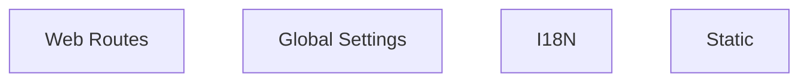

# Functional Analysis: Projects (conf)

## Capability Inventory

| ID | Capability | Priority | Status | Description |
|----|-----------|----------|--------|-------------|
| CAP-1 | Web Routes | medium | ACTIVE | — |
| CAP-2 | Global Settings | medium | ACTIVE | — |
| CAP-3 | I18N | medium | ACTIVE | — |
| CAP-4 | Static | medium | ACTIVE | — |

## Functional Decomposition

## Capability-Component Mapping

| Capability | Realized By | Component Kind |
|-----------|------------|----------------|
| Web Routes | *unrealized* | — |
| Global Settings | Global Settings (COMP-2) | service |
| I18N | I18N (COMP-3) | service |
| Static | Static (COMP-4) | service |

## Behavioral Coverage

Total behaviors: 18

**Untraced behaviors:** 18
- GET  (BEH-1)
- GET bookmarklets/ (BEH-2)
- GET tags/ (BEH-3)
- GET filters/ (BEH-4)
- GET views/ (BEH-5)
- GET views/<view>/ (BEH-6)
- GET models/ (BEH-7)
- GET ^models/(?P<app_label>[^.]+)\.(?P<model_name>[^/]+)/$ (BEH-8)
- GET templates/<path:template>/ (BEH-9)
- GET login/ (BEH-10)
- *...and 8 more*
