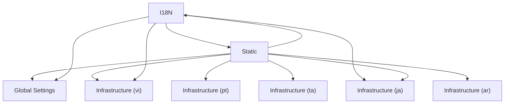

# Logical Architecture: Projects (conf)

## Layer Structure

| Order | Layer | Technologies | Directories |
|-------|-------|-------------|-------------|
| 0 | infra | — | — |

## Component Allocation

### unassigned

| Component | Kind | Files | Responsibilities |
|-----------|------|-------|------------------|
| Global Settings (COMP-2) | service | 1 files | — |
| I18N (COMP-3) | service | 1 files | — |
| Static (COMP-4) | service | 1 files | — |
| Infrastructure (ar) (COMP-5-1) | service | 1 files | — |
| Infrastructure (ar_DZ) (COMP-5-2) | service | 1 files | — |
| Infrastructure (az) (COMP-5-3) | service | 1 files | — |
| Infrastructure (bg) (COMP-5-4) | service | 1 files | — |
| Infrastructure (bn) (COMP-5-5) | service | 1 files | — |
| Infrastructure (bs) (COMP-5-6) | service | 1 files | — |
| Infrastructure (ca) (COMP-5-7) | service | 1 files | — |
| Infrastructure (ckb) (COMP-5-8) | service | 1 files | — |
| Infrastructure (cs) (COMP-5-9) | service | 1 files | — |
| Infrastructure (cy) (COMP-5-10) | service | 1 files | — |
| Infrastructure (da) (COMP-5-11) | service | 1 files | — |
| Infrastructure (de) (COMP-5-12) | service | 1 files | — |
| Infrastructure (de_CH) (COMP-5-13) | service | 1 files | — |
| Infrastructure (el) (COMP-5-14) | service | 1 files | — |
| Infrastructure (en) (COMP-5-15) | service | 1 files | — |
| Infrastructure (en_AU) (COMP-5-16) | service | 1 files | — |
| Infrastructure (en_CA) (COMP-5-17) | service | 1 files | — |
| Infrastructure (en_GB) (COMP-5-18) | service | 1 files | — |
| Infrastructure (en_IE) (COMP-5-19) | service | 1 files | — |
| Infrastructure (eo) (COMP-5-20) | service | 1 files | — |
| Infrastructure (es) (COMP-5-21) | service | 1 files | — |
| Infrastructure (es_AR) (COMP-5-22) | service | 1 files | — |
| Infrastructure (es_CO) (COMP-5-23) | service | 1 files | — |
| Infrastructure (es_MX) (COMP-5-24) | service | 1 files | — |
| Infrastructure (es_NI) (COMP-5-25) | service | 1 files | — |
| Infrastructure (es_PR) (COMP-5-26) | service | 1 files | — |
| Infrastructure (et) (COMP-5-27) | service | 1 files | — |
| Infrastructure (eu) (COMP-5-28) | service | 1 files | — |
| Infrastructure (fa) (COMP-5-29) | service | 1 files | — |
| Infrastructure (fi) (COMP-5-30) | service | 1 files | — |
| Infrastructure (fr) (COMP-5-31) | service | 1 files | — |
| Infrastructure (fr_BE) (COMP-5-32) | service | 1 files | — |
| Infrastructure (fr_CA) (COMP-5-33) | service | 1 files | — |
| Infrastructure (fr_CH) (COMP-5-34) | service | 1 files | — |
| Infrastructure (fy) (COMP-5-35) | service | 1 files | — |
| Infrastructure (ga) (COMP-5-36) | service | 1 files | — |
| Infrastructure (gd) (COMP-5-37) | service | 1 files | — |
| Infrastructure (gl) (COMP-5-38) | service | 1 files | — |
| Infrastructure (he) (COMP-5-39) | service | 1 files | — |
| Infrastructure (hi) (COMP-5-40) | service | 1 files | — |
| Infrastructure (hr) (COMP-5-41) | service | 1 files | — |
| Infrastructure (ht) (COMP-5-42) | service | 1 files | — |
| Infrastructure (hu) (COMP-5-43) | service | 1 files | — |
| Infrastructure (id) (COMP-5-44) | service | 1 files | — |
| Infrastructure (ig) (COMP-5-45) | service | 1 files | — |
| Infrastructure (is) (COMP-5-46) | service | 1 files | — |
| Infrastructure (it) (COMP-5-47) | service | 1 files | — |
| Infrastructure (ja) (COMP-5-48) | service | 1 files | — |
| Infrastructure (ka) (COMP-5-49) | service | 1 files | — |
| Infrastructure (km) (COMP-5-50) | service | 1 files | — |
| Infrastructure (kn) (COMP-5-51) | service | 1 files | — |
| Infrastructure (ko) (COMP-5-52) | service | 1 files | — |
| Infrastructure (ky) (COMP-5-53) | service | 1 files | — |
| Infrastructure (lt) (COMP-5-54) | service | 1 files | — |
| Infrastructure (lv) (COMP-5-55) | service | 1 files | — |
| Infrastructure (mk) (COMP-5-56) | service | 1 files | — |
| Infrastructure (ml) (COMP-5-57) | service | 1 files | — |
| Infrastructure (mn) (COMP-5-58) | service | 1 files | — |
| Infrastructure (ms) (COMP-5-59) | service | 1 files | — |
| Infrastructure (nb) (COMP-5-60) | service | 1 files | — |
| Infrastructure (nl) (COMP-5-61) | service | 1 files | — |
| Infrastructure (nn) (COMP-5-62) | service | 1 files | — |
| Infrastructure (pl) (COMP-5-63) | service | 1 files | — |
| Infrastructure (pt) (COMP-5-64) | service | 1 files | — |
| Infrastructure (pt_BR) (COMP-5-65) | service | 1 files | — |
| Infrastructure (ro) (COMP-5-66) | service | 1 files | — |
| Infrastructure (ru) (COMP-5-67) | service | 1 files | — |
| Infrastructure (sk) (COMP-5-68) | service | 1 files | — |
| Infrastructure (sl) (COMP-5-69) | service | 1 files | — |
| Infrastructure (sq) (COMP-5-70) | service | 1 files | — |
| Infrastructure (sr) (COMP-5-71) | service | 1 files | — |
| Infrastructure (sr_Latn) (COMP-5-72) | service | 1 files | — |
| Infrastructure (sv) (COMP-5-73) | service | 1 files | — |
| Infrastructure (ta) (COMP-5-74) | service | 1 files | — |
| Infrastructure (te) (COMP-5-75) | service | 1 files | — |
| Infrastructure (tg) (COMP-5-76) | service | 1 files | — |
| Infrastructure (th) (COMP-5-77) | service | 1 files | — |
| Infrastructure (tk) (COMP-5-78) | service | 1 files | — |
| Infrastructure (tr) (COMP-5-79) | service | 1 files | — |
| Infrastructure (ug) (COMP-5-80) | service | 1 files | — |
| Infrastructure (uk) (COMP-5-81) | service | 1 files | — |
| Infrastructure (uz) (COMP-5-82) | service | 1 files | — |
| Infrastructure (vi) (COMP-5-83) | service | 1 files | — |
| Infrastructure (zh_Hans) (COMP-5-84) | service | 1 files | — |
| Infrastructure (zh_Hant) (COMP-5-85) | service | 1 files | — |

## Inter-Component Interfaces

*No interfaces defined.*

## Dependency Graph

