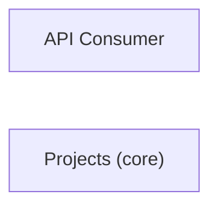

# Concept of Operations: Projects (core)

## System Overview

Projects (core) provides 77 capabilities implemented across 76 components.

**Core Capabilities:**

- **Web Routes**
- **Asgi**
- **Db**
- **Dummy**
- **Filebased**
- **Locmem**
- **Memcached**
- **Redis**
- **Async Checks**
- **Caches**
- **Commands**
- **Django 4 0**
- **Database**
- **Files**
- **Mail**
- **Messages**
- **Model Checks**
- **Registry**
- **Csrf**
- **Sessions**
- **Templates**
- **Translation**
- **Urls**
- **Exceptions**
- **Images**
- **Move**
- **Filesystem**
- **Handler**
- **Memory**
- **Mixins**
- **Uploadedfile**
- **Uploadhandler**
- **Exception**
- **Wsgi**
- **Console**
- **Smtp**
- **Deprecation**
- **Message**
- **Color**
- **Check**
- **Compilemessages**
- **Createcachetable**
- **Dbshell**
- **Diffsettings**
- **Dumpdata**
- **Flush**
- **Inspectdb**
- **Listurls**
- **Loaddata**
- **Makemessages**
- **Makemigrations**
- **Migrate**
- **Optimizemigration**
- **Runserver**
- **Sendtestemail**
- **Shell**
- **Showmigrations**
- **Sqlflush**
- **Sqlmigrate**
- **Sqlsequencereset**
- **Squashmigrations**
- **Startapp**
- **Startproject**
- **Test**
- **Testserver**
- **Sql**
- **Paginator**
- **Json**
- **Jsonl**
- **Python**
- **Pyyaml**
- **Xml Serializer**
- **Basehttp**
- **Signing**
- **Validators**
- **CLI Base**
- **CLI Templates**

## Stakeholders

| Actor | Type | Goals |
|-------|------|-------|
| API Consumer | human | — |

## Operational Scenarios

### System Workflows

- **GET **: 
- **GET bookmarklets/**: 
- **GET tags/**: 
- **GET filters/**: 
- **GET views/**: 
- **GET views/<view>/**: 
- **GET models/**: 
- **GET ^models/(?P<app_label>[^.]+)\.(?P<model_name>[^/]+)/$**: 
- **GET templates/<path:template>/**: 
- **GET login/**: 
- **GET logout/**: 
- **GET password_change/**: 
- **GET password_change/done/**: 
- **GET password_reset/**: 
- **GET password_reset/done/**: 
- **GET reset/<uidb64>/<token>/**: 
- **GET reset/done/**: 
- **GET <path:url>**: flatpage
- **TemporaryFileUploadHandler**: new_file -> receive_data_chunk -> file_complete -> upload_interrupted
- **MemoryFileUploadHandler**: handle_raw_input -> new_file -> receive_data_chunk -> file_complete
- *...and 32 more workflows*

## System Context

### External Interfaces

| Interface | Type | Provider | Consumer |
|-----------|------|----------|----------|
| base CLI | internal | — | — |
| templates CLI | internal | — | — |

## Operational Constraints

*No constraints defined in the model.*
