# Functional Analysis: Projects (forms)

## Capability Inventory

| ID | Capability | Priority | Status | Description |
|----|-----------|----------|--------|-------------|
| CAP-1 | Root Management | medium | ACTIVE | — |
| CAP-2 | Bookmarklet Management | medium | ACTIVE | — |
| CAP-3 | Tag Management | medium | ACTIVE | — |
| CAP-4 | Filter Management | medium | ACTIVE | — |
| CAP-5 | View Management | medium | ACTIVE | — |
| CAP-6 | Model Management | medium | ACTIVE | — |
| CAP-7 | ^Model Management | medium | ACTIVE | — |
| CAP-8 | Template Management | medium | ACTIVE | — |
| CAP-9 | Login Management | medium | ACTIVE | — |
| CAP-10 | Logout Management | medium | ACTIVE | — |
| CAP-11 | Password Change Management | medium | ACTIVE | — |
| CAP-12 | Password Reset Management | medium | ACTIVE | — |
| CAP-13 | Reset Management | medium | ACTIVE | — |
| CAP-14 | <Path:Url> Management | medium | ACTIVE | — |
| CAP-15 | Boundfield | medium | ACTIVE | — |
| CAP-16 | Fields | medium | ACTIVE | — |
| CAP-17 | Forms | medium | ACTIVE | — |
| CAP-18 | Formsets | medium | ACTIVE | — |
| CAP-19 | Models | medium | ACTIVE | — |
| CAP-20 | Renderers | medium | ACTIVE | — |
| CAP-21 | Widgets | medium | ACTIVE | — |

## Functional Decomposition

```mermaid
graph TD
    CAP-1["Root Management"]
    CAP-2["Bookmarklet Management"]
    CAP-3["Tag Management"]
    CAP-4["Filter Management"]
    CAP-5["View Management"]
    CAP-6["Model Management"]
    CAP-7["^Model Management"]
    CAP-8["Template Management"]
    CAP-9["Login Management"]
    CAP-10["Logout Management"]
    CAP-11["Password Change Management"]
    CAP-12["Password Reset Management"]
    CAP-13["Reset Management"]
    CAP-14["<Path:Url> Management"]
    CAP-15["Boundfield"]
    CAP-16["Fields"]
    CAP-17["Forms"]
    CAP-18["Formsets"]
    CAP-19["Models"]
    CAP-20["Renderers"]
    CAP-21["Widgets"]
```

## Capability-Component Mapping

| Capability | Realized By | Component Kind |
|-----------|------------|----------------|
| Root Management | *unrealized* | — |
| Bookmarklet Management | *unrealized* | — |
| Tag Management | *unrealized* | — |
| Filter Management | *unrealized* | — |
| View Management | *unrealized* | — |
| Model Management | *unrealized* | — |
| ^Model Management | *unrealized* | — |
| Template Management | *unrealized* | — |
| Login Management | *unrealized* | — |
| Logout Management | *unrealized* | — |
| Password Change Management | *unrealized* | — |
| Password Reset Management | *unrealized* | — |
| Reset Management | *unrealized* | — |
| <Path:Url> Management | *unrealized* | — |
| Boundfield | Boundfield (COMP-1) | service |
| Fields | Fields (COMP-2) | service |
| Forms | Forms (COMP-3) | service |
| Formsets | Formsets (COMP-4) | service |
| Models | Models (COMP-5) | service |
| Renderers | Renderers (COMP-6) | service |
| Widgets | Widgets (COMP-8) | service |

## Behavioral Coverage

Total behaviors: 20

**Untraced behaviors:** 20
- GET  (BEH-1)
- GET bookmarklets/ (BEH-2)
- GET tags/ (BEH-3)
- GET filters/ (BEH-4)
- GET views/ (BEH-5)
- GET views/<view>/ (BEH-6)
- GET models/ (BEH-7)
- GET ^models/(?P<app_label>[^.]+)\.(?P<model_name>[^/]+)/$ (BEH-8)
- GET templates/<path:template>/ (BEH-9)
- GET login/ (BEH-10)
- *...and 10 more*
