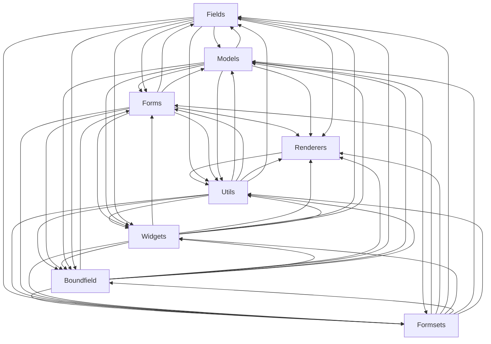

# Logical Architecture: Projects (forms)

## Layer Structure

| Order | Layer | Technologies | Directories |
|-------|-------|-------------|-------------|
| 0 | infra | — | — |
| 0 | data | — | — |

## Component Allocation

### unassigned

| Component | Kind | Files | Responsibilities |
|-----------|------|-------|------------------|
| Boundfield (COMP-1) | service | 1 files | — |
| Fields (COMP-2) | service | 1 files | — |
| Forms (COMP-3) | service | 1 files | — |
| Formsets (COMP-4) | service | 1 files | — |
| Models (COMP-5) | service | 1 files | — |
| Renderers (COMP-6) | service | 1 files | — |
| Utils (COMP-7) | service | 1 files | — |
| Widgets (COMP-8) | service | 1 files | — |

## Inter-Component Interfaces

*No interfaces defined.*

## Dependency Graph

