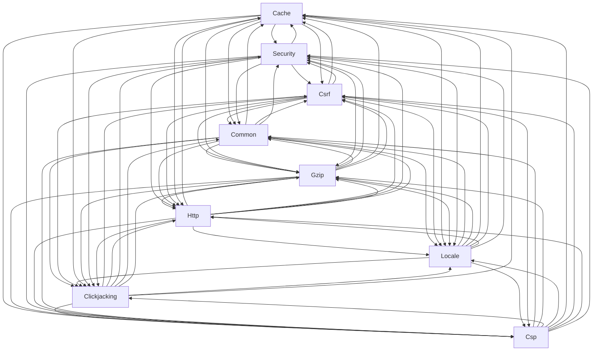

# Logical Architecture: Projects (middleware)

## Layer Structure

| Order | Layer | Technologies | Directories |
|-------|-------|-------------|-------------|
| 0 | infra | — | — |

## Component Allocation

### unassigned

| Component | Kind | Files | Responsibilities |
|-----------|------|-------|------------------|
| Cache (COMP-1) | service | 1 files | — |
| Clickjacking (COMP-2) | service | 1 files | — |
| Common (COMP-3) | service | 1 files | — |
| Csp (COMP-4) | service | 1 files | — |
| Csrf (COMP-5) | service | 1 files | — |
| Gzip (COMP-6) | service | 1 files | — |
| Http (COMP-7) | service | 1 files | — |
| Locale (COMP-8) | service | 1 files | — |
| Security (COMP-9) | service | 1 files | — |

## Inter-Component Interfaces

*No interfaces defined.*

## Dependency Graph

