# Functional Analysis: Projects (template)

## Capability Inventory

| ID | Capability | Priority | Status | Description |
|----|-----------|----------|--------|-------------|
| CAP-1 | Root Management | medium | ACTIVE | — |
| CAP-2 | Bookmarklet Management | medium | ACTIVE | — |
| CAP-3 | Tag Management | medium | ACTIVE | — |
| CAP-4 | Filter Management | medium | ACTIVE | — |
| CAP-5 | View Management | medium | ACTIVE | — |
| CAP-6 | Model Management | medium | ACTIVE | — |
| CAP-7 | ^Model Management | medium | ACTIVE | — |
| CAP-8 | Template Management | medium | ACTIVE | — |
| CAP-9 | Login Management | medium | ACTIVE | — |
| CAP-10 | Logout Management | medium | ACTIVE | — |
| CAP-11 | Password Change Management | medium | ACTIVE | — |
| CAP-12 | Password Reset Management | medium | ACTIVE | — |
| CAP-13 | Reset Management | medium | ACTIVE | — |
| CAP-14 | <Path:Url> Management | medium | ACTIVE | — |
| CAP-15 | Autoreload | medium | ACTIVE | — |
| CAP-16 | Django | medium | ACTIVE | — |
| CAP-17 | Dummy | medium | ACTIVE | — |
| CAP-18 | Jinja2 | medium | ACTIVE | — |
| CAP-19 | Context | medium | ACTIVE | — |
| CAP-20 | Context Processors | medium | ACTIVE | — |
| CAP-21 | Defaultfilters | medium | ACTIVE | — |
| CAP-22 | Defaulttags | medium | ACTIVE | — |
| CAP-23 | Engine | medium | ACTIVE | — |
| CAP-24 | Exceptions | medium | ACTIVE | — |
| CAP-25 | Library | medium | ACTIVE | — |
| CAP-26 | Loader | medium | ACTIVE | — |
| CAP-27 | Loader Tags | medium | ACTIVE | — |
| CAP-28 | App Directories | medium | ACTIVE | — |
| CAP-29 | Cached | medium | ACTIVE | — |
| CAP-30 | Filesystem | medium | ACTIVE | — |
| CAP-31 | Locmem | medium | ACTIVE | — |
| CAP-32 | Response | medium | ACTIVE | — |
| CAP-33 | Smartif | medium | ACTIVE | — |

## Functional Decomposition

```mermaid
graph TD
    CAP-1["Root Management"]
    CAP-2["Bookmarklet Management"]
    CAP-3["Tag Management"]
    CAP-4["Filter Management"]
    CAP-5["View Management"]
    CAP-6["Model Management"]
    CAP-7["^Model Management"]
    CAP-8["Template Management"]
    CAP-9["Login Management"]
    CAP-10["Logout Management"]
    CAP-11["Password Change Management"]
    CAP-12["Password Reset Management"]
    CAP-13["Reset Management"]
    CAP-14["<Path:Url> Management"]
    CAP-15["Autoreload"]
    CAP-16["Django"]
    CAP-17["Dummy"]
    CAP-18["Jinja2"]
    CAP-19["Context"]
    CAP-20["Context Processors"]
    CAP-21["Defaultfilters"]
    CAP-22["Defaulttags"]
    CAP-23["Engine"]
    CAP-24["Exceptions"]
    CAP-25["Library"]
    CAP-26["Loader"]
    CAP-27["Loader Tags"]
    CAP-28["App Directories"]
    CAP-29["Cached"]
    CAP-30["Filesystem"]
    CAP-31["Locmem"]
    CAP-32["Response"]
    CAP-33["Smartif"]
```

## Capability-Component Mapping

| Capability | Realized By | Component Kind |
|-----------|------------|----------------|
| Root Management | *unrealized* | — |
| Bookmarklet Management | *unrealized* | — |
| Tag Management | *unrealized* | — |
| Filter Management | *unrealized* | — |
| View Management | *unrealized* | — |
| Model Management | *unrealized* | — |
| ^Model Management | *unrealized* | — |
| Template Management | *unrealized* | — |
| Login Management | *unrealized* | — |
| Logout Management | *unrealized* | — |
| Password Change Management | *unrealized* | — |
| Password Reset Management | *unrealized* | — |
| Reset Management | *unrealized* | — |
| <Path:Url> Management | *unrealized* | — |
| Autoreload | Autoreload (COMP-15) | service |
| Django | Django (COMP-16) | service |
| Dummy | Dummy (COMP-17) | service |
| Jinja2 | Jinja2 (COMP-18) | service |
| Context | Context (COMP-19) | service |
| Context Processors | *unrealized* | — |
| Defaultfilters | Defaultfilters (COMP-21) | service |
| Defaulttags | Defaulttags (COMP-22) | service |
| Engine | Engine (COMP-23) | service |
| Exceptions | Exceptions (COMP-24) | service |
| Library | Library (COMP-25) | service |
| Loader | Loader (COMP-26) | service |
| Loader Tags | *unrealized* | — |
| App Directories | App Directories (COMP-28) | service |
| Cached | Cached (COMP-29) | service |
| Filesystem | Filesystem (COMP-30) | service |
| Locmem | Locmem (COMP-31) | service |
| Response | Response (COMP-32) | service |
| Smartif | Smartif (COMP-33) | service |

## Behavioral Coverage

Total behaviors: 18

**Untraced behaviors:** 18
- GET  (BEH-1)
- GET bookmarklets/ (BEH-2)
- GET tags/ (BEH-3)
- GET filters/ (BEH-4)
- GET views/ (BEH-5)
- GET views/<view>/ (BEH-6)
- GET models/ (BEH-7)
- GET ^models/(?P<app_label>[^.]+)\.(?P<model_name>[^/]+)/$ (BEH-8)
- GET templates/<path:template>/ (BEH-9)
- GET login/ (BEH-10)
- *...and 8 more*
