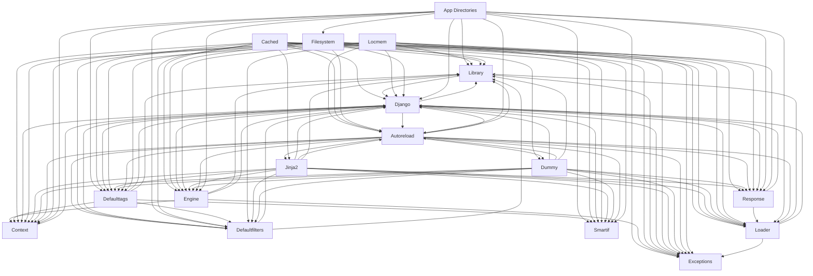

# Logical Architecture: Projects (template)

## Layer Structure

| Order | Layer | Technologies | Directories |
|-------|-------|-------------|-------------|
| 0 | infra | — | — |

## Component Allocation

### unassigned

| Component | Kind | Files | Responsibilities |
|-----------|------|-------|------------------|
| Autoreload (COMP-15) | service | 1 files | — |
| Django (COMP-16) | service | 6 files | — |
| Dummy (COMP-17) | service | 1 files | — |
| Jinja2 (COMP-18) | service | 1 files | — |
| Context (COMP-19) | service | 2 files | — |
| Defaultfilters (COMP-21) | service | 1 files | — |
| Defaulttags (COMP-22) | service | 1 files | — |
| Engine (COMP-23) | service | 1 files | — |
| Exceptions (COMP-24) | service | 1 files | — |
| Library (COMP-25) | service | 1 files | — |
| Loader (COMP-26) | service | 2 files | — |
| App Directories (COMP-28) | service | 1 files | — |
| Cached (COMP-29) | service | 1 files | — |
| Filesystem (COMP-30) | service | 1 files | — |
| Locmem (COMP-31) | service | 1 files | — |
| Response (COMP-32) | service | 1 files | — |
| Smartif (COMP-33) | service | 1 files | — |

## Inter-Component Interfaces

*No interfaces defined.*

## Dependency Graph

