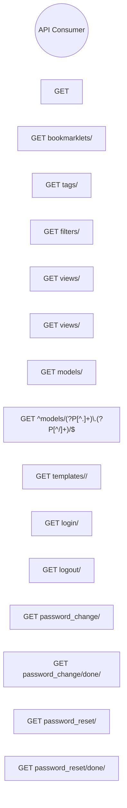

# Use Cases: Projects (template)

## Actor-Goal Matrix

| Actor | Goals |
|-------|-------|
| API Consumer | — |

## Use Case Specifications

### UC: GET 

**ID:** BEH-1
**Main Flow:**
  1. 

### UC: GET bookmarklets/

**ID:** BEH-2
**Main Flow:**
  1. 

### UC: GET tags/

**ID:** BEH-3
**Main Flow:**
  1. 

### UC: GET filters/

**ID:** BEH-4
**Main Flow:**
  1. 

### UC: GET views/

**ID:** BEH-5
**Main Flow:**
  1. 

### UC: GET views/<view>/

**ID:** BEH-6
**Main Flow:**
  1. 

### UC: GET models/

**ID:** BEH-7
**Main Flow:**
  1. 

### UC: GET ^models/(?P<app_label>[^.]+)\.(?P<model_name>[^/]+)/$

**ID:** BEH-8
**Main Flow:**
  1. 

### UC: GET templates/<path:template>/

**ID:** BEH-9
**Main Flow:**
  1. 

### UC: GET login/

**ID:** BEH-10
**Main Flow:**
  1. 

### UC: GET logout/

**ID:** BEH-11
**Main Flow:**
  1. 

### UC: GET password_change/

**ID:** BEH-12
**Main Flow:**
  1. 

### UC: GET password_change/done/

**ID:** BEH-13
**Main Flow:**
  1. 

### UC: GET password_reset/

**ID:** BEH-14
**Main Flow:**
  1. 

### UC: GET password_reset/done/

**ID:** BEH-15
**Main Flow:**
  1. 

### UC: GET reset/<uidb64>/<token>/

**ID:** BEH-16
**Main Flow:**
  1. 

### UC: GET reset/done/

**ID:** BEH-17
**Main Flow:**
  1. 

### UC: GET <path:url>

**ID:** BEH-18
**Main Flow:**
  1. flatpage

## Use Case Diagram

