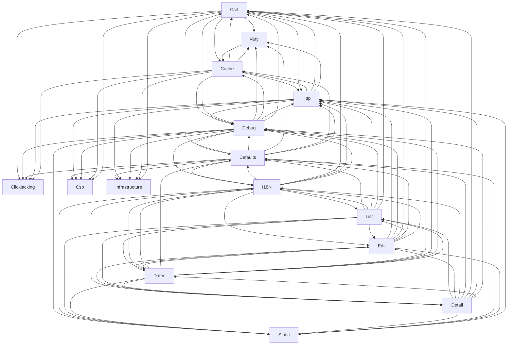

# Logical Architecture: Projects (views)

## Layer Structure

| Order | Layer | Technologies | Directories |
|-------|-------|-------------|-------------|
| 0 | web | — | — |
| 0 | infra | — | — |

## Component Allocation

### unassigned

| Component | Kind | Files | Responsibilities |
|-----------|------|-------|------------------|
| Csrf (COMP-15) | service | 4 files | — |
| Debug (COMP-16) | service | 2 files | — |
| Cache (COMP-17) | service | 1 files | — |
| Clickjacking (COMP-18) | service | 1 files | — |
| Csp (COMP-19) | service | 1 files | — |
| Http (COMP-20) | service | 1 files | — |
| Vary (COMP-21) | service | 1 files | — |
| Defaults (COMP-22) | service | 1 files | — |
| Dates (COMP-23) | service | 1 files | — |
| Detail (COMP-24) | service | 1 files | — |
| Edit (COMP-25) | service | 1 files | — |
| List (COMP-26) | service | 1 files | — |
| I18N (COMP-27) | service | 1 files | — |
| Static (COMP-28) | service | 1 files | — |
| Infrastructure (COMP-29) | service | 1 files | — |

## Inter-Component Interfaces

*No interfaces defined.*

## Dependency Graph

