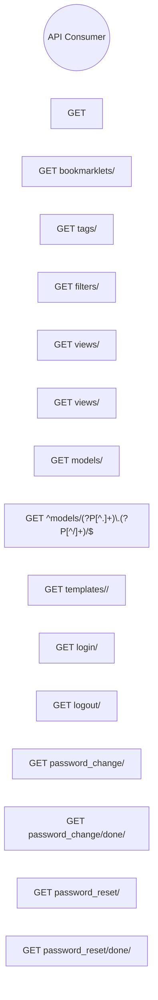

# Use Cases: Src (projects)

## Actor-Goal Matrix

| Actor | Goals |
|-------|-------|
| API Consumer | — |

## Use Case Specifications

### UC: GET 

**ID:** BEH-1
**Main Flow:**
  1. 

### UC: GET bookmarklets/

**ID:** BEH-2
**Main Flow:**
  1. 

### UC: GET tags/

**ID:** BEH-3
**Main Flow:**
  1. 

### UC: GET filters/

**ID:** BEH-4
**Main Flow:**
  1. 

### UC: GET views/

**ID:** BEH-5
**Main Flow:**
  1. 

### UC: GET views/<view>/

**ID:** BEH-6
**Main Flow:**
  1. 

### UC: GET models/

**ID:** BEH-7
**Main Flow:**
  1. 

### UC: GET ^models/(?P<app_label>[^.]+)\.(?P<model_name>[^/]+)/$

**ID:** BEH-8
**Main Flow:**
  1. 

### UC: GET templates/<path:template>/

**ID:** BEH-9
**Main Flow:**
  1. 

### UC: GET login/

**ID:** BEH-10
**Main Flow:**
  1. 

### UC: GET logout/

**ID:** BEH-11
**Main Flow:**
  1. 

### UC: GET password_change/

**ID:** BEH-12
**Main Flow:**
  1. 

### UC: GET password_change/done/

**ID:** BEH-13
**Main Flow:**
  1. 

### UC: GET password_reset/

**ID:** BEH-14
**Main Flow:**
  1. 

### UC: GET password_reset/done/

**ID:** BEH-15
**Main Flow:**
  1. 

### UC: GET reset/<uidb64>/<token>/

**ID:** BEH-16
**Main Flow:**
  1. 

### UC: GET reset/done/

**ID:** BEH-17
**Main Flow:**
  1. 

### UC: GET <path:url>

**ID:** BEH-18
**Main Flow:**
  1. flatpage

### UC: TextualHandler

**ID:** BEH-19
**Main Flow:**
  1. emit

### UC: DataTable

**ID:** BEH-20
**Main Flow:**
  1. hover_row
  2. hover_column
  3. cursor_row
  4. cursor_column
  5. row_count
  6. update_cell
  7. update_cell_at
  8. get_cell
  9. get_cell_at
  10. get_cell_coordinate
  11. get_row
  12. get_row_at
  13. get_row_index
  14. get_column
  15. get_column_at
  16. get_column_index
  17. get_row_height
  18. notify_style_update
  19. watch_show_cursor
  20. watch_show_header
  21. watch_show_row_labels
  22. watch_fixed_rows
  23. watch_fixed_columns
  24. watch_zebra_stripes
  25. watch_header_height
  26. validate_cell_padding
  27. watch_cell_padding
  28. watch_hover_coordinate
  29. watch_cursor_coordinate
  30. move_cursor
  31. coordinate_to_cell_key
  32. validate_cursor_coordinate
  33. watch_cursor_type
  34. clear
  35. add_column
  36. add_row
  37. add_columns
  38. add_rows
  39. remove_row
  40. remove_column
  41. refresh_coordinate
  42. refresh_row
  43. refresh_column
  44. is_valid_row_index
  45. is_valid_column_index
  46. is_valid_coordinate
  47. ordered_columns
  48. ordered_rows
  49. render_lines
  50. render_line
  51. sort
  52. action_page_down
  53. action_page_up
  54. action_page_left
  55. action_page_right
  56. action_scroll_top
  57. action_scroll_bottom
  58. action_scroll_home
  59. action_scroll_end
  60. action_cursor_up
  61. action_cursor_down
  62. action_cursor_right
  63. action_cursor_left
  64. action_select_cursor

## Use Case Diagram

