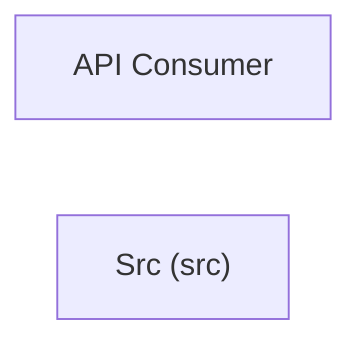

# Concept of Operations: Src (src)

## System Overview

Src (src) provides 95 capabilities implemented across 72 components.

**Core Capabilities:**

- **Web Routes**
- **Gate**
- **Parser**
- **Main**
- **Loader**
- **Schema**
- **Cluster**
- **Completeness**
- **Compression**
- **Confidence**
- **Corrections**
- **Coverage**
- **Decomposer**
- **Differ**
- **Merger**
- **Regen Readiness**
- **Representativeness**
- **Slicer**
- **Source Block Assign**
- **Source Block Quality**
- **Validator**
- **Visualize**
- **Flatfiles**
- **Reference**
- **Constraint Detector**
- **From Artifacts**
- **From Code**
- **Route Detector**
- **Table Parser**
- **Behavior**
- **Blocks**
- **Body Hints**
- **Call Graph**
- **Chains**
- **Display**
- **Generator**
- **Grouping**
- **Interfaces**
- **Kt Scanner**
- **Metrics**
- **Multi Scanner**
- **Protocol**
- **Recursive**
- **Scan Cache**
- **Scanner**
- **Slicers**
- **Ts Scanner**
- **Monitoring**
- **Monitoring Checks**
- **Auto Enrich**
- **Behavior Decompose**
- **Behavior Flows**
- **Capability Inference**
- **Compaction**
- **Decompose**
- **Deep Decompose**
- **Enrich**
- **Enrichment Context**
- **Naming Context**
- **Pipeline**
- **Trigger Detection**
- **Use Case Inference**
- **Patterns**
- **Store**
- **Allocate**
- **Allocate Types**
- **Artifacts**
- **Cache**
- **Context Gen**
- **Contract**
- **Contract Types**
- **Coordinator**
- **Decompose Types**
- **Emit**
- **Emit Types**
- **Global Learning**
- **Infer**
- **Infer Types**
- **Learning**
- **Lessons**
- **Observe**
- **Observe Types**
- **Regen Score**
- **Relate**
- **Relate Types**
- **Report**
- **Requirements Derive**
- **Specify**
- **Specify Types**
- **Synthesize**
- **Synthesize Types**
- **Validate**
- **Validate Types**
- **Discovery**
- **CLI Main**

## Stakeholders

| Actor | Type | Goals |
|-------|------|-------|
| API Consumer | human | — |

## Operational Scenarios

### System Workflows

- **GET **: 
- **GET bookmarklets/**: 
- **GET tags/**: 
- **GET filters/**: 
- **GET views/**: 
- **GET views/<view>/**: 
- **GET models/**: 
- **GET ^models/(?P<app_label>[^.]+)\.(?P<model_name>[^/]+)/$**: 
- **GET templates/<path:template>/**: 
- **GET login/**: 
- **GET logout/**: 
- **GET password_change/**: 
- **GET password_change/done/**: 
- **GET password_reset/**: 
- **GET password_reset/done/**: 
- **GET reset/<uidb64>/<token>/**: 
- **GET reset/done/**: 
- **GET <path:url>**: flatpage
- **CLI: Main**: ArgumentParser -> add_subparsers -> add_parser -> add_argument -> parse_args

## System Context

### External Interfaces

| Interface | Type | Provider | Consumer |
|-----------|------|----------|----------|
| main CLI | internal | — | — |

## Operational Constraints

*No constraints defined in the model.*
