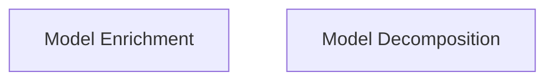

> **Model Completeness: D (40%)**
> Some sections may be empty due to missing model entities.
> - No interfaces defined on components → interface-spec doc empty
> - No requirements defined
> - No actors defined → conops stakeholder section empty
> - No constraints defined → operations manual empty
> Run the extraction pipeline or manually add behaviors/interfaces/constraints.

# Functional Analysis: architecture-model-standard/Orchestration

## Capability Inventory

| ID | Capability | Priority | Status | Description | Intent |
|----|-----------|----------|--------|-------------|--------|
| CAP-ENRICH | Model Enrichment | medium | ACTIVE | Enrich model with signatures, body_hints, constants, test_contracts from manifest | Bridge the gap between abstract architecture models and regeneration-ready models by populating AST-level detail onto components |
| CAP-DECOMPOSE | Model Decomposition | medium | ACTIVE | Split model into per-F-block sub-models with recursive manifests | Enable independent per-subsystem reasoning and regeneration by producing self-contained sub-models from the monolithic parent |

## Measures of Effectiveness

| Capability | MOE |
|---|---|
| Model Enrichment (CAP-ENRICH) | All active components with files receive signatures, constants, and test_contracts after enrichment |
| Model Enrichment (CAP-ENRICH) | Body hint coverage >= 50% for trivial functions |
| Model Enrichment (CAP-ENRICH) | Enriched model passes validation without score regression |
| Model Decomposition (CAP-DECOMPOSE) | Each F-block with >= 5 files produces its own .architecture-model.yaml and manifest.json |
| Model Decomposition (CAP-DECOMPOSE) | Sub-models contain all transitively reachable entities via relationship tracing |
| Model Decomposition (CAP-DECOMPOSE) | Round-trip merge of all sub-models reconstructs the parent model's entity set |

## Functional Decomposition

## Capability-Component Mapping

| Capability | Realized By | Component Kind |
|-----------|------------|----------------|
| Model Enrichment | Orchestration (COMP-ORCHESTRATION) | service |
| Model Decomposition | Orchestration (COMP-ORCHESTRATION) | service |

### Design Trade-offs

**Orchestration** (COMP-ORCHESTRATION):
- Convenience of single pipeline entry point vs flexibility of calling enrich/decompose independently
- Deep decomposition adds LLM cost but produces richer sub-models than shallow relationship tracing
- Monolithic COMP-ORCHESTRATION component covers 15 files — could be split but cohesion is high

## Behavioral Coverage

Total behaviors: 2

**Untraced behaviors:** 1
- run_pipeline (BEH-1)
