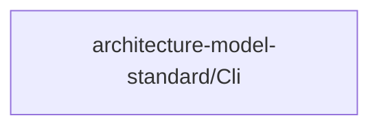

# Concept of Operations: architecture-model-standard/Cli

## System Overview

architecture-model-standard/Cli provides 1 capabilities implemented across 1 components.

**Core Capabilities:**

- **Command-Line Operations** - Expose all architecture-model operations as CLI subcommands
  - *Intent:* Provide a unified argparse-based entry point so users and CI pipelines can validate, slice, diff, enrich, and run the extraction pipeline from the terminal
  - *Measures of Effectiveness:*
    - Every core operation (validate, slice, diff, stats, pipeline, manifest, enrich, impact) is accessible as a subcommand
    - Exit codes reflect success (0) or failure (non-zero) for CI integration
    - Help text is auto-generated and accurate for all subcommands

## Stakeholders

*No actors defined in the model.*

## Operational Scenarios

### System Workflows

- **Project Initialization**: Discover project configuration from directory structure -> Run extraction pipeline (7 stages) -> Enrich model from manifest -> Decompose into sub-models -> Generate documentation

## System Context

### External Interfaces

| Interface | Type | Provider | Consumer |
|-----------|------|----------|----------|
| CLI Interface | cli | — | — |

## Degraded Operations & Failure Modes

### CLI
- Invalid model YAML causes unhandled yaml.YAMLError if not wrapped in try/except
- Large models produce terminal output exceeding buffer limits when not piped
- Missing optional dependencies (e.g., visualization libraries) cause ImportError at subcommand runtime rather than at startup

## Operational Constraints

*No constraints defined in the model.*
