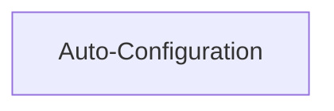

> **Model Completeness: F (15%)**
> Some sections may be empty due to missing model entities.
> - 1/1 components have no behavioral specification
> - No interfaces defined on components → interface-spec doc empty
> - No requirements defined
> - No actors defined → conops stakeholder section empty
> Run the extraction pipeline or manually add behaviors/interfaces/constraints.

# Functional Analysis: architecture-model-standard/Config

## Capability Inventory

| ID | Capability | Priority | Status | Description | Intent |
|----|-----------|----------|--------|-------------|--------|
| CAP-CONFIG | Auto-Configuration | medium | ACTIVE | Self-bootstrapping project discovery and configuration | Eliminate manual setup by auto-discovering project structure, source roots, and functional blocks from directory layout and import analysis |

## Measures of Effectiveness

| Capability | MOE |
|---|---|
| Auto-Configuration (CAP-CONFIG) | Projects with no .architecture-model.yaml produce valid ProjectConfig via get_config() |
| Auto-Configuration (CAP-CONFIG) | Discovered functional blocks match actual directory structure |
| Auto-Configuration (CAP-CONFIG) | Config round-trips through YAML without data loss |

## Functional Decomposition

## Capability-Component Mapping

| Capability | Realized By | Component Kind |
|-----------|------------|----------------|
| Auto-Configuration | Config (COMP-CONFIG) | library |

### Design Trade-offs

**Config** (COMP-CONFIG):
- Auto-discovery uses heuristics (directory naming, import patterns) that may misclassify unconventional project layouts
- Schema dataclasses are flat rather than validated with pydantic, trading runtime validation for simplicity and zero extra dependencies

## Behavioral Coverage

*No behaviors defined.*
