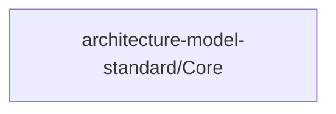

# Concept of Operations: architecture-model-standard/Core

## System Overview

architecture-model-standard/Core provides 5 capabilities implemented across 1 components.

**Core Capabilities:**

- **Model Parsing** - Parse YAML into typed ArchitectureModel, serialize back to YAML
  - *Intent:* Enable round-trip conversion between YAML files and typed Python objects so all other subsystems operate on a validated in-memory model rather than raw dicts.
  - *Measures of Effectiveness:*
    - All 7 entity types and 17 relationship types parse without data loss
    - Round-trip serialize/deserialize produces byte-identical YAML output
    - Invalid YAML raises structured errors with line numbers
- **Model Validation** - Check model structural correctness (ID uniqueness, referential integrity, orphan detection)
  - *Intent:* Guarantee every persisted model satisfies structural invariants before downstream consumers (slicer, docs, LLM context) process it.
  - *Measures of Effectiveness:*
    - Detects 100% of duplicate entity IDs across all entity types
    - Identifies all dangling relationship references (from/to IDs that don't exist)
    - Produces a 0-100 score that monotonically improves as issues are fixed
- **Model Slicing** - Extract subsets by F-block, layer, status, or artifact type
  - *Intent:* Provide focused model views so LLM agents receive only the context relevant to their current task, reducing token usage and improving accuracy.
  - *Measures of Effectiveness:*
    - Sliced model contains only entities reachable from the slice criterion
    - All internal relationships between retained entities are preserved
    - Sliced model independently passes validation
- **Model Diffing** - Compare two model versions, produce structured change report
  - *Intent:* Detect architectural drift between model versions so staleness can be quantified and targeted re-extraction triggered.
  - *Measures of Effectiveness:*
    - Reports all added, removed, and modified entities with field-level detail
    - Reports all added and removed relationships
    - Diff of identical models produces zero changes
- **Coverage Analysis** - Compare model against code reality, compute file/relationship/boundary coverage
  - *Intent:* Measure how faithfully the architecture model represents the actual codebase so gaps between model claims and code reality are surfaced.
  - *Measures of Effectiveness:*
    - File coverage percentage reflects ratio of modeled files to discovered files
    - Relationship accuracy detects import edges missing from the model
    - Boundary coherence flags files assigned to wrong components

## Stakeholders

*No actors defined in the model.*

## Operational Scenarios

### System Workflows

- **Regen Score Computation**: —

## System Context

### External Interfaces

| Interface | Type | Provider | Consumer |
|-----------|------|----------|----------|
| Python API | library | — | — |
| YAML Model Schema | file | — | — |

## Degraded Operations & Failure Modes

### Core
- Schema drift — types.py diverges from spec/schema.json, causing silent data loss on parse
- Validator false negatives — missing validation rules allow structurally invalid models to score 100
- Slicer relationship leakage — slice includes relationships referencing entities outside the slice boundary

## Operational Constraints

### Technology & Regulatory

- **No LLM in Core** [technology]
