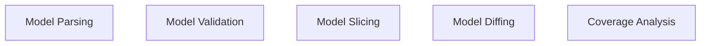

# Functional Analysis: architecture-model-standard/Core

## Capability Inventory

| ID | Capability | Priority | Status | Description | Intent |
|----|-----------|----------|--------|-------------|--------|
| CAP-PARSE | Model Parsing | medium | ACTIVE | Parse YAML into typed ArchitectureModel, serialize back to YAML | Enable round-trip conversion between YAML files and typed Python objects so all other subsystems operate on a validated in-memory model rather than raw dicts. |
| CAP-VALIDATE | Model Validation | medium | ACTIVE | Check model structural correctness (ID uniqueness, referential integrity, orphan detection) | Guarantee every persisted model satisfies structural invariants before downstream consumers (slicer, docs, LLM context) process it. |
| CAP-SLICE | Model Slicing | medium | ACTIVE | Extract subsets by F-block, layer, status, or artifact type | Provide focused model views so LLM agents receive only the context relevant to their current task, reducing token usage and improving accuracy. |
| CAP-DIFF | Model Diffing | medium | ACTIVE | Compare two model versions, produce structured change report | Detect architectural drift between model versions so staleness can be quantified and targeted re-extraction triggered. |
| CAP-COVERAGE | Coverage Analysis | medium | ACTIVE | Compare model against code reality, compute file/relationship/boundary coverage | Measure how faithfully the architecture model represents the actual codebase so gaps between model claims and code reality are surfaced. |

## Measures of Effectiveness

| Capability | MOE |
|---|---|
| Model Parsing (CAP-PARSE) | All 7 entity types and 17 relationship types parse without data loss |
| Model Parsing (CAP-PARSE) | Round-trip serialize/deserialize produces byte-identical YAML output |
| Model Parsing (CAP-PARSE) | Invalid YAML raises structured errors with line numbers |
| Model Validation (CAP-VALIDATE) | Detects 100% of duplicate entity IDs across all entity types |
| Model Validation (CAP-VALIDATE) | Identifies all dangling relationship references (from/to IDs that don't exist) |
| Model Validation (CAP-VALIDATE) | Produces a 0-100 score that monotonically improves as issues are fixed |
| Model Slicing (CAP-SLICE) | Sliced model contains only entities reachable from the slice criterion |
| Model Slicing (CAP-SLICE) | All internal relationships between retained entities are preserved |
| Model Slicing (CAP-SLICE) | Sliced model independently passes validation |
| Model Diffing (CAP-DIFF) | Reports all added, removed, and modified entities with field-level detail |
| Model Diffing (CAP-DIFF) | Reports all added and removed relationships |
| Model Diffing (CAP-DIFF) | Diff of identical models produces zero changes |
| Coverage Analysis (CAP-COVERAGE) | File coverage percentage reflects ratio of modeled files to discovered files |
| Coverage Analysis (CAP-COVERAGE) | Relationship accuracy detects import edges missing from the model |
| Coverage Analysis (CAP-COVERAGE) | Boundary coherence flags files assigned to wrong components |

## Functional Decomposition

## Capability-Component Mapping

| Capability | Realized By | Component Kind |
|-----------|------------|----------------|
| Model Parsing | Core (COMP-CORE) | library |
| Model Validation | Core (COMP-CORE) | library |
| Model Slicing | Core (COMP-CORE) | library |
| Model Diffing | Core (COMP-CORE) | library |
| Coverage Analysis | Core (COMP-CORE) | library |

### Design Trade-offs

**Core** (COMP-CORE):
- Richness vs. parse speed — 1186-line types.py covers all schema variants but increases import time
- Strict typing vs. extensibility — dataclass fields enforce schema but make adding new entity types a multi-file change
- Determinism vs. intelligence — no LLM calls means coverage/confidence metrics are heuristic-based approximations

## Behavioral Coverage

Total behaviors: 1

