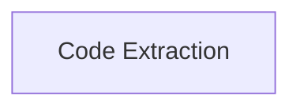

> **Model Completeness: F (15%)**
> Some sections may be empty due to missing model entities.
> - 1/1 components have no behavioral specification
> - No interfaces defined on components → interface-spec doc empty
> - No requirements defined
> - No actors defined → conops stakeholder section empty
> Run the extraction pipeline or manually add behaviors/interfaces/constraints.

# Functional Analysis: architecture-model-standard/Extract

## Capability Inventory

| ID | Capability | Priority | Status | Description | Intent |
|----|-----------|----------|--------|-------------|--------|
| CAP-EXTRACT | Code Extraction | medium | ACTIVE | Extract architecture model directly from source code analysis | Enable backward-pass model derivation from code reality so that architecture models can be generated without manual authoring or markdown artifacts |

## Measures of Effectiveness

| Capability | MOE |
|---|---|
| Code Extraction (CAP-EXTRACT) | Produces valid ArchitectureModel from arbitrary Python repo with score >= 90/100 |
| Code Extraction (CAP-EXTRACT) | Detects routes, constraints, imports, and layers from AST analysis |
| Code Extraction (CAP-EXTRACT) | Extraction completes within 60 seconds for repos under 200 modules |

## Functional Decomposition

## Capability-Component Mapping

| Capability | Realized By | Component Kind |
|-----------|------------|----------------|
| Code Extraction | Extract (COMP-EXTRACT) | library |

### Design Trade-offs

**Extract** (COMP-EXTRACT):
- AST-only analysis misses runtime-dynamic registrations vs. static completeness is simpler and faster
- Single-pass extraction vs. iterative refinement — speed over precision for initial model
- Python-only AST support vs. multi-language — focused quality over broad coverage

## Behavioral Coverage

*No behaviors defined.*
