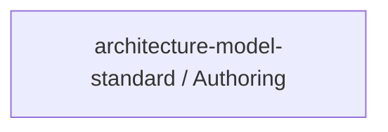

# Concept of Operations: architecture-model-standard / Authoring

## System Overview

architecture-model-standard / Authoring provides 2 capabilities implemented across 1 components.

**Core Capabilities:**

- **Author Model from Requirements** - Parse requirements document into a concept-phase architecture model
- **Check Development Gate** - Verify code reality is tracking toward authored architecture intent

## Stakeholders

*No actors defined in the model.*

## Operational Scenarios

*No behaviors defined in the model.*

## System Context

### External Interfaces

| Interface | Type | Provider | Consumer |
|-----------|------|----------|----------|
| Authoring API | internal | — | — |

## Operational Constraints

*No constraints defined in the model.*

---
## Traceability

**Source entities:** `CAP-6`, `CAP-12`
**LLM Review:** — Not yet reviewed
**Generated by:** Pipeline emit stage → SE doc generator
