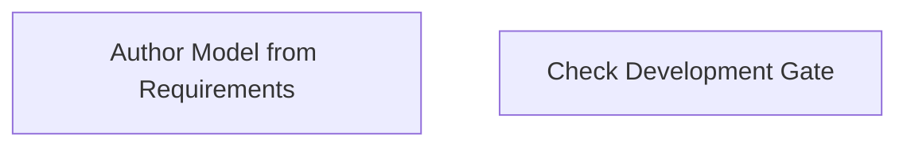

# Functional Analysis: architecture-model-standard / Authoring

## Capability Inventory

| ID | Capability | Priority | Status | Description |
|----|-----------|----------|--------|-------------|
| CAP-6 | Author Model from Requirements | medium | ACTIVE | Parse requirements document into a concept-phase architecture model |
| CAP-12 | Check Development Gate | medium | ACTIVE | Verify code reality is tracking toward authored architecture intent |

## Functional Decomposition

## Capability-Component Mapping

| Capability | Realized By | Component Kind |
|-----------|------------|----------------|
| Author Model from Requirements | Authoring (COMP-7) | library |
| Check Development Gate | Authoring (COMP-7) | library |

## Behavioral Coverage

*No behaviors defined.*

---
## Traceability

**Source entities:** `CAP-6`, `CAP-12`
**LLM Review:** — Not yet reviewed
**Generated by:** Pipeline emit stage → SE doc generator
