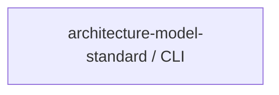

# Concept of Operations: architecture-model-standard / CLI

## System Overview

architecture-model-standard / CLI provides 0 capabilities implemented across 1 components.

## Stakeholders

*No actors defined in the model.*

## Operational Scenarios

*No behaviors defined in the model.*

## System Context

### External Interfaces

| Interface | Type | Provider | Consumer |
|-----------|------|----------|----------|
| CLI API | internal | — | — |

## Operational Constraints

*No constraints defined in the model.*

---
## Traceability

**Source entities:** None mapped
**LLM Review:** — Not yet reviewed
**Generated by:** Pipeline emit stage → SE doc generator
