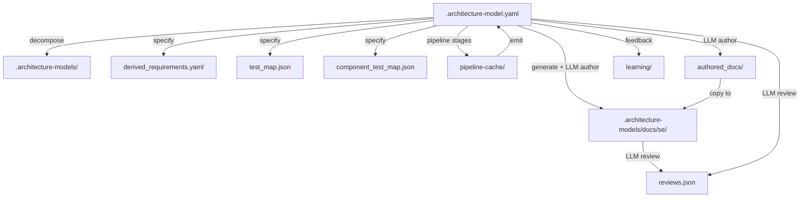

> **Model Completeness: D (35%)**
> Some sections may be empty due to missing model entities.
> - 1/1 components have no behavioral specification
> - No requirements defined
> - No actors defined → conops stakeholder section empty
> - No constraints defined → operations manual empty
> Run the extraction pipeline or manually add behaviors/interfaces/constraints.

# Artifact Traceability Map: architecture-model-standard / Configuration

## 1. Entity Inventory

| Entity Type | Count | Feeds SE Documents |
|-------------|-------|--------------------|
| Components | 1 | Logical Architecture, Maintenance Manual, Operations Manual, Interface Specification, Component Specs |
| Capabilities | 0 | ConOps, Functional Analysis, Requirements Analysis |
| Behaviors | 0 | Use Cases, Functional Analysis, Verification & Validation, Behavior Flows |
| Interfaces | 1 | Interface Specification, Logical Architecture |
| Constraints | 0 | Requirements Analysis, Risk Assessment |
| Requirements | 0 | Requirements Analysis, Verification & Validation |
| Actors | 0 | ConOps, Use Cases |
| Layers | 0 | Logical Architecture |

## 2. Artifact Dependency Graph

## 3. Entity-to-Artifact Traceability Matrix

| Artifact | Components | Capabilities | Behaviors | Interfaces | Constraints | Requirements | Actors | Layers |
|---|---|---|---|---|---|---|---|---|
| Behavior Flows | | | — | | | | | |
| Component Specs | **1** | | | | | | | |
| ConOps | | — | | | | | — | |
| Functional Analysis | | — | — | | | | | |
| Interface Specification | **1** | | | **1** | | | | |
| Logical Architecture | **1** | | | **1** | | | | — |
| Maintenance Manual | **1** | | | | | | | |
| Operations Manual | **1** | | | | | | | |
| Requirements Analysis | | — | | | — | — | | |
| Risk Assessment | | | | | — | | | |
| Use Cases | | | — | | | | — | |
| Verification & Validation | | | — | | | — | | |

## 4. Relationship Distribution

| Relationship Type | Count | Connects |
|-------------------|-------|----------|
| depends-on | 5 | Unknown → Component, Unknown → Unknown |
| exposes | 1 | Component → Interface |

## 5. Traceability Gaps

- **Capabilities** — 0 entities; leaves gaps in: ConOps, Functional Analysis, Requirements Analysis
- **Behaviors** — 0 entities; leaves gaps in: Use Cases, Functional Analysis, Verification & Validation, Behavior Flows
- **Constraints** — 0 entities; leaves gaps in: Requirements Analysis, Risk Assessment
- **Requirements** — 0 entities; leaves gaps in: Requirements Analysis, Verification & Validation
- **Actors** — 0 entities; leaves gaps in: ConOps, Use Cases
- **Layers** — 0 entities; leaves gaps in: Logical Architecture
- **allocated-to** relationship type missing — weakens cross-entity traceability
- **constrained-by** relationship type missing — weakens cross-entity traceability
- **realizes** relationship type missing — weakens cross-entity traceability

## 6. Architecture Artifact Inventory

### Architecture Models

| Path | Size | LLM Reviewed | Review Summary |
|------|------|-------------|----------------|
| `.architecture-model.yaml` | 42.5KB | — |  |
| `.architecture-models/authoring/.architecture-model.yaml` | 1.8KB | — |  |
| `.architecture-models/cli/.architecture-model.yaml` | 1.5KB | — |  |
| `.architecture-models/configuration/.architecture-model.yaml` | 1.3KB | — |  |
| `.architecture-models/core/.architecture-model.yaml` | 8.5KB | — |  |
| `.architecture-models/documentation/.architecture-model.yaml` | 8.5KB | — |  |
| `.architecture-models/export/.architecture-model.yaml` | 1.5KB | — |  |
| `.architecture-models/extract/.architecture-model.yaml` | 1.6KB | — |  |
| `.architecture-models/manifest/.architecture-model.yaml` | 5.0KB | — |  |
| `.architecture-models/orchestration/.architecture-model.yaml` | 3.3KB | — |  |
| `.architecture-models/pipeline/.architecture-model.yaml` | 6.8KB | — |  |
| `.architecture-models/pipeline-learning/.architecture-model.yaml` | 1.1KB | — |  |
| `.architecture-models/scripts-core/.architecture-model.yaml` | 3.1KB | — |  |
| `.architecture-models/scripts-dev-simulation/.architecture-model.yaml` | 6.1KB | — |  |
| `.architecture-models/src-core/.architecture-model.yaml` | 12.4KB | — |  |
| `.architecture-models/src-extract/.architecture-model.yaml` | 3.1KB | — |  |
| `.architecture-models/src-manifest/.architecture-model.yaml` | 20.6KB | — |  |
| `.architecture-models/src-orchestration/.architecture-model.yaml` | 9.7KB | — |  |
| `.architecture-models/src-pipeline/.architecture-model.yaml` | 19.8KB | — |  |
| `.architecture-models/utilities/.architecture-model.yaml` | 852B | — |  |

### System Manifests

| Path | Size | LLM Reviewed | Review Summary |
|------|------|-------------|----------------|
| `.architecture/manifest.json` | 626.4KB | — |  |
| `.architecture-models/scripts-core/manifest.json` | 619B | — |  |
| `.architecture-models/scripts-dev-simulation/manifest.json` | 1.1KB | — |  |
| `.architecture-models/src-core/manifest.json` | 2.0KB | — |  |
| `.architecture-models/src-extract/manifest.json` | 622B | — |  |
| `.architecture-models/src-manifest/manifest.json` | 2.3KB | — |  |
| `.architecture-models/src-orchestration/manifest.json` | 1.6KB | — |  |
| `.architecture-models/src-pipeline/manifest.json` | 3.8KB | — |  |

### SE Documents

| Path | Size | LLM Reviewed | Review Summary |
|------|------|-------------|----------------|
| `.architecture-models/docs/se/artifact-traceability.md` | 112.6KB | — |  |
| `.architecture-models/docs/se/behavior-flows.md` | 4.2KB | — |  |
| `.architecture-models/docs/se/conops.md` | 5.4KB | — |  |
| `.architecture-models/docs/se/data-model.md` | 2.9KB | — |  |
| `.architecture-models/docs/se/deployment-guide.md` | 2.7KB | — |  |
| `.architecture-models/docs/se/functional-analysis.md` | 14.1KB | — |  |
| `.architecture-models/docs/se/index.md` | 763B | — |  |
| `.architecture-models/docs/se/interface-specification.md` | 11.1KB | — |  |
| `.architecture-models/docs/se/logical-architecture.md` | 9.9KB | — |  |
| `.architecture-models/docs/se/maintenance-manual.md` | 5.6KB | — |  |
| `.architecture-models/docs/se/operations-manual.md` | 4.9KB | — |  |
| `.architecture-models/docs/se/requirements-analysis.md` | 8.6KB | — |  |
| `.architecture-models/docs/se/risk-assessment.md` | 5.6KB | — |  |
| `.architecture-models/docs/se/security-analysis.md` | 4.0KB | — |  |
| `.architecture-models/docs/se/use-cases.md` | 8.0KB | — |  |
| `.architecture-models/docs/se/verification-validation.md` | 9.2KB | — |  |

### Pipeline Cache

| Path | Size | LLM Reviewed | Review Summary |
|------|------|-------------|----------------|
| `.architecture/pipeline-cache/allocate.json` | 11.8KB | — |  |
| `.architecture/pipeline-cache/contract.json` | 38.4KB | — |  |
| `.architecture/pipeline-cache/decompose.json` | 17.1KB | — |  |
| `.architecture/pipeline-cache/emit.json` | 6.1KB | — |  |
| `.architecture/pipeline-cache/enrichment_log.json` | 5.3KB | — |  |
| `.architecture/pipeline-cache/infer.json` | 54.6KB | — |  |
| `.architecture/pipeline-cache/llm_calls.json` | 5.0KB | — |  |
| `.architecture/pipeline-cache/meta.json` | 259B | — |  |
| `.architecture/pipeline-cache/observe.json` | 2.4MB | — |  |
| `.architecture/pipeline-cache/relate.json` | 21.9KB | — |  |
| `.architecture/pipeline-cache/reviews.json` | 89.3KB | — |  |
| `.architecture/pipeline-cache/specify.json` | 1.2KB | — |  |
| `.architecture/pipeline-cache/synthesize.json` | 2.0MB | — |  |
| `.architecture/pipeline-cache/validate.json` | 2.3KB | — |  |

### Test Mapping

| Path | Size | LLM Reviewed | Review Summary |
|------|------|-------------|----------------|
| `.architecture/test_map.json` | 19.3KB | — |  |
| `.architecture/component_test_map.json` | 8.8KB | — |  |

### Requirements

| Path | Size | LLM Reviewed | Review Summary |
|------|------|-------------|----------------|
| `.architecture/derived_requirements.yaml` | 23.8KB | — |  |

### Learning

| Path | Size | LLM Reviewed | Review Summary |
|------|------|-------------|----------------|
| `.architecture/learning/history.json` | 3.7KB | — |  |

### Authored Docs Cache

| Path | Size | LLM Reviewed | Review Summary |
|------|------|-------------|----------------|
| `.architecture/authored_docs/api_reference.md` | 1.3KB | — |  |
| `.architecture/authored_docs/cli_reference.md` | 7.6KB | — |  |
| `.architecture/authored_docs/conops.md` | 4.6KB | — |  |
| `.architecture/authored_docs/data_model.md` | 5.9KB | — |  |
| `.architecture/authored_docs/deployment_guide.md` | 2.3KB | — |  |
| `.architecture/authored_docs/functional_analysis.md` | 13.4KB | — |  |
| `.architecture/authored_docs/interface_spec.md` | 10.2KB | — |  |
| `.architecture/authored_docs/logical_architecture.md` | 9.1KB | — |  |
| `.architecture/authored_docs/maintenance_manual.md` | 4.8KB | — |  |
| `.architecture/authored_docs/operations_manual.md` | 4.1KB | — |  |
| `.architecture/authored_docs/plugin_guide.md` | 7.4KB | — |  |
| `.architecture/authored_docs/requirements_analysis.md` | 7.8KB | — |  |
| `.architecture/authored_docs/risk_assessment.md` | 4.9KB | — |  |
| `.architecture/authored_docs/security_analysis.md` | 3.5KB | — |  |
| `.architecture/authored_docs/use_cases.md` | 7.3KB | — |  |
| `.architecture/authored_docs/verification_validation.md` | 8.4KB | — |  |
| `.architecture/authored_docs/api_reference.meta.json` | 59B | — |  |
| `.architecture/authored_docs/cli_reference.meta.json` | 59B | — |  |
| `.architecture/authored_docs/conops.meta.json` | 52B | — |  |
| `.architecture/authored_docs/data_model.meta.json` | 56B | — |  |
| `.architecture/authored_docs/deployment_guide.meta.json` | 62B | — |  |
| `.architecture/authored_docs/functional_analysis.meta.json` | 65B | — |  |
| `.architecture/authored_docs/interface_spec.meta.json` | 60B | — |  |
| `.architecture/authored_docs/logical_architecture.meta.json` | 66B | — |  |
| `.architecture/authored_docs/maintenance_manual.meta.json` | 64B | — |  |
| `.architecture/authored_docs/operations_manual.meta.json` | 63B | — |  |
| `.architecture/authored_docs/plugin_guide.meta.json` | 58B | — |  |
| `.architecture/authored_docs/requirements_analysis.meta.json` | 67B | — |  |
| `.architecture/authored_docs/risk_assessment.meta.json` | 61B | — |  |
| `.architecture/authored_docs/security_analysis.meta.json` | 63B | — |  |
| `.architecture/authored_docs/use_cases.meta.json` | 55B | — |  |
| `.architecture/authored_docs/verification_validation.meta.json` | 69B | — |  |

### Component Specs

| Path | Size | LLM Reviewed | Review Summary |
|------|------|-------------|----------------|
| `.architecture-models/docs/components/COMP-1.md` | 1.1KB | — |  |
| `.architecture-models/docs/components/COMP-10.md` | 525B | — |  |
| `.architecture-models/docs/components/COMP-11.md` | 417B | — |  |
| `.architecture-models/docs/components/COMP-12.md` | 356B | — |  |
| `.architecture-models/docs/components/COMP-2.md` | 1000B | — |  |
| `.architecture-models/docs/components/COMP-3.md` | 720B | — |  |
| `.architecture-models/docs/components/COMP-4.md` | 1.8KB | — |  |
| `.architecture-models/docs/components/COMP-5.md` | 538B | — |  |
| `.architecture-models/docs/components/COMP-6.md` | 601B | — |  |
| `.architecture-models/docs/components/COMP-7.md` | 566B | — |  |
| `.architecture-models/docs/components/COMP-8.md` | 588B | — |  |
| `.architecture-models/docs/components/COMP-9.md` | 271B | — |  |

### Subsystem Views

| Path | Size | LLM Reviewed | Review Summary |
|------|------|-------------|----------------|
| `.architecture-models/authoring/docs/se/artifact-traceability.md` | 28.2KB | — |  |
| `.architecture-models/authoring/docs/se/behavior-flows.md` | 448B | — |  |
| `.architecture-models/authoring/docs/se/conops.md` | 1.2KB | — |  |
| `.architecture-models/authoring/docs/se/functional-analysis.md` | 1.2KB | — |  |
| `.architecture-models/authoring/docs/se/index.md` | 721B | — |  |
| `.architecture-models/authoring/docs/se/interface-specification.md` | 811B | — |  |
| `.architecture-models/authoring/docs/se/logical-architecture.md` | 900B | — |  |
| `.architecture-models/authoring/docs/se/maintenance-manual.md` | 1.2KB | — |  |
| `.architecture-models/authoring/docs/se/operations-manual.md` | 667B | — |  |
| `.architecture-models/authoring/docs/se/requirements-analysis.md` | 849B | — |  |
| `.architecture-models/authoring/docs/se/risk-assessment.md` | 554B | — |  |
| `.architecture-models/authoring/docs/se/security-analysis.md` | 687B | — |  |
| `.architecture-models/authoring/docs/se/use-cases.md` | 570B | — |  |
| `.architecture-models/authoring/docs/se/verification-validation.md` | 781B | — |  |
| `.architecture-models/cli/docs/se/artifact-traceability.md` | 29.2KB | — |  |
| `.architecture-models/cli/docs/se/behavior-flows.md` | 436B | — |  |
| `.architecture-models/cli/docs/se/conops.md` | 929B | — |  |
| `.architecture-models/cli/docs/se/functional-analysis.md` | 611B | — |  |
| `.architecture-models/cli/docs/se/index.md` | 645B | — |  |
| `.architecture-models/cli/docs/se/interface-specification.md` | 787B | — |  |
| `.architecture-models/cli/docs/se/logical-architecture.md` | 874B | — |  |
| `.architecture-models/cli/docs/se/maintenance-manual.md` | 1.2KB | — |  |
| `.architecture-models/cli/docs/se/operations-manual.md` | 649B | — |  |
| `.architecture-models/cli/docs/se/requirements-analysis.md` | 792B | — |  |
| `.architecture-models/cli/docs/se/risk-assessment.md` | 670B | — |  |
| `.architecture-models/cli/docs/se/use-cases.md` | 558B | — |  |
| `.architecture-models/cli/docs/se/verification-validation.md` | 763B | — |  |
| `.architecture-models/configuration/docs/se/conops.md` | 1.3KB | — |  |
| `.architecture-models/configuration/docs/se/functional-analysis.md` | 1000B | — |  |
| `.architecture-models/configuration/docs/se/interface-specification.md` | 1.2KB | — |  |
| `.architecture-models/configuration/docs/se/logical-architecture.md` | 1.3KB | — |  |
| `.architecture-models/configuration/docs/se/maintenance-manual.md` | 1.7KB | — |  |
| `.architecture-models/configuration/docs/se/operations-manual.md` | 1.0KB | — |  |
| `.architecture-models/configuration/docs/se/requirements-analysis.md` | 1.0KB | — |  |
| `.architecture-models/configuration/docs/se/risk-assessment.md` | 1.1KB | — |  |
| `.architecture-models/configuration/docs/se/use-cases.md` | 947B | — |  |
| `.architecture-models/configuration/docs/se/verification-validation.md` | 1.1KB | — |  |
| `.architecture-models/core/docs/se/artifact-traceability.md` | 22.7KB | — |  |
| `.architecture-models/core/docs/se/behavior-flows.md` | 438B | — |  |
| `.architecture-models/core/docs/se/conops.md` | 1.7KB | — |  |
| `.architecture-models/core/docs/se/functional-analysis.md` | 1.9KB | — |  |
| `.architecture-models/core/docs/se/index.md` | 645B | — |  |
| `.architecture-models/core/docs/se/interface-specification.md` | 1.6KB | — |  |
| `.architecture-models/core/docs/se/logical-architecture.md` | 1.5KB | — |  |
| `.architecture-models/core/docs/se/maintenance-manual.md` | 2.8KB | — |  |
| `.architecture-models/core/docs/se/operations-manual.md` | 894B | — |  |
| `.architecture-models/core/docs/se/requirements-analysis.md` | 1.7KB | — |  |
| `.architecture-models/core/docs/se/risk-assessment.md` | 817B | — |  |
| `.architecture-models/core/docs/se/use-cases.md` | 560B | — |  |
| `.architecture-models/core/docs/se/verification-validation.md` | 1.2KB | — |  |
| `.architecture-models/documentation/docs/se/artifact-traceability.md` | 25.6KB | — |  |
| `.architecture-models/documentation/docs/se/behavior-flows.md` | 456B | — |  |
| `.architecture-models/documentation/docs/se/conops.md` | 1.8KB | — |  |
| `.architecture-models/documentation/docs/se/functional-analysis.md` | 1.0KB | — |  |
| `.architecture-models/documentation/docs/se/index.md` | 645B | — |  |
| `.architecture-models/documentation/docs/se/interface-specification.md` | 2.8KB | — |  |
| `.architecture-models/documentation/docs/se/logical-architecture.md` | 2.0KB | — |  |
| `.architecture-models/documentation/docs/se/maintenance-manual.md` | 3.1KB | — |  |
| `.architecture-models/documentation/docs/se/operations-manual.md` | 1.2KB | — |  |
| `.architecture-models/documentation/docs/se/requirements-analysis.md` | 1.8KB | — |  |
| `.architecture-models/documentation/docs/se/risk-assessment.md` | 562B | — |  |
| `.architecture-models/documentation/docs/se/use-cases.md` | 578B | — |  |
| `.architecture-models/documentation/docs/se/verification-validation.md` | 1.1KB | — |  |
| `.architecture-models/extract/docs/se/artifact-traceability.md` | 27.1KB | — |  |
| `.architecture-models/extract/docs/se/behavior-flows.md` | 444B | — |  |
| `.architecture-models/extract/docs/se/conops.md` | 1.1KB | — |  |
| `.architecture-models/extract/docs/se/functional-analysis.md` | 1.0KB | — |  |
| `.architecture-models/extract/docs/se/index.md` | 645B | — |  |
| `.architecture-models/extract/docs/se/interface-specification.md` | 803B | — |  |
| `.architecture-models/extract/docs/se/logical-architecture.md` | 887B | — |  |
| `.architecture-models/extract/docs/se/maintenance-manual.md` | 1.3KB | — |  |
| `.architecture-models/extract/docs/se/operations-manual.md` | 661B | — |  |
| `.architecture-models/extract/docs/se/requirements-analysis.md` | 843B | — |  |
| `.architecture-models/extract/docs/se/risk-assessment.md` | 550B | — |  |
| `.architecture-models/extract/docs/se/use-cases.md` | 566B | — |  |
| `.architecture-models/extract/docs/se/verification-validation.md` | 787B | — |  |
| `.architecture-models/manifest/docs/se/artifact-traceability.md` | 24.4KB | — |  |
| `.architecture-models/manifest/docs/se/behavior-flows.md` | 446B | — |  |
| `.architecture-models/manifest/docs/se/conops.md` | 1.3KB | — |  |
| `.architecture-models/manifest/docs/se/functional-analysis.md` | 1022B | — |  |
| `.architecture-models/manifest/docs/se/index.md` | 645B | — |  |
| `.architecture-models/manifest/docs/se/interface-specification.md` | 1.4KB | — |  |
| `.architecture-models/manifest/docs/se/logical-architecture.md` | 1.5KB | — |  |
| `.architecture-models/manifest/docs/se/maintenance-manual.md` | 2.6KB | — |  |
| `.architecture-models/manifest/docs/se/operations-manual.md` | 847B | — |  |
| `.architecture-models/manifest/docs/se/requirements-analysis.md` | 1.1KB | — |  |
| `.architecture-models/manifest/docs/se/risk-assessment.md` | 855B | — |  |
| `.architecture-models/manifest/docs/se/use-cases.md` | 568B | — |  |
| `.architecture-models/manifest/docs/se/verification-validation.md` | 1001B | — |  |
| `.architecture-models/orchestration/docs/se/artifact-traceability.md` | 26.8KB | — |  |
| `.architecture-models/orchestration/docs/se/behavior-flows.md` | 846B | — |  |
| `.architecture-models/orchestration/docs/se/conops.md` | 1.7KB | — |  |
| `.architecture-models/orchestration/docs/se/functional-analysis.md` | 1.7KB | — |  |
| `.architecture-models/orchestration/docs/se/index.md` | 645B | — |  |
| `.architecture-models/orchestration/docs/se/interface-specification.md` | 1.5KB | — |  |
| `.architecture-models/orchestration/docs/se/logical-architecture.md` | 1.5KB | — |  |
| `.architecture-models/orchestration/docs/se/maintenance-manual.md` | 2.5KB | — |  |
| `.architecture-models/orchestration/docs/se/operations-manual.md` | 1.1KB | — |  |
| `.architecture-models/orchestration/docs/se/requirements-analysis.md` | 1.2KB | — |  |
| `.architecture-models/orchestration/docs/se/risk-assessment.md` | 952B | — |  |
| `.architecture-models/orchestration/docs/se/use-cases.md` | 968B | — |  |
| `.architecture-models/orchestration/docs/se/verification-validation.md` | 1.3KB | — |  |
| `.architecture-models/pipeline/docs/se/artifact-traceability.md` | 23.6KB | — |  |
| `.architecture-models/pipeline/docs/se/behavior-flows.md` | 446B | — |  |
| `.architecture-models/pipeline/docs/se/conops.md` | 1.4KB | — |  |
| `.architecture-models/pipeline/docs/se/functional-analysis.md` | 1.1KB | — |  |
| `.architecture-models/pipeline/docs/se/index.md` | 645B | — |  |
| `.architecture-models/pipeline/docs/se/interface-specification.md` | 1.7KB | — |  |
| `.architecture-models/pipeline/docs/se/logical-architecture.md` | 1.7KB | — |  |
| `.architecture-models/pipeline/docs/se/maintenance-manual.md` | 3.3KB | — |  |
| `.architecture-models/pipeline/docs/se/operations-manual.md` | 955B | — |  |
| `.architecture-models/pipeline/docs/se/requirements-analysis.md` | 1.5KB | — |  |
| `.architecture-models/pipeline/docs/se/risk-assessment.md` | 552B | — |  |
| `.architecture-models/pipeline/docs/se/use-cases.md` | 568B | — |  |
| `.architecture-models/pipeline/docs/se/verification-validation.md` | 1.2KB | — |  |
| `.architecture-models/scripts-core/docs/se/artifact-traceability.md` | 78.9KB | — |  |
| `.architecture-models/scripts-core/docs/se/conops.md` | 1.8KB | — |  |
| `.architecture-models/scripts-core/docs/se/functional-analysis.md` | 2.8KB | — |  |
| `.architecture-models/scripts-core/docs/se/index.md` | 603B | — |  |
| `.architecture-models/scripts-core/docs/se/interface-specification.md` | 613B | — |  |
| `.architecture-models/scripts-core/docs/se/logical-architecture.md` | 606B | — |  |
| `.architecture-models/scripts-core/docs/se/maintenance-manual.md` | 704B | — |  |
| `.architecture-models/scripts-core/docs/se/operations-manual.md` | 1.1KB | — |  |
| `.architecture-models/scripts-core/docs/se/requirements-analysis.md` | 2.1KB | — |  |
| `.architecture-models/scripts-core/docs/se/risk-assessment.md` | 3.5KB | — |  |
| `.architecture-models/scripts-core/docs/se/use-cases.md` | 2.2KB | — |  |
| `.architecture-models/scripts-core/docs/se/verification-validation.md` | 884B | — |  |
| `.architecture-models/scripts-dev-simulation/docs/se/artifact-traceability.md` | 79.1KB | — |  |
| `.architecture-models/scripts-dev-simulation/docs/se/conops.md` | 2.3KB | — |  |
| `.architecture-models/scripts-dev-simulation/docs/se/functional-analysis.md` | 4.5KB | — |  |
| `.architecture-models/scripts-dev-simulation/docs/se/index.md` | 603B | — |  |
| `.architecture-models/scripts-dev-simulation/docs/se/interface-specification.md` | 969B | — |  |
| `.architecture-models/scripts-dev-simulation/docs/se/logical-architecture.md` | 2.0KB | — |  |
| `.architecture-models/scripts-dev-simulation/docs/se/maintenance-manual.md` | 3.2KB | — |  |
| `.architecture-models/scripts-dev-simulation/docs/se/operations-manual.md` | 1.4KB | — |  |
| `.architecture-models/scripts-dev-simulation/docs/se/requirements-analysis.md` | 1.9KB | — |  |
| `.architecture-models/scripts-dev-simulation/docs/se/risk-assessment.md` | 3.0KB | — |  |
| `.architecture-models/scripts-dev-simulation/docs/se/use-cases.md` | 2.5KB | — |  |
| `.architecture-models/scripts-dev-simulation/docs/se/verification-validation.md` | 1.8KB | — |  |
| `.architecture-models/src-core/docs/se/artifact-traceability.md` | 79.1KB | — |  |
| `.architecture-models/src-core/docs/se/conops.md` | 2.1KB | — |  |
| `.architecture-models/src-core/docs/se/data-model.md` | 634B | — |  |
| `.architecture-models/src-core/docs/se/functional-analysis.md` | 5.3KB | — |  |
| `.architecture-models/src-core/docs/se/index.md` | 665B | — |  |
| `.architecture-models/src-core/docs/se/interface-specification.md` | 786B | — |  |
| `.architecture-models/src-core/docs/se/logical-architecture.md` | 5.8KB | — |  |
| `.architecture-models/src-core/docs/se/maintenance-manual.md` | 8.1KB | — |  |
| `.architecture-models/src-core/docs/se/operations-manual.md` | 1.3KB | — |  |
| `.architecture-models/src-core/docs/se/requirements-analysis.md` | 1.9KB | — |  |
| `.architecture-models/src-core/docs/se/risk-assessment.md` | 5.8KB | — |  |
| `.architecture-models/src-core/docs/se/use-cases.md` | 2.4KB | — |  |
| `.architecture-models/src-core/docs/se/verification-validation.md` | 2.1KB | — |  |
| `.architecture-models/src-extract/docs/se/artifact-traceability.md` | 78.9KB | — |  |
| `.architecture-models/src-extract/docs/se/conops.md` | 1.7KB | — |  |
| `.architecture-models/src-extract/docs/se/functional-analysis.md` | 2.6KB | — |  |
| `.architecture-models/src-extract/docs/se/index.md` | 603B | — |  |
| `.architecture-models/src-extract/docs/se/interface-specification.md` | 611B | — |  |
| `.architecture-models/src-extract/docs/se/logical-architecture.md` | 604B | — |  |
| `.architecture-models/src-extract/docs/se/maintenance-manual.md` | 702B | — |  |
| `.architecture-models/src-extract/docs/se/operations-manual.md` | 1.1KB | — |  |
| `.architecture-models/src-extract/docs/se/requirements-analysis.md` | 2.0KB | — |  |
| `.architecture-models/src-extract/docs/se/risk-assessment.md` | 3.4KB | — |  |
| `.architecture-models/src-extract/docs/se/use-cases.md` | 2.2KB | — |  |
| `.architecture-models/src-extract/docs/se/verification-validation.md` | 882B | — |  |
| `.architecture-models/src-manifest/docs/se/artifact-traceability.md` | 79.1KB | — |  |
| `.architecture-models/src-manifest/docs/se/conops.md` | 2.1KB | — |  |
| `.architecture-models/src-manifest/docs/se/data-model.md` | 641B | — |  |
| `.architecture-models/src-manifest/docs/se/functional-analysis.md` | 5.4KB | — |  |
| `.architecture-models/src-manifest/docs/se/index.md` | 665B | — |  |
| `.architecture-models/src-manifest/docs/se/interface-specification.md` | 793B | — |  |
| `.architecture-models/src-manifest/docs/se/logical-architecture.md` | 11.3KB | — |  |
| `.architecture-models/src-manifest/docs/se/maintenance-manual.md` | 10.6KB | — |  |
| `.architecture-models/src-manifest/docs/se/operations-manual.md` | 1.3KB | — |  |
| `.architecture-models/src-manifest/docs/se/requirements-analysis.md` | 1.9KB | — |  |
| `.architecture-models/src-manifest/docs/se/risk-assessment.md` | 6.5KB | — |  |
| `.architecture-models/src-manifest/docs/se/use-cases.md` | 2.4KB | — |  |
| `.architecture-models/src-manifest/docs/se/verification-validation.md` | 2.2KB | — |  |
| `.architecture-models/src-orchestration/docs/se/artifact-traceability.md` | 79.1KB | — |  |
| `.architecture-models/src-orchestration/docs/se/conops.md` | 2.1KB | — |  |
| `.architecture-models/src-orchestration/docs/se/data-model.md` | 651B | — |  |
| `.architecture-models/src-orchestration/docs/se/functional-analysis.md` | 5.1KB | — |  |
| `.architecture-models/src-orchestration/docs/se/index.md` | 665B | — |  |
| `.architecture-models/src-orchestration/docs/se/interface-specification.md` | 803B | — |  |
| `.architecture-models/src-orchestration/docs/se/logical-architecture.md` | 4.5KB | — |  |
| `.architecture-models/src-orchestration/docs/se/maintenance-manual.md` | 6.1KB | — |  |
| `.architecture-models/src-orchestration/docs/se/operations-manual.md` | 1.3KB | — |  |
| `.architecture-models/src-orchestration/docs/se/requirements-analysis.md` | 1.9KB | — |  |
| `.architecture-models/src-orchestration/docs/se/risk-assessment.md` | 4.4KB | — |  |
| `.architecture-models/src-orchestration/docs/se/use-cases.md` | 2.4KB | — |  |
| `.architecture-models/src-orchestration/docs/se/verification-validation.md` | 2.0KB | — |  |
| `.architecture-models/src-pipeline/docs/se/artifact-traceability.md` | 79.1KB | — |  |
| `.architecture-models/src-pipeline/docs/se/conops.md` | 2.4KB | — |  |
| `.architecture-models/src-pipeline/docs/se/data-model.md` | 641B | — |  |
| `.architecture-models/src-pipeline/docs/se/functional-analysis.md` | 7.1KB | — |  |
| `.architecture-models/src-pipeline/docs/se/index.md` | 665B | — |  |
| `.architecture-models/src-pipeline/docs/se/interface-specification.md` | 793B | — |  |
| `.architecture-models/src-pipeline/docs/se/logical-architecture.md` | 9.9KB | — |  |
| `.architecture-models/src-pipeline/docs/se/maintenance-manual.md` | 10.5KB | — |  |
| `.architecture-models/src-pipeline/docs/se/operations-manual.md` | 1.3KB | — |  |
| `.architecture-models/src-pipeline/docs/se/requirements-analysis.md` | 2.6KB | — |  |
| `.architecture-models/src-pipeline/docs/se/risk-assessment.md` | 8.3KB | — |  |
| `.architecture-models/src-pipeline/docs/se/use-cases.md` | 2.4KB | — |  |
| `.architecture-models/src-pipeline/docs/se/verification-validation.md` | 2.5KB | — |  |

**Total:** 309 files, 6.8MB, 0 reviewed

## 7. Entity → Document → Review Traceability

Shows which model entities feed which SE documents, and whether those documents have been reviewed.

| SE Document | Source Entities | Review Status | Review Summary |
|-------------|----------------|---------------|----------------|
| Behavior Flows |  | — Not reviewed |  |
| Component Specs | 1 Components | — Not reviewed |  |
| ConOps |  | — Not reviewed |  |
| Functional Analysis |  | — Not reviewed |  |
| Interface Specification | 1 Components, 1 Interfaces | — Not reviewed |  |
| Logical Architecture | 1 Components, 1 Interfaces | — Not reviewed |  |
| Maintenance Manual | 1 Components | — Not reviewed |  |
| Operations Manual | 1 Components | — Not reviewed |  |
| Requirements Analysis |  | — Not reviewed |  |
| Risk Assessment |  | — Not reviewed |  |
| Use Cases |  | — Not reviewed |  |
| Verification & Validation |  | — Not reviewed |  |

Detailed entity-to-document mapping

**Component Specs:**
- Components: `COMP-9`

**Interface Specification:**
- Components: `COMP-9`
- Interfaces: `IF-auto-COMP-9`

**Logical Architecture:**
- Components: `COMP-9`
- Interfaces: `IF-auto-COMP-9`

**Maintenance Manual:**
- Components: `COMP-9`

**Operations Manual:**
- Components: `COMP-9`

## LLM Review Status

No LLM reviews available.

## LLM Enrichment Provenance

No LLM enrichment records available.

## Review Details

No review details available.
