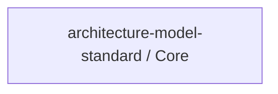

# Concept of Operations: architecture-model-standard / Core

## System Overview

architecture-model-standard / Core provides 5 capabilities implemented across 6 components.

**Core Capabilities:**

- **Validate Architecture Models** - Check model correctness, completeness, hierarchy consistency, and domain rules
- **Slice and Query Models** - Filter model by block, layer, status, artifact for focused context delivery
- **Diff Model Versions** - Compare two model versions showing additions, removals, and changes
- **Assess Regen Readiness** - Score how well a model captures enough detail to regenerate code
- **Detect and Fix Model Drift** - Compare model against current code, report coverage gaps

## Stakeholders

*No actors defined in the model.*

## Operational Scenarios

*No behaviors defined in the model.*

## System Context

### External Interfaces

| Interface | Type | Provider | Consumer |
|-----------|------|----------|----------|
| Core API | internal | — | — |
| Type System API | internal | — | — |
| Validation API | internal | — | — |
| Parser & Persistence API | internal | — | — |
| Model Operations API | internal | — | — |
| Quality Metrics API | internal | — | — |

## Operational Constraints

*No constraints defined in the model.*

---
## Traceability

**Source entities:** `CAP-1`, `CAP-7`, `CAP-8`, `CAP-11`, `CAP-13`
**LLM Review:** — Not yet reviewed
**Generated by:** Pipeline emit stage → SE doc generator
