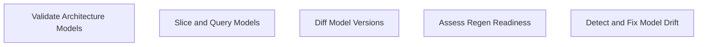

# Functional Analysis: architecture-model-standard / Core

## Capability Inventory

| ID | Capability | Priority | Status | Description |
|----|-----------|----------|--------|-------------|
| CAP-1 | Validate Architecture Models | medium | ACTIVE | Check model correctness, completeness, hierarchy consistency, and domain rules |
| CAP-7 | Slice and Query Models | medium | ACTIVE | Filter model by block, layer, status, artifact for focused context delivery |
| CAP-8 | Diff Model Versions | medium | ACTIVE | Compare two model versions showing additions, removals, and changes |
| CAP-11 | Assess Regen Readiness | medium | ACTIVE | Score how well a model captures enough detail to regenerate code |
| CAP-13 | Detect and Fix Model Drift | medium | ACTIVE | Compare model against current code, report coverage gaps |

## Functional Decomposition

## Capability-Component Mapping

| Capability | Realized By | Component Kind |
|-----------|------------|----------------|
| Validate Architecture Models | Validation (COMP-1.2) | library |
| Slice and Query Models | Model Operations (COMP-1.4) | library |
| Diff Model Versions | Model Operations (COMP-1.4) | library |
| Assess Regen Readiness | Quality Metrics (COMP-1.5) | library |
| Detect and Fix Model Drift | Model Operations (COMP-1.4) | library |

## Behavioral Coverage

*No behaviors defined.*

---
## Traceability

**Source entities:** `CAP-1`, `CAP-7`, `CAP-8`, `CAP-11`, `CAP-13`
**LLM Review:** — Not yet reviewed
**Generated by:** Pipeline emit stage → SE doc generator
