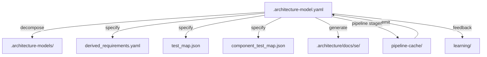
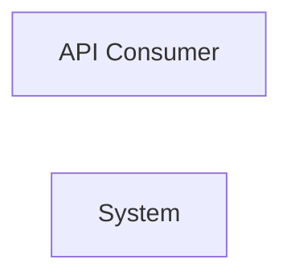
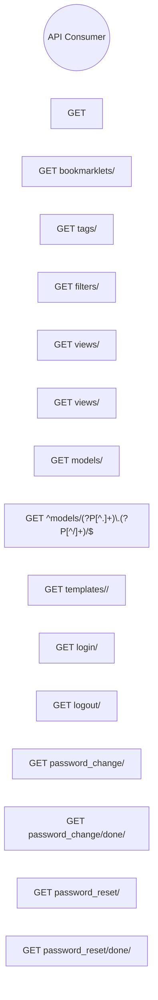

# Artifact Traceability Map: System

## 1. Entity Inventory

| Entity Type | Count | Feeds SE Documents |
|-------------|-------|--------------------|
| Components | 92 | Logical Architecture, Maintenance Manual, Operations Manual, Interface Specification |
| Capabilities | 6 | ConOps, Functional Analysis, Requirements Analysis |
| Behaviors | 25 | Use Cases, Functional Analysis, Verification & Validation |
| Interfaces | 1 | Interface Specification, Logical Architecture |
| Constraints | 0 | Requirements Analysis, Risk Assessment |
| Requirements | 0 | Requirements Analysis, Verification & Validation |
| Actors | 1 | ConOps, Use Cases |
| Layers | 2 | Logical Architecture |

## 2. Artifact Dependency Graph



## 3. Entity-to-Artifact Traceability Matrix

| Artifact | Components | Capabilities | Behaviors | Interfaces | Constraints | Requirements | Actors | Layers |
|---|---|---|---|---|---|---|---|---|
| ConOps | | **6** | | | | | **1** | |
| Functional Analysis | | **6** | **25** | | | | | |
| Interface Specification | **92** | | | **1** | | | | |
| Logical Architecture | **92** | | | **1** | | | | **2** |
| Maintenance Manual | **92** | | | | | | | |
| Operations Manual | **92** | | | | | | | |
| Requirements Analysis | | **6** | | | — | — | | |
| Risk Assessment | | | | | — | | | |
| Use Cases | | | **25** | | | | **1** | |
| Verification & Validation | | | **25** | | | — | | |

## 4. Relationship Distribution

| Relationship Type | Count | Connects |
|-------------------|-------|----------|
| depends-on | 474 | Component → Component, Unknown → Unknown |
| realizes | 91 | Component → Unknown, Unknown → Capability |
| contains | 77 | Unknown → Component |
| uses | 3 | Unknown → Unknown |

## 5. Traceability Gaps

- **Constraints** — 0 entities; leaves gaps in: Requirements Analysis, Risk Assessment
- **Requirements** — 0 entities; leaves gaps in: Requirements Analysis, Verification & Validation
- **allocated-to** relationship type missing — weakens cross-entity traceability
- **constrained-by** relationship type missing — weakens cross-entity traceability

## 6. Architecture File Map

| Path | Purpose | Generated By |
|------|---------|-------------|
| `.architecture-model.yaml` | Canonical architecture model (source of truth) | Pipeline emit stage |
| `.architecture-models/` | Per-system sub-models from decomposition | Pipeline decompose stage |
| `.architecture/` | Root directory for all architecture artifacts | Pipeline |
| `.architecture/derived_requirements.yaml` | Requirements derived from model analysis | Pipeline specify stage |
| `.architecture/test_map.json` | Mapping of components to test files | Pipeline specify stage |
| `.architecture/component_test_map.json` | Component-level test coverage map | Pipeline specify stage |
| `.architecture/pipeline-cache/` | Cached intermediate pipeline stage results | Pipeline (all stages) |
| `.architecture/docs/se/` | Generated SE documents | SE doc generator |
| `.architecture/learning/` | Accumulated heuristics and learnings | Learning subsystem |

## LLM Review Status

| Artifact | Reviewed | Summary | Comments Count | Timestamp |
|----------|----------|---------|----------------|-----------|
| .architecture-model.yaml | Yes | This system-of-systems architecture model defines a multi-module Python project with pipeline, core, and supporting subsystems, but contains a duplicate system entry and some structural inconsistencies that suggest auto-generation without full validation. | 3 | 2026-08-18T23:36:44.491814+00:00 |
| docs/se/artifact-traceability.md | Yes | This ConOps is essentially a skeleton with 14% completeness — it lacks meaningful descriptions, requirements, interface details, and stakeholder goals, making it unsuitable for architectural decision-making or stakeholder communication in its current state. | 3 | 2026-08-18T23:36:48.076510+00:00 |
| docs/se/conops.md | Yes | This ConOps is essentially empty scaffolding—14% complete with no meaningful descriptions, no requirements, no interface details, and no scenario descriptions filled in. It provides almost no architectural value in its current state. | 3 | 2026-08-18T23:36:54.951635+00:00 |
| docs/se/data-model.md | Yes | This data model document is essentially empty and non-functional, scoring 14% completeness with no descriptions, responsibilities, interfaces, or actual data model content—only file listings for two script components. | 2 | 2026-08-18T23:37:00.440452+00:00 |
| docs/se/functional-analysis.md | Yes | This functional analysis is at a very early stage (14% completeness) with all capabilities unrealized, no component mappings, no requirements, and 25 untraced behaviors, making it largely unusable for architectural decision-making in its current form. | 2 | 2026-08-18T23:37:06.459880+00:00 |
| docs/se/interface-specification.md | Yes | This interface specification is essentially empty and provides almost no architectural value, with only a single poorly-defined internal interface ("runner CLI") lacking protocol, provider, consumer, and behavioral details, consistent with the self-reported 14% model completeness. | 2 | 2026-08-18T23:37:11.795393+00:00 |
| docs/se/logical-architecture.md | Yes | This logical architecture document is at a very early, auto-generated stage (14% completeness) with 92 components lacking descriptions, responsibilities, interfaces, and requirements—rendering it nearly useless as an architectural reference for decision-making or onboarding. | 4 | 2026-08-18T23:37:20.844165+00:00 |
| docs/se/maintenance-manual.md | Yes | This maintenance manual is severely incomplete at 14% model completeness, with all 92 components lacking descriptions, responsibilities, signatures, and test contracts, rendering it nearly useless for actual maintenance purposes despite having a basic inventory and partial dependency analysis. | 2 | 2026-08-18T23:37:27.227237+00:00 |
| docs/se/operations-manual.md | Yes | This operations manual is essentially empty and non-functional, with a self-reported completeness score of 14%. It provides no meaningful operational guidance, missing workflows, constraints, error handling, and component descriptions. | 2 | 2026-08-18T23:37:32.552659+00:00 |
| docs/se/requirements-analysis.md | Yes | This requirements analysis document is essentially empty, reflecting a 14% model completeness score. It provides no actionable requirements, constraints, or traceability, and identifies four capabilities with no realizing components—indicating the architecture model is in a very early or neglected state. | 2 | 2026-08-18T23:37:38.507169+00:00 |
| docs/se/risk-assessment.md | Yes | This risk assessment is almost entirely auto-generated with extremely low model completeness (14%), producing a monotonous register of 40+ identical "dependency/single point of failure" risks with copy-paste mitigations, offering negligible actionable insight for engineering decisions. | 3 | 2026-08-18T23:37:46.525850+00:00 |
| docs/se/security-analysis.md | Yes | This security analysis is essentially empty and provides no actionable security insights, reflecting a 14% model completeness that renders the document ineffective for any architectural security review. | 2 | 2026-08-18T23:37:52.190552+00:00 |
| docs/se/use-cases.md | Yes | This use cases document is extremely incomplete (14% model completeness) and provides no meaningful architectural value — use cases are merely auto-extracted URL endpoints with no descriptions, preconditions, postconditions, flows, or actor-goal mappings. | 3 | 2026-08-18T23:37:59.635738+00:00 |
| docs/se/verification-validation.md | Yes | This V&V artifact reveals a system with zero test coverage across all 92 components, no requirements defined, no constraints, and no behavioral specifications with steps/pre/postconditions—indicating the project is in a very early or purely exploratory phase with no formal verification infrastructure in place. | 3 | 2026-08-18T23:38:07.386920+00:00 |

## LLM Enrichment Provenance

| Entity ID | Type | Stage | Old Value | New Value | Timestamp |
|-----------|------|-------|-----------|-----------|-----------|
| CAP-1 | capability | infer | Web Routes | HTTP Route Definitions | 2026-08-18T18:35:41 |
| CAP-3 | capability | infer | Scripts | Build Configuration Scripts | 2026-08-18T18:35:43 |
| CAP-4 | capability | infer | Src | Package Group Management | 2026-08-18T18:35:45 |
| CAP-5 | capability | infer | CLI Main | Command Line Interface Entry Point | 2026-08-18T18:35:47 |
| CAP-6 | capability | infer | CLI Runner | Command Line Executor | 2026-08-18T18:35:49 |
| COMP-4-1 | component | allocate | Src (core) | Architecture Model Monitoring | 2026-08-18T18:35:52 |
| COMP-4-3 | component | allocate | Src (core) | Core Analysis Engine | 2026-08-18T18:35:55 |
| COMP-4-7 | component | allocate | Src (cli) | CLI Interface Layer | 2026-08-18T18:35:57 |

## Review Details

### .architecture-model.yaml

**Summary:** This system-of-systems architecture model defines a multi-module Python project with pipeline, core, and supporting subsystems, but contains a duplicate system entry and some structural inconsistencies that suggest auto-generation without full validation.

- `SYS-src-(core)` is defined twice with identical id, name, and model_path, which would cause conflicts or undefined behavior in tooling that consumes this model.
- The behaviors mix HTTP route definitions (BEH-1 through BEH-18) with CLI commands (BEH-19 through BEH-25) but there are no explicit mappings connecting behaviors to capabilities or components, reducing the model's traceability value.
- Components are inlined at the top level rather than nested within their respective system references, which contradicts the `system_of_systems: true` pattern where each system should define its own components via its `model_path`.

<details>
<summary>Prompt and response</summary>

**Prompt sent:**
```
Review the following architecture artifact '.architecture-model.yaml'.
Respond ONLY in this format:
SUMMARY: <one paragraph overall assessment>
COMMENT: <specific observation>
COMMENT: <another observation>

---
meta:
  schema_version: '2.0'
  system_of_systems: true
entities:
  systems:
  - id: SYS-scripts-(core)
    name: Scripts (core)
    model_path: scripts-core/.architecture-model.yaml
  - id: SYS-scripts-(dev_simulation)
    name: Scripts (dev_simulation)
    model_path: scripts-dev-simulation/.architecture-model.yaml
  - id: SYS-src-(core)
    name: Src (core)
    model_path: src-core/.architecture-model.yaml
  - id: SYS-src-(pipeline)
    name: Src (pipeline)
    model_path: src-pipeline/.architecture-model.yaml
  - id: SYS-src-(core)
    name: Src (core)
    model_path: src-core/.architecture-model.yaml
  - id: SYS-src-(manifest)
    name: Src (manifest)
    model_path: src-manifest/.architecture-model.yaml
  - id: SYS-src-(orchestration)
    name: Src (orchestration)
    model_path: src-orchestration/.architecture-model.yaml
  - id: SYS-src-(extract)
    name: Src (extract)
    model_path: src-extract/.architecture-model.yaml
  - id: SYS-src-(config)
    name: Src (config)
    model_path: src-config/.architecture-model.yaml
  - id: SYS-src-(utils)
    name: Src (utils)
    model_path: src-utils/.architecture-model.yaml
  - id: SYS-src-(cli)
    name: Src (cli)
    model_path: src-cli/.architecture-model.yaml
  - id: SYS-src-(authoring)
    name: Src (authoring)
    model_path: src-authoring/.architecture-model.yaml
  - id: SYS-src-(persistence)
    name: Src (persistence)
    model_path: src-persistence/.architecture-model.yaml
  - id: SYS-src-(profiles)
    name: Src (profiles)
    model_path: src-profiles/.architecture-model.yaml
  - id: SYS-src-(export)
    name: Src (export)
    model_path: src-export/.architecture-model.yaml
  actors:
  - id: ACT-1
    name: API Consumer
  capabilities:
  - id: CAP-1
    name: HTTP Route Definitions
  - id: CAP-2
    name: gRPC Services
  - id: CAP-3
    name: Build Configuration Scripts
  - id: CAP-4
    name: Package Group Management
  - id: CAP-5
    name: Command Line Interface Entry Point
  - id: CAP-6
    name: Command Line Executor
  behaviors:
  - id: BEH-1
    name: 'GET '
  - id: BEH-2
    name: GET bookmarklets/
  - id: BEH-3
    name: GET tags/
  - id: BEH-4
    name: GET filters/
  - id: BEH-5
    name: GET views/
  - id: BEH-6
    name: GET views/<view>/
  - id: BEH-7
    name: GET models/
  - id: BEH-8
    name: GET ^models/(?P<app_label>[^.]+)\.(?P<model_name>[^/]+)/$
  - id: BEH-9
    name: GET templates/<path:template>/
  - id: BEH-10
    name: GET login/
  - id: BEH-11
    name: GET logout/
  - id: BEH-12
    name: GET password_change/
  - id: BEH-13
    name: GET password_change/done/
  - id: BEH-14
    name: GET password_reset/
  - id: BEH-15
    name: GET password_reset/done/
  - id: BEH-16
    name: GET reset/<uidb64>/<token>/
  - id: BEH-17
    name: GET reset/done/
  - id: BEH-18
    name: GET <path:url>
  - id: BEH-19
    name: 'CLI: Test Guided Round Trip'
  - id: BEH-20
    name: 'CLI: Test Enriched Round Trip'
  - id: BEH-21
    name: 'CLI: Test Multi Repo'
  - id: BEH-22
    name: 'CLI: Test Round Trip'
  - id: BEH-23
    name: 'CLI: Test Decomposed Round Trip'
  - id: BEH-24
    name: 'CLI: Main'
  - id: BEH-25
    name: 'CLI: Runner'
  components:
  - id: scripts-dev-simulation-COMP-1
    name: Checkout
    files:
    - scripts/dev_simulation/checkout.py
  - id: scripts-dev-simulation-COMP-2
    name: Cohesion
    files:
    - scripts/dev_simulation/cohesion.py
  - id: scripts-dev-simulation-COMP-3
    name: Drift Tracker
    files:
    - scripts/dev_simulation/drift_tracker.py
  - id: scripts-dev-simulation-COMP-4
    name: Extractor
    files:
    - scripts/dev_simulation/extractor.py
  - id: scripts-dev-simulation-COMP-5
    name: Llm Predictor
    files:
    - scripts/dev_simulation/llm_predictor.py
  - id: scripts-dev-simulation-COMP-6
    name: Regen Scorer
    files:
    - scripts/dev_simulation/regen_scorer.py
  - id: scripts-dev-simulation-COMP-7
    name: Report
    files:
    - scripts/dev_simulation/report.py
  - id: scripts-dev-simulation-COMP-8
    name: Runner
    files:
    - scripts/dev_simulation/runner.py
  - id: scripts-dev-simulation-COMP-9
    name: Slice Evaluator
    files:
    - scripts/dev_simulation/slice_evaluator.py
  - id: scripts-dev-simulation-COMP-10
    name: Infrastructure
    files:
    - scripts/dev_simulation/cli.py
  - id: src-pipeline-COMP-16
    name: Allocate
    files:
    - src/architecture_model/pipeline/allocate.py
    - src/architecture_model/pipeline/allocate_types.py
  - id: src-pipeline-COMP-18
    name: Artifacts
    files:
    - src/architecture_model/pipeline/artifacts.py
  - id: src-pipeline-COMP-19
    name: Cache
    files:
    - src/architecture_model/pipeline/cache.py
  - id: src-pipeline-COMP-20
    name: Context Gen
    files:
    - src/architecture_model/pipeline/context_gen.py
  - id: src-pipeline-COMP-21
    name: Contract
    files:
    - src/architecture_model/pipeline/contract.py
    - src/architecture_model/pipeline/contract_types.py
  - id: src-pipeline-COMP-23
    name: Coordinator
    files:
    - src/architecture_model/pipeline/coordinator.py
  - id: src-pipeline-COMP-24
    name: Corrections
    files:
    - src/architecture_model/pipeline/corrections.py
  - id: src-pipeline-COMP-25
    name: Decompose
    files:
    - src/architecture_model/pipeline/__init__.py
    - src/architecture_model/pipeline/decompose.py
    - src/architecture_model/pipeline/decompose_types.py
  - id: src-pipeline-COMP-27
    name: Emit
    files:
    - src/architecture_model/pipeline/emit.py
    - src/architecture_model/pipeline/emit_types.py
  - id: src-pipeline-COMP-29
    name: Global Learning
    files:
    - src/architecture_model/pipeline/global_learning.py
    - src/architecture_model/pipeline/learning.py
  - id: src-pipeline-COMP-30
    name: Infer
    files:
    - src/architecture_model/pipeline/infer.py
    - src/architecture_model/pipeline/infer_types.py
  - id: src-pipeline-COMP-33
    name: Lessons
    files:
    - src/architecture_model/pipeline/lessons.py
  - id: src-pipeline-COMP-34
    name: Observe
    files:
    - src/architecture_model/pipeline/observe.py
    - src/architecture_model/pipeline/observe_types.py
  - id: src-pipeline-COMP-36
    name: Protocol
    files:
    - src/architecture_model/pipeline/protocol.py
  - id: src-pipeline-COMP-37
    name: Regen Score
    files:
    - src/architecture_model/pipeline/regen_score.py
  - id: src-pipeline-COMP-38
    name: Relate
    files:
    - src/architecture_model/pipeline/relate.py
    - src/architecture_model/pipeline/relate_types.py
  - id: src-pipeline-COMP-40
    name: Report
    files:
    - src/architecture_model/pipeline/report.py
  - id: src-pipeline-COMP-41
    name: Requirements Derive
    files:
    - src/architecture_model/pipeline/requirements_derive.py
  - id: src-pipeline-COMP-42
    name: Specify
    files:
    - src/architecture_model/pipeline/specify.py
    - src/architecture_model/pipeline/specify_types.py
  - id: src-pipeline-COMP-44
    name: Synthesize
    files:
    - src/architecture_model/pipeline/synthesize.py
    - src/architecture_model/pipeline/synthesize_types.py
  - id: src-pipeline-COMP-46
    name: Validate
    files:
    - src/architecture_model/pipeline/validate.py
    - src/architecture_model/pipeline/validate_types.py
  - id: src-core-COMP-15
    name: Cluster
    files:
    - src/architecture_model/core/cluster.py
  - id: src-core-COMP-16
    name: Completeness
    files:
    - src/architecture_model/core/completeness.py
  - id: src-core-COMP-17
    name: Compression
    files:
    - src/architecture_model/core/compression.py
  - id: src-core-COMP-18
    name: Confidence
    files:
    - src/architecture_model/core/confidence.py
  - id: src-core-COMP-19
    name: Corrections
    files:
    - src/architecture_model/core/corrections.py
  - id: src-core-COMP-20
    name: Coverage
    files:
    - src/architecture_model/core/coverage.py
  - id: src-core-COMP-21
    name: Decomposer
    files:
    - src/architecture_model/core/
---
```

**Response received:**
```
SUMMARY: This system-of-systems architecture model defines a multi-module Python project with pipeline, core, and supporting subsystems, but contains a duplicate system entry and some structural inconsistencies that suggest auto-generation without full validation.

COMMENT: `SYS-src-(core)` is defined twice with identical id, name, and model_path, which would cause conflicts or undefined behavior in tooling that consumes this model.

COMMENT: The behaviors mix HTTP route definitions (BEH-1 through BEH-18) with CLI commands (BEH-19 through BEH-25) but there are no explicit mappings connecting behaviors to capabilities or components, reducing the model's traceability value.

COMMENT: Components are inlined at the top level rather than nested within their respective system references, which contradicts the `system_of_systems: true` pattern where each system should define its own components via its `model_path`.
```

</details>

### docs/se/artifact-traceability.md

**Summary:** This ConOps is essentially a skeleton with 14% completeness — it lacks meaningful descriptions, requirements, interface details, and stakeholder goals, making it unsuitable for architectural decision-making or stakeholder communication in its current state.

- The "Core Capabilities" (Web Routes, gRPC Services, Scripts, Src, CLI Main, CLI Runner) read as implementation categories rather than actual business capabilities; a proper ConOps should describe what value the system delivers, not how code is organized.
- The single stakeholder "API Consumer" has no goals defined, and the system context diagram shows no connections between the actor and the system, rendering the operational context meaningless.
- Operational scenarios are just raw URL route listings with no descriptions — these are not scenarios but endpoint inventories, offering no insight into user workflows or operational modes.

<details>
<summary>Prompt and response</summary>

**Prompt sent:**
```
Review the following architecture artifact 'docs/se/artifact-traceability.md'.
Respond ONLY in this format:
SUMMARY: <one paragraph overall assessment>
COMMENT: <specific observation>
COMMENT: <another observation>

---
---
document: Artifact Traceability Map
system: System
system_id: SYS-unknown
generated_at: 2026-08-18T23:36:29Z
generator_version: 0.3.0
model_hash: 41fb0d4bec16
edition: 7
---

> **Model Completeness: F (14%)**
> Some sections may be empty due to missing model entities.
> - No interfaces defined on components → interface-spec doc empty
> - No requirements defined
> - Actors defined but missing goals/descriptions
> - 92/92 components missing description/responsibilities
> Run the extraction pipeline or manually add behaviors/interfaces/constraints.

# Artifact Traceability Map: System
## 1. Entity Inventory
| Entity Type | Count | Feeds SE Documents |
|-------------|-------|--------------------|
| Components | 92 | Logical Architecture, Maintenance Manual, Operations Manual, Interface Specification |
| Capabilities | 6 | ConOps, Functional Analysis, Requirements Analysis |
| Behaviors | 25 | Use Cases, Functional Analysis, Verification & Validation |
| Interfaces | 1 | Interface Specification, Logical Architecture |
| Constraints | 0 | Requirements Analysis, Risk Assessment |
| Requirements | 0 | Requirements Analysis, Verification & Validation |
| Actors | 1 | ConOps, Use Cases |
| Layers | 2 | Logical Architecture |
## 2. Artifact Dependency Graph

## 3. Entity-to-Artifact Traceability Matrix
| Artifact | Components | Capabilities | Behaviors | Interfaces | Constraints | Requirements | Actors | Layers |
|---|---|---|---|---|---|---|---|---|
| ConOps | | **6** | | | | | **1** | |
| Functional Analysis | | **6** | **25** | | | | | |
| Interface Specification | **92** | | | **1** | | | | |
| Logical Architecture | **92** | | | **1** | | | | **2** |
| Maintenance Manual | **92** | | | | | | | |
| Operations Manual | **92** | | | | | | | |
| Requirements Analysis | | **6** | | | — | — | | |
| Risk Assessment | | | | | — | | | |
| Use Cases | | | **25** | | | | **1** | |
| Verification & Validation | | | **25** | | | — | | |
## 4. Relationship Distribution
| Relationship Type | Count | Connects |
|-------------------|-------|----------|
| depends-on | 474 | Component → Component, Unknown → Unknown |
| realizes | 91 | Component → Unknown, Unknown → Capability |
| contains | 77 | Unknown → Component |
| uses | 3 | Unknown → Unknown |
## 5. Traceability Gaps
- **Constraints** — 0 entities; leaves gaps in: Requirements Analysis, Risk Assessment
- **Requirements** — 0 entities; leaves gaps in: Requirements Analysis, Verification & Validation
- **allocated-to** relationship type missing — weakens cross-entity traceability
- **constrained-by** relationship type missing — weakens cross-entity traceability
## 6. Architecture File Map
| Path | Purpose | Generated By |
|------|---------|-------------|
| `.architecture-model.yaml` | Canonical architecture model (source of truth) | Pipeline emit stage |
| `.architecture-models/` | Per-system sub-models from decomposition | Pipeline decompose stage |
| `.architecture/` | Root directory for all architecture artifacts | Pipeline |
| `.architecture/derived_requirements.yaml` | Requirements derived from model analysis | Pipeline specify stage |
| `.architecture/test_map.json` | Mapping of components to test files | Pipeline specify stage |
| `.architecture/component_test_map.json` | Component-level test coverage map | Pipeline specify stage |
| `.architecture/pipeline-cache/` | Cached intermediate pipeline stage results | Pipeline (all stages) |
| `.architecture/docs/se/` | Generated SE documents | SE doc generator |
| `.architecture/learning/` | Accumulated heuristics and learnings | Learning subsystem |
## LLM Review Status
No LLM reviews available.
## LLM Enrichment Provenance
No LLM enrichment records available.
## Review Details
No review details available.

---
```

**Response received:**
```
SUMMARY: This traceability map reveals a severely incomplete architecture model (14% completeness) with 92 components lacking descriptions, zero requirements or constraints defined, and significant gaps that undermine the utility of downstream SE documents like Requirements Analysis, Risk Assessment, and Verification & Validation.
COMMENT: The 474 "depends-on" relationships connecting to "Unknown" entity types suggest the model was auto-extracted without proper entity classification, creating phantom traceability that may be misleading.
COMMENT: Having 92 components feed into Maintenance Manual, Operations Manual, and Interface Specification while all lack descriptions/responsibilities means those generated documents are likely hollow shells with no actionable content.
COMMENT: The circular dependency between CACHE and MODEL in the dependency graph (CACHE emits MODEL, MODEL feeds CACHE) should be documented with clearer stage-ordering semantics to avoid confusion about the source of truth.
```

</details>

### docs/se/conops.md

**Summary:** This ConOps is essentially a skeleton with 14% completeness — it lacks meaningful descriptions, requirements, interface details, and stakeholder goals, making it unsuitable for architectural decision-making or stakeholder communication in its current state.

- The "Core Capabilities" (Web Routes, gRPC Services, Scripts, Src, CLI Main, CLI Runner) read as implementation categories rather than actual business capabilities; a proper ConOps should describe what value the system delivers, not how code is organized.
- The single stakeholder "API Consumer" has no goals defined, and the system context diagram shows no connections between the actor and the system, rendering the operational context meaningless.
- Operational scenarios are just raw URL route listings with no descriptions — these are not scenarios but endpoint inventories, offering no insight into user workflows or operational modes.

<details>
<summary>Prompt and response</summary>

**Prompt sent:**
```
Review the following architecture artifact 'docs/se/conops.md'.
Respond ONLY in this format:
SUMMARY: <one paragraph overall assessment>
COMMENT: <specific observation>
COMMENT: <another observation>

---
---
document: ConOps
system: System
system_id: SYS-unknown
generated_at: 2026-08-18T23:34:04Z
generator_version: 0.3.0
model_hash: 41fb0d4bec16
edition: 6
---

> **Model Completeness: F (14%)**
> Some sections may be empty due to missing model entities.
> - No interfaces defined on components → interface-spec doc empty
> - No requirements defined
> - Actors defined but missing goals/descriptions
> - 92/92 components missing description/responsibilities
> Run the extraction pipeline or manually add behaviors/interfaces/constraints.

# Concept of Operations: System
---
```

**Response received:**
```
SUMMARY: This ConOps is essentially a skeleton with 14% completeness — it lacks meaningful descriptions, requirements, interface details, and stakeholder goals, making it unsuitable for architectural decision-making or stakeholder communication in its current state.

COMMENT: The "Core Capabilities" (Web Routes, gRPC Services, Scripts, Src, CLI Main, CLI Runner) read as implementation categories rather than actual business capabilities; a proper ConOps should describe what value the system delivers, not how code is organized.

COMMENT: The single stakeholder "API Consumer" has no goals defined, and the system context diagram shows no connections between the actor and the system, rendering the operational context meaningless.

COMMENT: Operational scenarios are just raw URL route listings with no descriptions — these are not scenarios but endpoint inventories, offering no insight into user workflows or operational modes.
```

</details>

### docs/se/conops.md

**Summary:** This ConOps is essentially empty scaffolding—14% complete with no meaningful descriptions, no requirements, no interface details, and no scenario descriptions filled in. It provides almost no architectural value in its current state.

- The 92 components all lack descriptions and responsibilities, making it impossible to understand system decomposition or rationale.
- Operational scenarios list URL routes and CLI commands with no descriptions, offering no insight into user workflows or expected system behavior.
- The system context diagram shows a single actor with no connections to the system, indicating missing interaction modeling.

<details>
<summary>Prompt and response</summary>

**Prompt sent:**
```
Review the following architecture artifact 'docs/se/conops.md'.
Respond ONLY in this format:
SUMMARY: <one paragraph overall assessment>
COMMENT: <specific observation>
COMMENT: <another observation>

---
---
document: ConOps
system: System
system_id: SYS-unknown
generated_at: 2026-08-18T23:36:29Z
generator_version: 0.3.0
model_hash: 41fb0d4bec16
edition: 7
---

> **Model Completeness: F (14%)**
> Some sections may be empty due to missing model entities.
> - No interfaces defined on components → interface-spec doc empty
> - No requirements defined
> - Actors defined but missing goals/descriptions
> - 92/92 components missing description/responsibilities
> Run the extraction pipeline or manually add behaviors/interfaces/constraints.

# Concept of Operations: System
## System Overview
System provides 6 capabilities implemented across 92 components.

**Core Capabilities:**

- **HTTP Route Definitions**
- **gRPC Services**
- **Build Configuration Scripts**
- **Package Group Management**
- **Command Line Interface Entry Point**
- **Command Line Executor**
## Stakeholders
| Actor | Type | Goals |
|-------|------|-------|
| API Consumer | human | — |
## Operational Scenarios
### System Workflows

- **GET **: —
- **GET bookmarklets/**: —
- **GET tags/**: —
- **GET filters/**: —
- **GET views/**: —
- **GET views/<view>/**: —
- **GET models/**: —
- **GET ^models/(?P<app_label>[^.]+)\.(?P<model_name>[^/]+)/$**: —
- **GET templates/<path:template>/**: —
- **GET login/**: —
- **GET logout/**: —
- **GET password_change/**: —
- **GET password_change/done/**: —
- **GET password_reset/**: —
- **GET password_reset/done/**: —
- **GET reset/<uidb64>/<token>/**: —
- **GET reset/done/**: —
- **GET <path:url>**: —
- **CLI: Test Guided Round Trip**: —
- **CLI: Test Enriched Round Trip**: —
- *...and 5 more workflows*
## System Context
### External Interfaces

| Interface | Type | Provider | Consumer |
|-----------|------|----------|----------|
| runner CLI | internal | — | — |


## Operational Constraints
*No constraints defined in the model.*

---
---
```

**Response received:**
```
SUMMARY: This ConOps is essentially empty scaffolding—14% complete with no meaningful descriptions, no requirements, no interface details, and no scenario descriptions filled in. It provides almost no architectural value in its current state.
COMMENT: The 92 components all lack descriptions and responsibilities, making it impossible to understand system decomposition or rationale.
COMMENT: Operational scenarios list URL routes and CLI commands with no descriptions, offering no insight into user workflows or expected system behavior.
COMMENT: The system context diagram shows a single actor with no connections to the system, indicating missing interaction modeling.
```

</details>

### docs/se/data-model.md

**Summary:** This data model document is essentially empty and non-functional, scoring 14% completeness with no descriptions, responsibilities, interfaces, or actual data model content—only file listings for two script components.

- The document is titled "Data Model" but contains no actual data entities, relationships, schemas, or data flows—just component file listings that belong in a component inventory.
- All 92 components lack descriptions and responsibilities, making this artifact unusable for architectural decision-making or onboarding without significant manual enrichment.

<details>
<summary>Prompt and response</summary>

**Prompt sent:**
```
Review the following architecture artifact 'docs/se/data-model.md'.
Respond ONLY in this format:
SUMMARY: <one paragraph overall assessment>
COMMENT: <specific observation>
COMMENT: <another observation>

---
---
document: Data Model
system: System
system_id: SYS-unknown
generated_at: 2026-08-18T23:36:29Z
generator_version: 0.3.0
model_hash: 41fb0d4bec16
edition: 6
---

> **Model Completeness: F (14%)**
> Some sections may be empty due to missing model entities.
> - No interfaces defined on components → interface-spec doc empty
> - No requirements defined
> - Actors defined but missing goals/descriptions
> - 92/92 components missing description/responsibilities
> Run the extraction pipeline or manually add behaviors/interfaces/constraints.

# Data Model: System
## Data Components
### Scripts (core) (COMP-3-1)
**Files:** `scripts/add_sub_behaviors.py`, `scripts/bench_enrichment.py`, `scripts/enrich_sub_behaviors.py`, `scripts/generate_models_pdf.py`, `scripts/se_enrich.py`

### Scripts (dev_simulation) (COMP-3-2)
**Files:** `scripts/dev_simulation/checkout.py`, `scripts/dev_simulation/cli.py`, `scripts/dev_simulation/cohesion.py`, `scripts/dev_simulation/drift_tracker.py`, `scripts/dev_simulation/extractor.py`

---
---
```

**Response received:**
```
SUMMARY: This data model document is essentially empty and non-functional, scoring 14% completeness with no descriptions, responsibilities, interfaces, or actual data model content—only file listings for two script components.

COMMENT: The document is titled "Data Model" but contains no actual data entities, relationships, schemas, or data flows—just component file listings that belong in a component inventory.

COMMENT: All 92 components lack descriptions and responsibilities, making this artifact unusable for architectural decision-making or onboarding without significant manual enrichment.
```

</details>

### docs/se/functional-analysis.md

**Summary:** This functional analysis is at a very early stage (14% completeness) with all capabilities unrealized, no component mappings, no requirements, and 25 untraced behaviors, making it largely unusable for architectural decision-making in its current form.

- All four non-build capabilities are marked "unrealized" with no component mapping, indicating the model extraction pipeline has not linked source code components to the identified capabilities.
- The 25 untraced behaviors (HTTP routes, gRPC calls, CLI commands) suggest the system has significant functionality that is completely disconnected from the capability and component model, creating a traceability gap.

<details>
<summary>Prompt and response</summary>

**Prompt sent:**
```
Review the following architecture artifact 'docs/se/functional-analysis.md'.
Respond ONLY in this format:
SUMMARY: <one paragraph overall assessment>
COMMENT: <specific observation>
COMMENT: <another observation>

---
---
document: Functional Analysis
system: System
system_id: SYS-unknown
generated_at: 2026-08-18T23:36:29Z
generator_version: 0.3.0
model_hash: 41fb0d4bec16
edition: 7
---

> **Model Completeness: F (14%)**
> Some sections may be empty due to missing model entities.
> - No interfaces defined on components → interface-spec doc empty
> - No requirements defined
> - Actors defined but missing goals/descriptions
> - 92/92 components missing description/responsibilities
> Run the extraction pipeline or manually add behaviors/interfaces/constraints.

# Functional Analysis: System
## Capability Inventory
| ID | Capability | Priority | Status | Description |
|----|-----------|----------|--------|-------------|
| CAP-1 | HTTP Route Definitions | medium | ACTIVE | — |
| CAP-2 | gRPC Services | medium | ACTIVE | — |
| CAP-3 | Build Configuration Scripts | medium | ACTIVE | — |
| CAP-4 | Package Group Management | medium | ACTIVE | — |
| CAP-5 | Command Line Interface Entry Point | medium | ACTIVE | — |
| CAP-6 | Command Line Executor | medium | ACTIVE | — |
## Functional Decomposition

## Capability-Component Mapping
| Capability | Realized By | Component Kind |
|-----------|------------|----------------|
| HTTP Route Definitions | *unrealized* | — |
| gRPC Services | *unrealized* | — |
| Command Line Interface Entry Point | *unrealized* | — |
| Command Line Executor | *unrealized* | — |
## Behavioral Coverage
Total behaviors: 25

**Untraced behaviors:** 25
- GET  (BEH-1)
- GET bookmarklets/ (BEH-2)
- GET tags/ (BEH-3)
- GET filters/ (BEH-4)
- GET views/ (BEH-5)
- GET views/<view>/ (BEH-6)
- GET models/ (BEH-7)
- GET ^models/(?P<app_label>[^.]+)\.(?P<model_name>[^/]+)/$ (BEH-8)
- GET templates/<path:template>/ (BEH-9)
- GET login/ (BEH-10)
- *...and 15 more*

---
---
```

**Response received:**
```
SUMMARY: This functional analysis is at a very early stage (14% completeness) with all capabilities unrealized, no component mappings, no requirements, and 25 untraced behaviors, making it largely unusable for architectural decision-making in its current form.
COMMENT: All four non-build capabilities are marked "unrealized" with no component mapping, indicating the model extraction pipeline has not linked source code components to the identified capabilities.
COMMENT: The 25 untraced behaviors (HTTP routes, gRPC calls, CLI commands) suggest the system has significant functionality that is completely disconnected from the capability and component model, creating a traceability gap.
```

</details>

### docs/se/interface-specification.md

**Summary:** This interface specification is essentially empty and provides almost no architectural value, with only a single poorly-defined internal interface ("runner CLI") lacking protocol, provider, consumer, and behavioral details, consistent with the self-reported 14% model completeness.

- The single interface "runner CLI" has no provider, consumer, protocol, data formats, or error handling defined, making it unusable for implementation or integration purposes.
- With 92/92 components missing descriptions and no component-level interfaces defined, this document cannot serve its purpose of guiding integration work and should be treated as a placeholder until the extraction pipeline is run.

<details>
<summary>Prompt and response</summary>

**Prompt sent:**
```
Review the following architecture artifact 'docs/se/interface-specification.md'.
Respond ONLY in this format:
SUMMARY: <one paragraph overall assessment>
COMMENT: <specific observation>
COMMENT: <another observation>

---
---
document: Interface Specification
system: System
system_id: SYS-unknown
generated_at: 2026-08-18T23:36:29Z
generator_version: 0.3.0
model_hash: 41fb0d4bec16
edition: 7
---

> **Model Completeness: F (14%)**
> Some sections may be empty due to missing model entities.
> - No interfaces defined on components → interface-spec doc empty
> - No requirements defined
> - Actors defined but missing goals/descriptions
> - 92/92 components missing description/responsibilities
> Run the extraction pipeline or manually add behaviors/interfaces/constraints.

# Interface Specification: System
## Interface Inventory
| ID | Interface | Type | Protocol | Provider | Consumer |
|----|-----------|------|----------|----------|----------|
| IF-1 | runner CLI | internal | — | — | — |
## Interface Details
### runner CLI

- **ID:** IF-1
- **Type:** internal
## Component-Level Interfaces
*No component-level interfaces defined.*

---
---
```

**Response received:**
```
SUMMARY: This interface specification is essentially empty and provides almost no architectural value, with only a single poorly-defined internal interface ("runner CLI") lacking protocol, provider, consumer, and behavioral details, consistent with the self-reported 14% model completeness.

COMMENT: The single interface "runner CLI" has no provider, consumer, protocol, data formats, or error handling defined, making it unusable for implementation or integration purposes.

COMMENT: With 92/92 components missing descriptions and no component-level interfaces defined, this document cannot serve its purpose of guiding integration work and should be treated as a placeholder until the extraction pipeline is run.
```

</details>

### docs/se/logical-architecture.md

**Summary:** This logical architecture document is at a very early, auto-generated stage (14% completeness) with 92 components lacking descriptions, responsibilities, interfaces, and requirements—rendering it nearly useless as an architectural reference for decision-making or onboarding.

- The overwhelming majority of components (92/92) are dumped into "unassigned" with no layer allocation, indicating the extraction pipeline produced a flat file inventory rather than a meaningful logical decomposition.
- Every component is labeled as kind "service" regardless of its actual nature (e.g., Parser, Slicer, Differ are clearly libraries/utilities), suggesting the classifier is defaulting rather than inferring component kinds.
- The dependency graph is truncated mid-line (`src-pi`), indicating either a generation bug or a rendering limit that leaves the architecture's most valuable structural information incomplete.
- The layer structure defines "infra" and "data" layers with no technologies or directories, yet components are allocated to "web" and "unassigned" layers not listed in the layer table—an internal inconsistency.

<details>
<summary>Prompt and response</summary>

**Prompt sent:**
```
Review the following architecture artifact 'docs/se/logical-architecture.md'.
Respond ONLY in this format:
SUMMARY: <one paragraph overall assessment>
COMMENT: <specific observation>
COMMENT: <another observation>

---
---
document: Logical Architecture
system: System
system_id: SYS-unknown
generated_at: 2026-08-18T23:36:29Z
generator_version: 0.3.0
model_hash: 41fb0d4bec16
edition: 7
---

> **Model Completeness: F (14%)**
> Some sections may be empty due to missing model entities.
> - No interfaces defined on components → interface-spec doc empty
> - No requirements defined
> - Actors defined but missing goals/descriptions
> - 92/92 components missing description/responsibilities
> Run the extraction pipeline or manually add behaviors/interfaces/constraints.

# Logical Architecture: System
## Layer Structure
| Order | Layer | Technologies | Directories |
|-------|-------|-------------|-------------|
| 0 | infra | — | — |
| 0 | data | — | — |
## Component Allocation
### data

| Component | Kind | Files | Responsibilities |
|-----------|------|-------|------------------|
| Scripts (core) (COMP-3-1) | service | 6 files | — |
| Scripts (dev_simulation) (COMP-3-2) | service | 10 files | — |

### unassigned

| Component | Kind | Files | Responsibilities |
|-----------|------|-------|------------------|
| Checkout (scripts-dev-simulation-COMP-1) | service | 1 files | — |
| Cohesion (scripts-dev-simulation-COMP-2) | service | 1 files | — |
| Drift Tracker (scripts-dev-simulation-COMP-3) | service | 1 files | — |
| Extractor (scripts-dev-simulation-COMP-4) | service | 1 files | — |
| Llm Predictor (scripts-dev-simulation-COMP-5) | service | 1 files | — |
| Regen Scorer (scripts-dev-simulation-COMP-6) | service | 1 files | — |
| Report (scripts-dev-simulation-COMP-7) | service | 1 files | — |
| Runner (scripts-dev-simulation-COMP-8) | service | 1 files | — |
| Slice Evaluator (scripts-dev-simulation-COMP-9) | service | 1 files | — |
| Infrastructure (scripts-dev-simulation-COMP-10) | service | 1 files | — |
| Allocate (src-pipeline-COMP-16) | service | 2 files | — |
| Artifacts (src-pipeline-COMP-18) | service | 1 files | — |
| Cache (src-pipeline-COMP-19) | service | 1 files | — |
| Context Gen (src-pipeline-COMP-20) | service | 1 files | — |
| Contract (src-pipeline-COMP-21) | service | 2 files | — |
| Coordinator (src-pipeline-COMP-23) | service | 1 files | — |
| Corrections (src-pipeline-COMP-24) | service | 1 files | — |
| Decompose (src-pipeline-COMP-25) | service | 3 files | — |
| Emit (src-pipeline-COMP-27) | service | 2 files | — |
| Global Learning (src-pipeline-COMP-29) | service | 2 files | — |
| Infer (src-pipeline-COMP-30) | service | 2 files | — |
| Lessons (src-pipeline-COMP-33) | service | 1 files | — |
| Observe (src-pipeline-COMP-34) | service | 2 files | — |
| Protocol (src-pipeline-COMP-36) | service | 1 files | — |
| Regen Score (src-pipeline-COMP-37) | service | 1 files | — |
| Relate (src-pipeline-COMP-38) | service | 2 files | — |
| Report (src-pipeline-COMP-40) | service | 1 files | — |
| Requirements Derive (src-pipeline-COMP-41) | service | 1 files | — |
| Specify (src-pipeline-COMP-42) | service | 2 files | — |
| Synthesize (src-pipeline-COMP-44) | service | 2 files | — |
| Validate (src-pipeline-COMP-46) | service | 2 files | — |
| Cluster (src-core-COMP-15) | service | 1 files | — |
| Completeness (src-core-COMP-16) | service | 1 files | — |
| Compression (src-core-COMP-17) | service | 1 files | — |
| Confidence (src-core-COMP-18) | service | 1 files | — |
| Corrections (src-core-COMP-19) | service | 1 files | — |
| Coverage (src-core-COMP-20) | service | 1 files | — |
| Decomposer (src-core-COMP-21) | service | 1 files | — |
| Differ (src-core-COMP-22) | service | 1 files | — |
| Merger (src-core-COMP-23) | service | 1 files | — |
| Parser (src-core-COMP-24) | service | 1 files | — |
| Regen Readiness (src-core-COMP-25) | service | 1 files | — |
| Representativeness (src-core-COMP-26) | service | 1 files | — |
| Slicer (src-core-COMP-27) | service | 1 files | — |
| Source Block Assign (src-core-COMP-28) | service | 3 files | — |
| Validator (src-core-COMP-30) | service | 1 files | — |
| Visualize (src-core-COMP-31) | service | 1 files | — |
| Behavior (src-manifest-COMP-16) | service | 1 files | — |
| Blocks (src-manifest-COMP-17) | service | 3 files | — |
| Body Hints (src-manifest-COMP-18) | service | 1 files | — |
| Call Graph (src-manifest-COMP-19) | service | 1 files | — |
| Chains (src-manifest-COMP-20) | service | 1 files | — |
| Display (src-manifest-COMP-21) | service | 1 files | — |
| Generator (src-manifest-COMP-22) | service | 1 files | — |
| Grouping (src-manifest-COMP-23) | service | 1 files | — |
| Interfaces (src-manifest-COMP-24) | service | 1 files | — |
| Kt Scanner (src-manifest-COMP-25) | service | 2 files | — |
| Metrics (src-manifest-COMP-26) | service | 1 files | — |
| Multi Scanner (src-manifest-COMP-27) | service | 1 files | — |
| Protocol (src-manifest-COMP-28) | service | 1 files | — |
| Recursive (src-manifest-COMP-29) | service | 1 files | — |
| Scan Cache (src-manifest-COMP-30) | service | 1 files | — |
| Slicers (src-manifest-COMP-32) | service | 1 files | — |
| Ts Scanner (src-manifest-COMP-33) | service | 1 files | — |
| Auto Enrich (src-orchestration-COMP-1) | service | 1 files | — |
| Behavior Decompose (src-orchestration-COMP-2) | service | 1 files | — |
| Behavior Flows (src-orchestration-COMP-3) | service | 1 files | — |
| Capability Inference (src-orchestration-COMP-4) | service | 1 files | — |
| Compaction (src-orchestration-COMP-5) | service | 1 files | — |
| Decompose (src-orchestration-COMP-6) | service | 1 files | — |
| Deep Decompose (src-orchestration-COMP-7) | service | 1 files | — |
| Enrich (src-orchestration-COMP-8) | service | 1 files | — |
| Enrichment Context (src-orchestration-COMP-9) | service | 1 files | — |
| Naming Context (src-orchestration-COMP-10) | service | 1 files | — |
| Pipeline (src-orchestration-COMP-11) | service | 1 files | — |
| Trigger Detection (src-orchestration-COMP-12) | service | 1 files | — |
| Use Case Inference (src-orchestration-COMP-13) | service | 1 files | — |

### web

| Component | Kind | Files | Responsibilities |
|-----------|------|-------|------------------|
| Architecture Model Monitoring (COMP-4-1) | service | 5 files | — |
| Src (pipeline) (COMP-4-2) | service | 33 files | — |
| Core Analysis Engine (COMP-4-3) | service | 18 files | — |
| Src (config) (COMP-4-4) | service | 3 files | — |
| Src (manifest) (COMP-4-5) | service | 20 files | — |
| Src (utils) (COMP-4-6) | service | 1 files | — |
| CLI Interface Layer (COMP-4-7) | service | 2 files | — |
| Src (authoring) (COMP-4-8) | service | 2 files | — |
| Src (persistence) (COMP-4-9) | service | 2 files | — |
| Src (orchestration) (COMP-4-10) | service | 13 files | — |
| Src (extract) (COMP-4-11) | service | 5 files | — |
| Src (profiles) (COMP-4-12) | service | 1 files | — |
| Src (export) (COMP-4-13) | service | 2 files | — |
## Inter-Component Interfaces
| Interface | Type | Protocol | Provider | Consumer |
|-----------|------|----------|----------|----------|
| runner CLI | internal | — | — | — |
## Dependency Graph
```mermaid
graph TD
    scripts-dev-simulation-COMP-10["Infrastructure"]
    scripts-dev-simulation-COMP-8["Runner"]
    scripts-dev-simulation-COMP-10 --> scripts-dev-simulation-COMP-8
    src-pipeline-COMP-19["Cache"]
    src-pipeline-COMP-30["Infer"]
    src-pipeline-COMP-19 --> src-pipeline-COMP-30
    src-pipeline-COMP-38["Relate"]
    src-pipeline-COMP-16["Allocate"]
    src-pipeline-COMP-38 --> src-pipeline-COMP-16
    src-pipeline-COMP-23["Coordinator"]
    src-pipeline-COMP-44["Synthesize"]
    src-pipeline-COMP-23 --> src-pipeline-COMP-44
    src-pipeline-COMP-18["Artifacts"]
    src-pipeline-COMP-23 --> src-pipeline-COMP-18
    src-pipeline-COMP-44 --> src-pipeline-COMP-30
    src-pipeline-COMP-25["Decompose"]
    src-pipeline-COMP-27["Emit"]
    src-pipeline-COMP-25 --> src-pipeline-COMP-27
    src-pipeline-COMP-23 --> src-pipeline-COMP-19
    src-pipeline-COMP-34["Observe"]
    src-pipeline-COMP-23 --> src-pipeline-COMP-34
    src-pipeline-COMP-46["Validate"]
    src-pi
---
```

**Response received:**
```
SUMMARY: This logical architecture document is at a very early, auto-generated stage (14% completeness) with 92 components lacking descriptions, responsibilities, interfaces, and requirements—rendering it nearly useless as an architectural reference for decision-making or onboarding.

COMMENT: The overwhelming majority of components (92/92) are dumped into "unassigned" with no layer allocation, indicating the extraction pipeline produced a flat file inventory rather than a meaningful logical decomposition.

COMMENT: Every component is labeled as kind "service" regardless of its actual nature (e.g., Parser, Slicer, Differ are clearly libraries/utilities), suggesting the classifier is defaulting rather than inferring component kinds.

COMMENT: The dependency graph is truncated mid-line (`src-pi`), indicating either a generation bug or a rendering limit that leaves the architecture's most valuable structural information incomplete.

COMMENT: The layer structure defines "infra" and "data" layers with no technologies or directories, yet components are allocated to "web" and "unassigned" layers not listed in the layer table—an internal inconsistency.
```

</details>

### docs/se/maintenance-manual.md

**Summary:** This maintenance manual is severely incomplete at 14% model completeness, with all 92 components lacking descriptions, responsibilities, signatures, and test contracts, rendering it nearly useless for actual maintenance purposes despite having a basic inventory and partial dependency analysis.

- The dependency impact analysis shows Allocate, Artifacts, Contract, and Context Gen as HIGH impact risk components with significant fan-in/fan-out, yet none have documented interfaces or test contracts to safeguard against breaking changes.
- Every component is classified as "service" kind regardless of actual role (scanners, parsers, CLI layers, configs), suggesting the extraction pipeline lacks differentiation logic and the taxonomy needs refinement.

<details>
<summary>Prompt and response</summary>

**Prompt sent:**
```
Review the following architecture artifact 'docs/se/maintenance-manual.md'.
Respond ONLY in this format:
SUMMARY: <one paragraph overall assessment>
COMMENT: <specific observation>
COMMENT: <another observation>

---
---
document: Maintenance Manual
system: System
system_id: SYS-unknown
generated_at: 2026-08-18T23:36:29Z
generator_version: 0.3.0
model_hash: 41fb0d4bec16
edition: 7
---

> **Model Completeness: F (14%)**
> Some sections may be empty due to missing model entities.
> - No interfaces defined on components → interface-spec doc empty
> - No requirements defined
> - Actors defined but missing goals/descriptions
> - 92/92 components missing description/responsibilities
> Run the extraction pipeline or manually add behaviors/interfaces/constraints.

# Maintenance Manual: System
## Component Inventory
| Component | Kind | Layer | Files | Signatures | Test Contracts |
|-----------|------|-------|-------|-----------|----------------|
| Checkout (scripts-dev-simulation-COMP-1) | service | — | 1 | 0 | 0 |
| Cohesion (scripts-dev-simulation-COMP-2) | service | — | 1 | 0 | 0 |
| Drift Tracker (scripts-dev-simulation-COMP-3) | service | — | 1 | 0 | 0 |
| Extractor (scripts-dev-simulation-COMP-4) | service | — | 1 | 0 | 0 |
| Llm Predictor (scripts-dev-simulation-COMP-5) | service | — | 1 | 0 | 0 |
| Regen Scorer (scripts-dev-simulation-COMP-6) | service | — | 1 | 0 | 0 |
| Report (scripts-dev-simulation-COMP-7) | service | — | 1 | 0 | 0 |
| Runner (scripts-dev-simulation-COMP-8) | service | — | 1 | 0 | 0 |
| Slice Evaluator (scripts-dev-simulation-COMP-9) | service | — | 1 | 0 | 0 |
| Infrastructure (scripts-dev-simulation-COMP-10) | service | — | 1 | 0 | 0 |
| Allocate (src-pipeline-COMP-16) | service | — | 2 | 0 | 0 |
| Artifacts (src-pipeline-COMP-18) | service | — | 1 | 0 | 0 |
| Cache (src-pipeline-COMP-19) | service | — | 1 | 0 | 0 |
| Context Gen (src-pipeline-COMP-20) | service | — | 1 | 0 | 0 |
| Contract (src-pipeline-COMP-21) | service | — | 2 | 0 | 0 |
| Coordinator (src-pipeline-COMP-23) | service | — | 1 | 0 | 0 |
| Corrections (src-pipeline-COMP-24) | service | — | 1 | 0 | 0 |
| Decompose (src-pipeline-COMP-25) | service | — | 3 | 0 | 0 |
| Emit (src-pipeline-COMP-27) | service | — | 2 | 0 | 0 |
| Global Learning (src-pipeline-COMP-29) | service | — | 2 | 0 | 0 |
| Infer (src-pipeline-COMP-30) | service | — | 2 | 0 | 0 |
| Lessons (src-pipeline-COMP-33) | service | — | 1 | 0 | 0 |
| Observe (src-pipeline-COMP-34) | service | — | 2 | 0 | 0 |
| Protocol (src-pipeline-COMP-36) | service | — | 1 | 0 | 0 |
| Regen Score (src-pipeline-COMP-37) | service | — | 1 | 0 | 0 |
| Relate (src-pipeline-COMP-38) | service | — | 2 | 0 | 0 |
| Report (src-pipeline-COMP-40) | service | — | 1 | 0 | 0 |
| Requirements Derive (src-pipeline-COMP-41) | service | — | 1 | 0 | 0 |
| Specify (src-pipeline-COMP-42) | service | — | 2 | 0 | 0 |
| Synthesize (src-pipeline-COMP-44) | service | — | 2 | 0 | 0 |
| Validate (src-pipeline-COMP-46) | service | — | 2 | 0 | 0 |
| Cluster (src-core-COMP-15) | service | — | 1 | 0 | 0 |
| Completeness (src-core-COMP-16) | service | — | 1 | 0 | 0 |
| Compression (src-core-COMP-17) | service | — | 1 | 0 | 0 |
| Confidence (src-core-COMP-18) | service | — | 1 | 0 | 0 |
| Corrections (src-core-COMP-19) | service | — | 1 | 0 | 0 |
| Coverage (src-core-COMP-20) | service | — | 1 | 0 | 0 |
| Decomposer (src-core-COMP-21) | service | — | 1 | 0 | 0 |
| Differ (src-core-COMP-22) | service | — | 1 | 0 | 0 |
| Merger (src-core-COMP-23) | service | — | 1 | 0 | 0 |
| Parser (src-core-COMP-24) | service | — | 1 | 0 | 0 |
| Regen Readiness (src-core-COMP-25) | service | — | 1 | 0 | 0 |
| Representativeness (src-core-COMP-26) | service | — | 1 | 0 | 0 |
| Slicer (src-core-COMP-27) | service | — | 1 | 0 | 0 |
| Source Block Assign (src-core-COMP-28) | service | — | 3 | 0 | 0 |
| Validator (src-core-COMP-30) | service | — | 1 | 0 | 0 |
| Visualize (src-core-COMP-31) | service | — | 1 | 0 | 0 |
| Behavior (src-manifest-COMP-16) | service | — | 1 | 0 | 0 |
| Blocks (src-manifest-COMP-17) | service | — | 3 | 0 | 0 |
| Body Hints (src-manifest-COMP-18) | service | — | 1 | 0 | 0 |
| Call Graph (src-manifest-COMP-19) | service | — | 1 | 0 | 0 |
| Chains (src-manifest-COMP-20) | service | — | 1 | 0 | 0 |
| Display (src-manifest-COMP-21) | service | — | 1 | 0 | 0 |
| Generator (src-manifest-COMP-22) | service | — | 1 | 0 | 0 |
| Grouping (src-manifest-COMP-23) | service | — | 1 | 0 | 0 |
| Interfaces (src-manifest-COMP-24) | service | — | 1 | 0 | 0 |
| Kt Scanner (src-manifest-COMP-25) | service | — | 2 | 0 | 0 |
| Metrics (src-manifest-COMP-26) | service | — | 1 | 0 | 0 |
| Multi Scanner (src-manifest-COMP-27) | service | — | 1 | 0 | 0 |
| Protocol (src-manifest-COMP-28) | service | — | 1 | 0 | 0 |
| Recursive (src-manifest-COMP-29) | service | — | 1 | 0 | 0 |
| Scan Cache (src-manifest-COMP-30) | service | — | 1 | 0 | 0 |
| Slicers (src-manifest-COMP-32) | service | — | 1 | 0 | 0 |
| Ts Scanner (src-manifest-COMP-33) | service | — | 1 | 0 | 0 |
| Auto Enrich (src-orchestration-COMP-1) | service | — | 1 | 0 | 0 |
| Behavior Decompose (src-orchestration-COMP-2) | service | — | 1 | 0 | 0 |
| Behavior Flows (src-orchestration-COMP-3) | service | — | 1 | 0 | 0 |
| Capability Inference (src-orchestration-COMP-4) | service | — | 1 | 0 | 0 |
| Compaction (src-orchestration-COMP-5) | service | — | 1 | 0 | 0 |
| Decompose (src-orchestration-COMP-6) | service | — | 1 | 0 | 0 |
| Deep Decompose (src-orchestration-COMP-7) | service | — | 1 | 0 | 0 |
| Enrich (src-orchestration-COMP-8) | service | — | 1 | 0 | 0 |
| Enrichment Context (src-orchestration-COMP-9) | service | — | 1 | 0 | 0 |
| Naming Context (src-orchestration-COMP-10) | service | — | 1 | 0 | 0 |
| Pipeline (src-orchestration-COMP-11) | service | — | 1 | 0 | 0 |
| Trigger Detection (src-orchestration-COMP-12) | service | — | 1 | 0 | 0 |
| Use Case Inference (src-orchestration-COMP-13) | service | — | 1 | 0 | 0 |
| Scripts (core) (COMP-3-1) | service | data | 6 | 0 | 0 |
| Scripts (dev_simulation) (COMP-3-2) | service | data | 10 | 0 | 0 |
| Architecture Model Monitoring (COMP-4-1) | service | web | 5 | 0 | 0 |
| Src (pipeline) (COMP-4-2) | service | web | 33 | 0 | 0 |
| Core Analysis Engine (COMP-4-3) | service | web | 18 | 0 | 0 |
| Src (config) (COMP-4-4) | service | web | 3 | 0 | 0 |
| Src (manifest) (COMP-4-5) | service | web | 20 | 0 | 0 |
| Src (utils) (COMP-4-6) | service | web | 1 | 0 | 0 |
| CLI Interface Layer (COMP-4-7) | service | web | 2 | 0 | 0 |
| Src (authoring) (COMP-4-8) | service | web | 2 | 0 | 0 |
| Src (persistence) (COMP-4-9) | service | web | 2 | 0 | 0 |
| Src (orchestration) (COMP-4-10) | service | web | 13 | 0 | 0 |
| Src (extract) (COMP-4-11) | service | web | 5 | 0 | 0 |
| Src (profiles) (COMP-4-12) | service | web | 1 | 0 | 0 |
| Src (export) (COMP-4-13) | service | web | 2 | 0 | 0 |
## Dependency Impact Analysis
| Component | Depends On (fan-out) | Depended By (fan-in) | Impact Risk |
|-----------|---------------------|---------------------|-------------|
| Checkout | — | — | LOW |
| Cohesion | — | — | LOW |
| Drift Tracker | — | — | LOW |
| Extractor | — | — | LOW |
| Llm Predictor | — | — | LOW |
| Regen Scorer | — | — | LOW |
| Report | — | — | LOW |
| Runner | — | Infrastructure | LOW |
| Slice Evaluator | — | — | LOW |
| Infrastructure | Runner | — | LOW |
| Allocate | Infer, Protocol, Observe, Corrections | Relate, Cache, Synthesize, Contract, Artifacts, Context Gen, Specify, Validate, Decompose, Coordinator, Emit | HIGH |
| Artifacts | Validate, Infer, Contract, Allocate, Observe, Specify, Protocol, Relate | Coordinator, Cache, Emit, Synthesize, Decompose | HIGH |
| Cache | Infer, Regen Score, Protocol, Allocate, Synthesize, Artifacts, Observe, Relate, Context Gen, Specify, Coordinator, Global Learning, Report, Validate, Corrections, Decompose, Emit, Requirements Derive, Contract, Lessons | Coordinator, Emit, Synthesize, Decompose | MEDIUM |
| Context Gen | Infer, Protocol, Allocate, Observe, Relate, Validate | Emit, Synthesize, Cache, Decompose, Coordinator | HIGH |
| Contract | Protocol, Allocate, Observe | Decompose, Artifacts, Coordinator, Cache, Emit, Synthesize | HIGH |
| C
---
```

**Response received:**
```
SUMMARY: This maintenance manual is severely incomplete at 14% model completeness, with all 92 components lacking descriptions, responsibilities, signatures, and test contracts, rendering it nearly useless for actual maintenance purposes despite having a basic inventory and partial dependency analysis.
COMMENT: The dependency impact analysis shows Allocate, Artifacts, Contract, and Context Gen as HIGH impact risk components with significant fan-in/fan-out, yet none have documented interfaces or test contracts to safeguard against breaking changes.
COMMENT: Every component is classified as "service" kind regardless of actual role (scanners, parsers, CLI layers, configs), suggesting the extraction pipeline lacks differentiation logic and the taxonomy needs refinement.
```

</details>

### docs/se/operations-manual.md

**Summary:** This operations manual is essentially empty and non-functional, with a self-reported completeness score of 14%. It provides no meaningful operational guidance, missing workflows, constraints, error handling, and component descriptions.

- 92/92 components lacking descriptions makes this document useless for its intended purpose of guiding operations staff.
- The only concrete content is a single internal CLI interface reference ("runner CLI"), which provides no operational value without associated workflows or configuration details.

<details>
<summary>Prompt and response</summary>

**Prompt sent:**
```
Review the following architecture artifact 'docs/se/operations-manual.md'.
Respond ONLY in this format:
SUMMARY: <one paragraph overall assessment>
COMMENT: <specific observation>
COMMENT: <another observation>

---
---
document: Operations Manual
system: System
system_id: SYS-unknown
generated_at: 2026-08-18T23:36:29Z
generator_version: 0.3.0
model_hash: 41fb0d4bec16
edition: 7
---

> **Model Completeness: F (14%)**
> Some sections may be empty due to missing model entities.
> - No interfaces defined on components → interface-spec doc empty
> - No requirements defined
> - Actors defined but missing goals/descriptions
> - 92/92 components missing description/responsibilities
> Run the extraction pipeline or manually add behaviors/interfaces/constraints.

# Operations Manual: System
## Interface Catalog
### runner CLI (internal)
## Operational Workflows
*No workflows with defined steps.*
## Configuration & Constraints
*No operational constraints defined.*
## Error Handling
*No explicit error handling behaviors defined.*

---
---
```

**Response received:**
```
SUMMARY: This operations manual is essentially empty and non-functional, with a self-reported completeness score of 14%. It provides no meaningful operational guidance, missing workflows, constraints, error handling, and component descriptions.
COMMENT: 92/92 components lacking descriptions makes this document useless for its intended purpose of guiding operations staff.
COMMENT: The only concrete content is a single internal CLI interface reference ("runner CLI"), which provides no operational value without associated workflows or configuration details.
```

</details>

### docs/se/requirements-analysis.md

**Summary:** This requirements analysis document is essentially empty, reflecting a 14% model completeness score. It provides no actionable requirements, constraints, or traceability, and identifies four capabilities with no realizing components—indicating the architecture model is in a very early or neglected state.

- The coverage gaps for CAP-1, CAP-2, CAP-5, and CAP-6 suggest that key system capabilities (web routing, gRPC, CLI) have not been allocated to any component, which is a fundamental architectural mapping deficiency.
- With 92/92 components missing descriptions and responsibilities, the underlying model cannot support meaningful requirements analysis—this document will remain hollow until the extraction pipeline populates component metadata.

<details>
<summary>Prompt and response</summary>

**Prompt sent:**
```
Review the following architecture artifact 'docs/se/requirements-analysis.md'.
Respond ONLY in this format:
SUMMARY: <one paragraph overall assessment>
COMMENT: <specific observation>
COMMENT: <another observation>

---
---
document: Requirements Analysis
system: System
system_id: SYS-unknown
generated_at: 2026-08-18T23:36:29Z
generator_version: 0.3.0
model_hash: 41fb0d4bec16
edition: 7
---

> **Model Completeness: F (14%)**
> Some sections may be empty due to missing model entities.
> - No interfaces defined on components → interface-spec doc empty
> - No requirements defined
> - Actors defined but missing goals/descriptions
> - 92/92 components missing description/responsibilities
> Run the extraction pipeline or manually add behaviors/interfaces/constraints.

# Requirements Analysis: System
## Constraint Inventory
*No constraints defined.*
## Capability-Derived Requirements
*No explicit requirements on capabilities.*
## Requirements Traceability
*No traceability relationships defined.*
## Constraint Allocation

## Coverage Gaps
- Capability **Web Routes** (CAP-1) has no realizing component
- Capability **gRPC Services** (CAP-2) has no realizing component
- Capability **CLI Main** (CAP-5) has no realizing component
- Capability **CLI Runner** (CAP-6) has no realizing component

---
---
```

**Response received:**
```
SUMMARY: This requirements analysis document is essentially empty, reflecting a 14% model completeness score. It provides no actionable requirements, constraints, or traceability, and identifies four capabilities with no realizing components—indicating the architecture model is in a very early or neglected state.
COMMENT: The coverage gaps for CAP-1, CAP-2, CAP-5, and CAP-6 suggest that key system capabilities (web routing, gRPC, CLI) have not been allocated to any component, which is a fundamental architectural mapping deficiency.
COMMENT: With 92/92 components missing descriptions and responsibilities, the underlying model cannot support meaningful requirements analysis—this document will remain hollow until the extraction pipeline populates component metadata.
```

</details>

### docs/se/risk-assessment.md

**Summary:** This risk assessment is almost entirely auto-generated with extremely low model completeness (14%), producing a monotonous register of 40+ identical "dependency/single point of failure" risks with copy-paste mitigations, offering negligible actionable insight for engineering decisions.

- Every risk entry uses the same templated mitigation ("ensure thorough testing; consider interface abstraction") regardless of the component's role, criticality, or blast radius — this fails to prioritize or differentiate response strategies.
- The assessment only covers dependency fan-in risks and completely ignores other critical categories such as security, performance, data integrity, operational/deployment risks, and failure propagation across subsystem boundaries.
- With 92/92 components missing descriptions and no requirements or interfaces defined, this document cannot meaningfully inform architectural decisions and should be regenerated after the extraction pipeline populates the model.

<details>
<summary>Prompt and response</summary>

**Prompt sent:**
```
Review the following architecture artifact 'docs/se/risk-assessment.md'.
Respond ONLY in this format:
SUMMARY: <one paragraph overall assessment>
COMMENT: <specific observation>
COMMENT: <another observation>

---
---
document: Risk Assessment
system: System
system_id: SYS-unknown
generated_at: 2026-08-18T23:36:29Z
generator_version: 0.3.0
model_hash: 41fb0d4bec16
edition: 7
---

> **Model Completeness: F (14%)**
> Some sections may be empty due to missing model entities.
> - No interfaces defined on components → interface-spec doc empty
> - No requirements defined
> - Actors defined but missing goals/descriptions
> - 92/92 components missing description/responsibilities
> Run the extraction pipeline or manually add behaviors/interfaces/constraints.

# Risk Assessment: System
## Risk Register
| Risk ID | Category | Severity | Description | Mitigation |
|---------|----------|----------|-------------|------------|
| RISK-DEP-src-pipeline-COMP-16 | Dependency | HIGH | Allocate has 11 dependents — single point of failure | Ensure thorough testing of Allocate; consider interface abstraction |
| RISK-DEP-src-pipeline-COMP-18 | Dependency | HIGH | Artifacts has 5 dependents — single point of failure | Ensure thorough testing of Artifacts; consider interface abstraction |
| RISK-DEP-src-pipeline-COMP-20 | Dependency | HIGH | Context Gen has 5 dependents — single point of failure | Ensure thorough testing of Context Gen; consider interface abstraction |
| RISK-DEP-src-pipeline-COMP-21 | Dependency | HIGH | Contract has 6 dependents — single point of failure | Ensure thorough testing of Contract; consider interface abstraction |
| RISK-DEP-src-pipeline-COMP-24 | Dependency | HIGH | Corrections has 7 dependents — single point of failure | Ensure thorough testing of Corrections; consider interface abstraction |
| RISK-DEP-src-pipeline-COMP-29 | Dependency | HIGH | Global Learning has 5 dependents — single point of failure | Ensure thorough testing of Global Learning; consider interface abstraction |
| RISK-DEP-src-pipeline-COMP-30 | Dependency | HIGH | Infer has 10 dependents — single point of failure | Ensure thorough testing of Infer; consider interface abstraction |
| RISK-DEP-src-pipeline-COMP-33 | Dependency | HIGH | Lessons has 5 dependents — single point of failure | Ensure thorough testing of Lessons; consider interface abstraction |
| RISK-DEP-src-pipeline-COMP-34 | Dependency | HIGH | Observe has 12 dependents — single point of failure | Ensure thorough testing of Observe; consider interface abstraction |
| RISK-DEP-src-pipeline-COMP-36 | Dependency | HIGH | Protocol has 18 dependents — single point of failure | Ensure thorough testing of Protocol; consider interface abstraction |
| RISK-DEP-src-pipeline-COMP-37 | Dependency | HIGH | Regen Score has 5 dependents — single point of failure | Ensure thorough testing of Regen Score; consider interface abstraction |
| RISK-DEP-src-pipeline-COMP-38 | Dependency | HIGH | Relate has 8 dependents — single point of failure | Ensure thorough testing of Relate; consider interface abstraction |
| RISK-DEP-src-pipeline-COMP-40 | Dependency | HIGH | Report has 5 dependents — single point of failure | Ensure thorough testing of Report; consider interface abstraction |
| RISK-DEP-src-pipeline-COMP-41 | Dependency | HIGH | Requirements Derive has 5 dependents — single point of failure | Ensure thorough testing of Requirements Derive; consider interface abstraction |
| RISK-DEP-src-pipeline-COMP-42 | Dependency | HIGH | Specify has 6 dependents — single point of failure | Ensure thorough testing of Specify; consider interface abstraction |
| RISK-DEP-src-pipeline-COMP-46 | Dependency | HIGH | Validate has 7 dependents — single point of failure | Ensure thorough testing of Validate; consider interface abstraction |
| RISK-DEP-src-core-COMP-15 | Dependency | HIGH | Cluster has 5 dependents — single point of failure | Ensure thorough testing of Cluster; consider interface abstraction |
| RISK-DEP-src-core-COMP-16 | Dependency | HIGH | Completeness has 5 dependents — single point of failure | Ensure thorough testing of Completeness; consider interface abstraction |
| RISK-DEP-src-core-COMP-17 | Dependency | HIGH | Compression has 5 dependents — single point of failure | Ensure thorough testing of Compression; consider interface abstraction |
| RISK-DEP-src-core-COMP-19 | Dependency | HIGH | Corrections has 5 dependents — single point of failure | Ensure thorough testing of Corrections; consider interface abstraction |
| RISK-DEP-src-core-COMP-20 | Dependency | HIGH | Coverage has 5 dependents — single point of failure | Ensure thorough testing of Coverage; consider interface abstraction |
| RISK-DEP-src-core-COMP-22 | Dependency | HIGH | Differ has 5 dependents — single point of failure | Ensure thorough testing of Differ; consider interface abstraction |
| RISK-DEP-src-core-COMP-23 | Dependency | HIGH | Merger has 5 dependents — single point of failure | Ensure thorough testing of Merger; consider interface abstraction |
| RISK-DEP-src-core-COMP-24 | Dependency | HIGH | Parser has 5 dependents — single point of failure | Ensure thorough testing of Parser; consider interface abstraction |
| RISK-DEP-src-core-COMP-27 | Dependency | HIGH | Slicer has 5 dependents — single point of failure | Ensure thorough testing of Slicer; consider interface abstraction |
| RISK-DEP-src-core-COMP-28 | Dependency | HIGH | Source Block Assign has 10 dependents — single point of failure | Ensure thorough testing of Source Block Assign; consider interface abstraction |
| RISK-DEP-src-core-COMP-30 | Dependency | HIGH | Validator has 5 dependents — single point of failure | Ensure thorough testing of Validator; consider interface abstraction |
| RISK-DEP-src-core-COMP-31 | Dependency | HIGH | Visualize has 5 dependents — single point of failure | Ensure thorough testing of Visualize; consider interface abstraction |
| RISK-DEP-src-manifest-COMP-16 | Dependency | HIGH | Behavior has 11 dependents — single point of failure | Ensure thorough testing of Behavior; consider interface abstraction |
| RISK-DEP-src-manifest-COMP-17 | Dependency | HIGH | Blocks has 11 dependents — single point of failure | Ensure thorough testing of Blocks; consider interface abstraction |
| RISK-DEP-src-manifest-COMP-18 | Dependency | HIGH | Body Hints has 11 dependents — single point of failure | Ensure thorough testing of Body Hints; consider interface abstraction |
| RISK-DEP-src-manifest-COMP-19 | Dependency | HIGH | Call Graph has 10 dependents — single point of failure | Ensure thorough testing of Call Graph; consider interface abstraction |
| RISK-DEP-src-manifest-COMP-20 | Dependency | HIGH | Chains has 11 dependents — single point of failure | Ensure thorough testing of Chains; consider interface abstraction |
| RISK-DEP-src-manifest-COMP-21 | Dependency | HIGH | Display has 11 dependents — single point of failure | Ensure thorough testing of Display; consider interface abstraction |
| RISK-DEP-src-manifest-COMP-22 | Dependency | HIGH | Generator has 10 dependents — single point of failure | Ensure thorough testing of Generator; consider interface abstraction |
| RISK-DEP-src-manifest-COMP-23 | Dependency | HIGH | Grouping has 10 dependents — single point of failure | Ensure thorough testing of Grouping; consider interface abstraction |
| RISK-DEP-src-manifest-COMP-24 | Dependency | HIGH | Interfaces has 10 dependents — single point of failure | Ensure thorough testing of Interfaces; consider interface abstraction |
| RISK-DEP-src-manifest-COMP-25 | Dependency | HIGH | Kt Scanner has 10 dependents — single point of failure | Ensure thorough testing of Kt Scanner; consider interface abstraction |
| RISK-DEP-src-manifest-COMP-26 | Dependency | HIGH | Metrics has 10 dependents — single point of failure | Ensure thorough testing of Metrics; consider interface abstraction |
| RISK-DEP-src-manifest-COMP-27 | Dependency | HIGH | Multi Scanner has 10 dependents — single point of failure | Ensure thorough testing of Multi Scanner; consider interface abstraction |
| RISK-DEP-src-manifest-COMP-28 | Dependency | HIGH | Protocol has 11 dependents — single point of failure | Ensure tho
---
```

**Response received:**
```
SUMMARY: This risk assessment is almost entirely auto-generated with extremely low model completeness (14%), producing a monotonous register of 40+ identical "dependency/single point of failure" risks with copy-paste mitigations, offering negligible actionable insight for engineering decisions.

COMMENT: Every risk entry uses the same templated mitigation ("ensure thorough testing; consider interface abstraction") regardless of the component's role, criticality, or blast radius — this fails to prioritize or differentiate response strategies.

COMMENT: The assessment only covers dependency fan-in risks and completely ignores other critical categories such as security, performance, data integrity, operational/deployment risks, and failure propagation across subsystem boundaries.

COMMENT: With 92/92 components missing descriptions and no requirements or interfaces defined, this document cannot meaningfully inform architectural decisions and should be regenerated after the extraction pipeline populates the model.
```

</details>

### docs/se/security-analysis.md

**Summary:** This security analysis is essentially empty and provides no actionable security insights, reflecting a 14% model completeness that renders the document ineffective for any architectural security review.

- No security constraints are defined, meaning the system has no documented authentication, authorization, encryption, or data protection requirements.
- The only component flagged as "security-related" (authoring gate/parser) lacks any explanation of why it's security-relevant or what threats it faces.

<details>
<summary>Prompt and response</summary>

**Prompt sent:**
```
Review the following architecture artifact 'docs/se/security-analysis.md'.
Respond ONLY in this format:
SUMMARY: <one paragraph overall assessment>
COMMENT: <specific observation>
COMMENT: <another observation>

---
---
document: Security Analysis
system: System
system_id: SYS-unknown
generated_at: 2026-08-18T23:36:29Z
generator_version: 0.3.0
model_hash: 41fb0d4bec16
edition: 6
---

> **Model Completeness: F (14%)**
> Some sections may be empty due to missing model entities.
> - No interfaces defined on components → interface-spec doc empty
> - No requirements defined
> - Actors defined but missing goals/descriptions
> - 92/92 components missing description/responsibilities
> Run the extraction pipeline or manually add behaviors/interfaces/constraints.

# Security Analysis: System
## Security Constraints
*No explicit security constraints defined.*
## Security-Related Components
### Src (authoring) (COMP-4-8)
Files: `src/architecture_model/authoring/gate.py`, `src/architecture_model/authoring/parser.py`

---
---
```

**Response received:**
```
SUMMARY: This security analysis is essentially empty and provides no actionable security insights, reflecting a 14% model completeness that renders the document ineffective for any architectural security review.
COMMENT: No security constraints are defined, meaning the system has no documented authentication, authorization, encryption, or data protection requirements.
COMMENT: The only component flagged as "security-related" (authoring gate/parser) lacks any explanation of why it's security-relevant or what threats it faces.
```

</details>

### docs/se/use-cases.md

**Summary:** This use cases document is extremely incomplete (14% model completeness) and provides no meaningful architectural value — use cases are merely auto-extracted URL endpoints with no descriptions, preconditions, postconditions, flows, or actor-goal mappings.

- The use cases are raw Django admin URL routes mechanically extracted rather than actual user-facing behaviors; they lack primary flows, alternative flows, preconditions, and postconditions that would make them useful specifications.
- The Actor-Goal Matrix lists "API Consumer" with no goals ("—"), making the actor definition pointless and indicating the extraction pipeline failed to connect behaviors to actors.
- The Mermaid diagram is truncated (only shows BEH-1 through BEH-15) and has no edges connecting the actor to any use case, rendering it non-functional.

<details>
<summary>Prompt and response</summary>

**Prompt sent:**
```
Review the following architecture artifact 'docs/se/use-cases.md'.
Respond ONLY in this format:
SUMMARY: <one paragraph overall assessment>
COMMENT: <specific observation>
COMMENT: <another observation>

---
---
document: Use Cases
system: System
system_id: SYS-unknown
generated_at: 2026-08-18T23:36:29Z
generator_version: 0.3.0
model_hash: 41fb0d4bec16
edition: 7
---

> **Model Completeness: F (14%)**
> Some sections may be empty due to missing model entities.
> - No interfaces defined on components → interface-spec doc empty
> - No requirements defined
> - Actors defined but missing goals/descriptions
> - 92/92 components missing description/responsibilities
> Run the extraction pipeline or manually add behaviors/interfaces/constraints.

# Use Cases: System
## Actor-Goal Matrix
| Actor | Goals |
|-------|-------|
| API Consumer | — |
## Use Case Specifications
### UC: GET 

**ID:** BEH-1

### UC: GET bookmarklets/

**ID:** BEH-2

### UC: GET tags/

**ID:** BEH-3

### UC: GET filters/

**ID:** BEH-4

### UC: GET views/

**ID:** BEH-5

### UC: GET views/<view>/

**ID:** BEH-6

### UC: GET models/

**ID:** BEH-7

### UC: GET ^models/(?P<app_label>[^.]+)\.(?P<model_name>[^/]+)/$

**ID:** BEH-8

### UC: GET templates/<path:template>/

**ID:** BEH-9

### UC: GET login/

**ID:** BEH-10

### UC: GET logout/

**ID:** BEH-11

### UC: GET password_change/

**ID:** BEH-12

### UC: GET password_change/done/

**ID:** BEH-13

### UC: GET password_reset/

**ID:** BEH-14

### UC: GET password_reset/done/

**ID:** BEH-15

### UC: GET reset/<uidb64>/<token>/

**ID:** BEH-16

### UC: GET reset/done/

**ID:** BEH-17

### UC: GET <path:url>

**ID:** BEH-18

### UC: CLI: Test Guided Round Trip

**ID:** BEH-19

### UC: CLI: Test Enriched Round Trip

**ID:** BEH-20
## Use Case Diagram


---
---
```

**Response received:**
```
SUMMARY: This use cases document is extremely incomplete (14% model completeness) and provides no meaningful architectural value — use cases are merely auto-extracted URL endpoints with no descriptions, preconditions, postconditions, flows, or actor-goal mappings.

COMMENT: The use cases are raw Django admin URL routes mechanically extracted rather than actual user-facing behaviors; they lack primary flows, alternative flows, preconditions, and postconditions that would make them useful specifications.

COMMENT: The Actor-Goal Matrix lists "API Consumer" with no goals ("—"), making the actor definition pointless and indicating the extraction pipeline failed to connect behaviors to actors.

COMMENT: The Mermaid diagram is truncated (only shows BEH-1 through BEH-15) and has no edges connecting the actor to any use case, rendering it non-functional.
```

</details>

### docs/se/verification-validation.md

**Summary:** This V&V artifact reveals a system with zero test coverage across all 92 components, no requirements defined, no constraints, and no behavioral specifications with steps/pre/postconditions—indicating the project is in a very early or purely exploratory phase with no formal verification infrastructure in place.

- 0% test contract coverage across 92 components represents a critical gap; even for an early-stage system, high-risk components like Validator, Coordinator, and Pipeline should have at least stub test contracts to establish the verification framework.
- The 25 behaviors with zero defined steps, preconditions, or postconditions means there is no basis for behavioral validation—these need to be formalized before any meaningful V&V can occur.
- Duplicate component names across subsystems (e.g., "Report," "Corrections," "Decompose," "Protocol") without clear namespace differentiation could cause traceability confusion in a future verification matrix.

<details>
<summary>Prompt and response</summary>

**Prompt sent:**
```
Review the following architecture artifact 'docs/se/verification-validation.md'.
Respond ONLY in this format:
SUMMARY: <one paragraph overall assessment>
COMMENT: <specific observation>
COMMENT: <another observation>

---
---
document: Verification & Validation
system: System
system_id: SYS-unknown
generated_at: 2026-08-18T23:36:29Z
generator_version: 0.3.0
model_hash: 41fb0d4bec16
edition: 7
---

> **Model Completeness: F (14%)**
> Some sections may be empty due to missing model entities.
> - No interfaces defined on components → interface-spec doc empty
> - No requirements defined
> - Actors defined but missing goals/descriptions
> - 92/92 components missing description/responsibilities
> Run the extraction pipeline or manually add behaviors/interfaces/constraints.

# Verification & Validation: System
## Verification Matrix
*No test contracts found on components.*
## Validation Coverage
- **Components with tests:** 0/92 (0%)
- **Total test contracts:** 0

### Constraint Verification Status

*No constraints to verify.*
## Behavior Validation
- **Total behaviors:** 25
- **Behaviors with defined steps:** 0
- **Behaviors with preconditions:** 0
- **Behaviors with postconditions:** 0
## Unverified Items
- Component **Checkout** (scripts-dev-simulation-COMP-1) has no test contracts
- Component **Cohesion** (scripts-dev-simulation-COMP-2) has no test contracts
- Component **Drift Tracker** (scripts-dev-simulation-COMP-3) has no test contracts
- Component **Extractor** (scripts-dev-simulation-COMP-4) has no test contracts
- Component **Llm Predictor** (scripts-dev-simulation-COMP-5) has no test contracts
- Component **Regen Scorer** (scripts-dev-simulation-COMP-6) has no test contracts
- Component **Report** (scripts-dev-simulation-COMP-7) has no test contracts
- Component **Runner** (scripts-dev-simulation-COMP-8) has no test contracts
- Component **Slice Evaluator** (scripts-dev-simulation-COMP-9) has no test contracts
- Component **Infrastructure** (scripts-dev-simulation-COMP-10) has no test contracts
- Component **Allocate** (src-pipeline-COMP-16) has no test contracts
- Component **Artifacts** (src-pipeline-COMP-18) has no test contracts
- Component **Cache** (src-pipeline-COMP-19) has no test contracts
- Component **Context Gen** (src-pipeline-COMP-20) has no test contracts
- Component **Contract** (src-pipeline-COMP-21) has no test contracts
- Component **Coordinator** (src-pipeline-COMP-23) has no test contracts
- Component **Corrections** (src-pipeline-COMP-24) has no test contracts
- Component **Decompose** (src-pipeline-COMP-25) has no test contracts
- Component **Emit** (src-pipeline-COMP-27) has no test contracts
- Component **Global Learning** (src-pipeline-COMP-29) has no test contracts
- Component **Infer** (src-pipeline-COMP-30) has no test contracts
- Component **Lessons** (src-pipeline-COMP-33) has no test contracts
- Component **Observe** (src-pipeline-COMP-34) has no test contracts
- Component **Protocol** (src-pipeline-COMP-36) has no test contracts
- Component **Regen Score** (src-pipeline-COMP-37) has no test contracts
- Component **Relate** (src-pipeline-COMP-38) has no test contracts
- Component **Report** (src-pipeline-COMP-40) has no test contracts
- Component **Requirements Derive** (src-pipeline-COMP-41) has no test contracts
- Component **Specify** (src-pipeline-COMP-42) has no test contracts
- Component **Synthesize** (src-pipeline-COMP-44) has no test contracts
- Component **Validate** (src-pipeline-COMP-46) has no test contracts
- Component **Cluster** (src-core-COMP-15) has no test contracts
- Component **Completeness** (src-core-COMP-16) has no test contracts
- Component **Compression** (src-core-COMP-17) has no test contracts
- Component **Confidence** (src-core-COMP-18) has no test contracts
- Component **Corrections** (src-core-COMP-19) has no test contracts
- Component **Coverage** (src-core-COMP-20) has no test contracts
- Component **Decomposer** (src-core-COMP-21) has no test contracts
- Component **Differ** (src-core-COMP-22) has no test contracts
- Component **Merger** (src-core-COMP-23) has no test contracts
- Component **Parser** (src-core-COMP-24) has no test contracts
- Component **Regen Readiness** (src-core-COMP-25) has no test contracts
- Component **Representativeness** (src-core-COMP-26) has no test contracts
- Component **Slicer** (src-core-COMP-27) has no test contracts
- Component **Source Block Assign** (src-core-COMP-28) has no test contracts
- Component **Validator** (src-core-COMP-30) has no test contracts
- Component **Visualize** (src-core-COMP-31) has no test contracts
- Component **Behavior** (src-manifest-COMP-16) has no test contracts
- Component **Blocks** (src-manifest-COMP-17) has no test contracts
- Component **Body Hints** (src-manifest-COMP-18) has no test contracts
- Component **Call Graph** (src-manifest-COMP-19) has no test contracts
- Component **Chains** (src-manifest-COMP-20) has no test contracts
- Component **Display** (src-manifest-COMP-21) has no test contracts
- Component **Generator** (src-manifest-COMP-22) has no test contracts
- Component **Grouping** (src-manifest-COMP-23) has no test contracts
- Component **Interfaces** (src-manifest-COMP-24) has no test contracts
- Component **Kt Scanner** (src-manifest-COMP-25) has no test contracts
- Component **Metrics** (src-manifest-COMP-26) has no test contracts
- Component **Multi Scanner** (src-manifest-COMP-27) has no test contracts
- Component **Protocol** (src-manifest-COMP-28) has no test contracts
- Component **Recursive** (src-manifest-COMP-29) has no test contracts
- Component **Scan Cache** (src-manifest-COMP-30) has no test contracts
- Component **Slicers** (src-manifest-COMP-32) has no test contracts
- Component **Ts Scanner** (src-manifest-COMP-33) has no test contracts
- Component **Auto Enrich** (src-orchestration-COMP-1) has no test contracts
- Component **Behavior Decompose** (src-orchestration-COMP-2) has no test contracts
- Component **Behavior Flows** (src-orchestration-COMP-3) has no test contracts
- Component **Capability Inference** (src-orchestration-COMP-4) has no test contracts
- Component **Compaction** (src-orchestration-COMP-5) has no test contracts
- Component **Decompose** (src-orchestration-COMP-6) has no test contracts
- Component **Deep Decompose** (src-orchestration-COMP-7) has no test contracts
- Component **Enrich** (src-orchestration-COMP-8) has no test contracts
- Component **Enrichment Context** (src-orchestration-COMP-9) has no test contracts
- Component **Naming Context** (src-orchestration-COMP-10) has no test contracts
- Component **Pipeline** (src-orchestration-COMP-11) has no test contracts
- Component **Trigger Detection** (src-orchestration-COMP-12) has no test contracts
- Component **Use Case Inference** (src-orchestration-COMP-13) has no test contracts
- Component **Scripts (core)** (COMP-3-1) has no test contracts
- Component **Scripts (dev_simulation)** (COMP-3-2) has no test contracts
- Component **Src (core)** (COMP-4-1) has no test contracts
- Component **Src (pipeline)** (COMP-4-2) has no test contracts
- Component **Src (core)** (COMP-4-3) has no test contracts
- Component **Src (config)** (COMP-4-4) has no test contracts
- Component **Src (manifest)** (COMP-4-5) has no test contracts
- Component **Src (utils)** (COMP-4-6) has no test contracts
- Component **Src (cli)** (COMP-4-7) has no test contracts
- Component **Src (authoring)** (COMP-4-8) has no test contracts
- Component **Src (persistence)** (COMP-4-9) has no test contracts
- Component **Src (orchestration)** (COMP-4-10) has no test contracts
- Component **Src (extract)** (COMP-4-11) has no test contracts
- Component **Src (profiles)** (COMP-4-12) has no test contracts
- Component **Src (export)** (COMP-4-13) has no test contracts

---
---
```

**Response received:**
```
SUMMARY: This V&V artifact reveals a system with zero test coverage across all 92 components, no requirements defined, no constraints, and no behavioral specifications with steps/pre/postconditions—indicating the project is in a very early or purely exploratory phase with no formal verification infrastructure in place.

COMMENT: 0% test contract coverage across 92 components represents a critical gap; even for an early-stage system, high-risk components like Validator, Coordinator, and Pipeline should have at least stub test contracts to establish the verification framework.

COMMENT: The 25 behaviors with zero defined steps, preconditions, or postconditions means there is no basis for behavioral validation—these need to be formalized before any meaningful V&V can occur.

COMMENT: Duplicate component names across subsystems (e.g., "Report," "Corrections," "Decompose," "Protocol") without clear namespace differentiation could cause traceability confusion in a future verification matrix.
```

</details>

