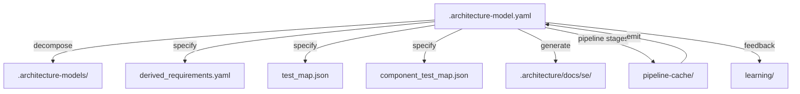

# Artifact Traceability Map: architecture-model-standard

## 1. Entity Inventory

| Entity Type | Count | Feeds SE Documents |
|-------------|-------|--------------------|
| Components | 29 | Logical Architecture, Maintenance Manual, Operations Manual, Interface Specification |
| Capabilities | 15 | ConOps, Functional Analysis, Requirements Analysis |
| Behaviors | 7 | Use Cases, Functional Analysis, Verification & Validation |
| Interfaces | 43 | Interface Specification, Logical Architecture |
| Constraints | 2 | Requirements Analysis, Risk Assessment |
| Requirements | 45 | Requirements Analysis, Verification & Validation |
| Actors | 3 | ConOps, Use Cases |
| Layers | 0 | Logical Architecture |

## 2. Artifact Dependency Graph

## 3. Entity-to-Artifact Traceability Matrix

| Artifact | Components | Capabilities | Behaviors | Interfaces | Constraints | Requirements | Actors | Layers |
|---|---|---|---|---|---|---|---|---|
| ConOps | | **15** | | | | | **3** | |
| Functional Analysis | | **15** | **7** | | | | | |
| Interface Specification | **29** | | | **43** | | | | |
| Logical Architecture | **29** | | | **43** | | | | — |
| Maintenance Manual | **29** | | | | | | | |
| Operations Manual | **29** | | | | | | | |
| Requirements Analysis | | **15** | | | **2** | **45** | | |
| Risk Assessment | | | | | **2** | | | |
| Use Cases | | | **7** | | | | **3** | |
| Verification & Validation | | | **7** | | | **45** | | |

## 4. Relationship Distribution

| Relationship Type | Count | Connects |
|-------------------|-------|----------|
| satisfies | 49 | Component → Requirement |
| exposes | 43 | Component → Interface |
| depends-on | 26 | Component → Component |
| contains | 18 | Component → Component |
| realizes | 15 | Component → Capability |

## 5. Traceability Gaps

- **Layers** — 0 entities; leaves gaps in: Logical Architecture
- **allocated-to** relationship type missing — weakens cross-entity traceability
- **constrained-by** relationship type missing — weakens cross-entity traceability

### Semantic Completeness Gaps

**Interfaces without contract:** 43
- IF-1: main CLI — missing contract (pre/post/invariant)
- IF-2: runner CLI — missing contract (pre/post/invariant)
- IF-3: COMP-4-7 Library API — missing contract (pre/post/invariant)
- IF-4: COMP-3-1 Library API — missing contract (pre/post/invariant)
- IF-5: COMP-4-1 Library API — missing contract (pre/post/invariant)
- IF-6: COMP-4-2 Library API — missing contract (pre/post/invariant)
- IF-7: COMP-4-3 Library API — missing contract (pre/post/invariant)
- IF-8: COMP-4-4 Library API — missing contract (pre/post/invariant)
- IF-9: COMP-4-5 Library API — missing contract (pre/post/invariant)
- IF-10: COMP-4-6 Library API — missing contract (pre/post/invariant)
- IF-11: COMP-4-8 Library API — missing contract (pre/post/invariant)
- IF-12: COMP-4-9 Library API — missing contract (pre/post/invariant)
- IF-13: COMP-4-10 Library API — missing contract (pre/post/invariant)
- IF-14: COMP-4-11 Library API — missing contract (pre/post/invariant)
- IF-15: COMP-4-12 Library API — missing contract (pre/post/invariant)
- IF-16: COMP-4-13 Library API — missing contract (pre/post/invariant)
- IF-auto-COMP-1: Core API — missing contract (pre/post/invariant)
- IF-auto-COMP-1.1: Type System API — missing contract (pre/post/invariant)
- IF-auto-COMP-1.2: Validation API — missing contract (pre/post/invariant)
- IF-auto-COMP-1.3: Parser & Persistence API — missing contract (pre/post/invariant)
- IF-auto-COMP-1.4: Model Operations API — missing contract (pre/post/invariant)
- IF-auto-COMP-1.5: Quality Metrics API — missing contract (pre/post/invariant)
- IF-auto-COMP-2: Pipeline API — missing contract (pre/post/invariant)
- IF-auto-COMP-2.1: Pipeline Coordination API — missing contract (pre/post/invariant)
- IF-auto-COMP-2.2: Observation Stages API — missing contract (pre/post/invariant)
- IF-auto-COMP-2.3: Allocation & Relation Stages API — missing contract (pre/post/invariant)
- IF-auto-COMP-2.4: Specification & Contract Stages API — missing contract (pre/post/invariant)
- IF-auto-COMP-2.5: Synthesis & Emit Stages API — missing contract (pre/post/invariant)
- IF-auto-COMP-3.1: Scanners API — missing contract (pre/post/invariant)
- IF-auto-COMP-3.2: Graph & Analysis API — missing contract (pre/post/invariant)
- IF-auto-COMP-3.3: Grouping & Generation API — missing contract (pre/post/invariant)
- IF-auto-COMP-4.1: Core Doc Generators API — missing contract (pre/post/invariant)
- IF-auto-COMP-4.2: SE Document Suite API — missing contract (pre/post/invariant)
- IF-auto-COMP-5: Orchestration API — missing contract (pre/post/invariant)
- IF-auto-COMP-5.1: Enrichment API — missing contract (pre/post/invariant)
- IF-auto-COMP-5.2: Decomposition API — missing contract (pre/post/invariant)
- IF-auto-COMP-6: Extract API — missing contract (pre/post/invariant)
- IF-auto-COMP-7: Authoring API — missing contract (pre/post/invariant)
- IF-auto-COMP-8: CLI API — missing contract (pre/post/invariant)
- IF-auto-COMP-9: Configuration API — missing contract (pre/post/invariant)
- IF-auto-COMP-10: Export API — missing contract (pre/post/invariant)
- IF-auto-COMP-11: Pipeline Learning API — missing contract (pre/post/invariant)
- IF-auto-COMP-12: Utilities API — missing contract (pre/post/invariant)

**Entities without intent:** 18
- COMP-1.1: Type System (component)
- COMP-1.2: Validation (component)
- COMP-1.3: Parser & Persistence (component)
- COMP-1.4: Model Operations (component)
- COMP-1.5: Quality Metrics (component)
- COMP-2.1: Pipeline Coordination (component)
- COMP-2.2: Observation Stages (component)
- COMP-2.3: Allocation & Relation Stages (component)
- COMP-2.4: Specification & Contract Stages (component)
- COMP-2.5: Synthesis & Emit Stages (component)
- COMP-3.1: Scanners (component)
- COMP-3.2: Graph & Analysis (component)
- COMP-3.3: Grouping & Generation (component)
- COMP-4.1: Core Doc Generators (component)
- COMP-4.2: SE Document Suite (component)
- COMP-5.1: Enrichment (component)
- COMP-5.2: Decomposition (component)
- COMP-11: Pipeline Learning (component)

## 6. Architecture File Map

| Path | Purpose | Generated By |
|------|---------|-------------|
| `.architecture-model.yaml` | Canonical architecture model (source of truth) | Pipeline emit stage |
| `.architecture-models/` | Per-system sub-models from decomposition | Pipeline decompose stage |
| `.architecture/` | Root directory for all architecture artifacts | Pipeline |
| `.architecture/derived_requirements.yaml` | Requirements derived from model analysis | Pipeline specify stage |
| `.architecture/test_map.json` | Mapping of components to test files | Pipeline specify stage |
| `.architecture/component_test_map.json` | Component-level test coverage map | Pipeline specify stage |
| `.architecture/pipeline-cache/` | Cached intermediate pipeline stage results | Pipeline (all stages) |
| `.architecture/docs/se/` | Generated SE documents | SE doc generator |
| `.architecture/learning/` | Accumulated heuristics and learnings | Learning subsystem |

## LLM Review Status

No LLM reviews available.

## LLM Enrichment Provenance

No LLM enrichment records available.

## Review Details

No review details available.
