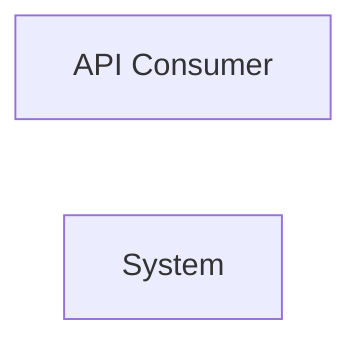

> **Model Completeness: F (14%)**
> Some sections may be empty due to missing model entities.
> - No interfaces defined on components → interface-spec doc empty
> - No requirements defined
> - Actors defined but missing goals/descriptions
> - 92/92 components missing description/responsibilities
> Run the extraction pipeline or manually add behaviors/interfaces/constraints.

# Concept of Operations: System
## System Overview
System provides 6 capabilities implemented across 92 components.

**Core Capabilities:**

- **HTTP Route Definitions**
- **gRPC Services**
- **Build Configuration Scripts**
- **Package Group Management**
- **Command Line Interface Entry Point**
- **Command Line Executor**
## Stakeholders
| Actor | Type | Goals |
|-------|------|-------|
| API Consumer | human | — |
## Operational Scenarios
### System Workflows

- **GET **: —
- **GET bookmarklets/**: —
- **GET tags/**: —
- **GET filters/**: —
- **GET views/**: —
- **GET views/<view>/**: —
- **GET models/**: —
- **GET ^models/(?P<app_label>[^.]+)\.(?P<model_name>[^/]+)/$**: —
- **GET templates/<path:template>/**: —
- **GET login/**: —
- **GET logout/**: —
- **GET password_change/**: —
- **GET password_change/done/**: —
- **GET password_reset/**: —
- **GET password_reset/done/**: —
- **GET reset/<uidb64>/<token>/**: —
- **GET reset/done/**: —
- **GET <path:url>**: —
- **CLI: Test Guided Round Trip**: —
- **CLI: Test Enriched Round Trip**: —
- *...and 5 more workflows*
## System Context
### External Interfaces

| Interface | Type | Provider | Consumer |
|-----------|------|----------|----------|
| runner CLI | internal | — | — |


## Operational Constraints
*No constraints defined in the model.*

---

---

## LLM Review

*Reviewed: 2026-08-18T23:36:54.951635+00:00 | Duration: 6874ms*

**Summary:** This ConOps is essentially empty scaffolding—14% complete with no meaningful descriptions, no requirements, no interface details, and no scenario descriptions filled in. It provides almost no architectural value in its current state.

- The 92 components all lack descriptions and responsibilities, making it impossible to understand system decomposition or rationale.
- Operational scenarios list URL routes and CLI commands with no descriptions, offering no insight into user workflows or expected system behavior.
- The system context diagram shows a single actor with no connections to the system, indicating missing interaction modeling.

<details>
<summary>Review details</summary>

**Prompt sent (truncated):**
```
Review the following architecture artifact 'docs/se/conops.md'.
Respond ONLY in this format:
SUMMARY: <one paragraph overall assessment>
COMMENT: <specific observation>
COMMENT: <another observation>

---
---
document: ConOps
system: System
system_id: SYS-unknown
generated_at: 2026-08-18T23:36:29Z
generator_version: 0.3.0
model_hash: 41fb0d4bec16
edition: 7
---

> **Model Completeness: F (14%)**
> Some sections may be empty due to missing model entities.
> - No interfaces defined on components →
```

**Full LLM response:**
```
SUMMARY: This ConOps is essentially empty scaffolding—14% complete with no meaningful descriptions, no requirements, no interface details, and no scenario descriptions filled in. It provides almost no architectural value in its current state.
COMMENT: The 92 components all lack descriptions and responsibilities, making it impossible to understand system decomposition or rationale.
COMMENT: Operational scenarios list URL routes and CLI commands with no descriptions, offering no insight into user workflows or expected system behavior.
COMMENT: The system context diagram shows a single actor with no connections to the system, indicating missing interaction modeling.
```

</details>
