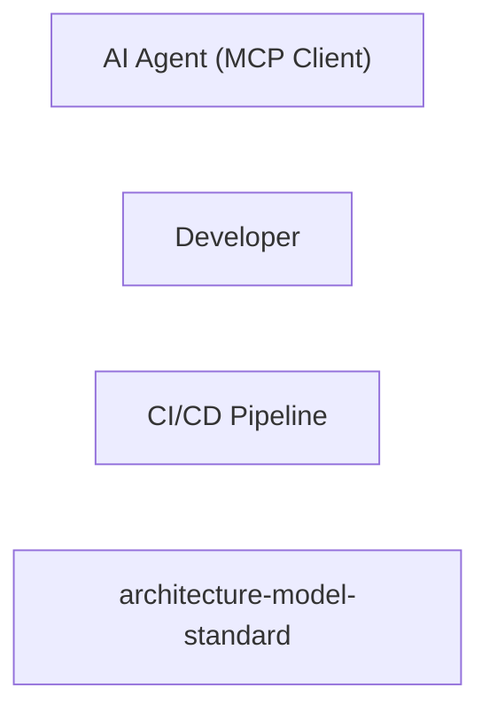

# Concept of Operations: architecture-model-standard

## System Overview

architecture-model-standard provides 15 capabilities implemented across 29 components.

**Core Capabilities:**

- **Validate Architecture Models** - Check model correctness, completeness, hierarchy consistency, and domain rules
  - *Intent:* Ensure architecture models are structurally sound and internally consistent before downstream consumption
  - *Measures of Effectiveness:*
    - Validation score >= 80 on well-formed models
    - Zero false-positive errors on valid models
    - All referential integrity violations detected
- **Extract Architecture from Code** - Scan source code AST and derive components, relationships, behaviors automatically
  - *Intent:* Bootstrap architecture models from existing codebases without manual authoring
  - *Measures of Effectiveness:*
    - Extraction produces valid models scoring >= 90 on arbitrary Python repos
    - All non-trivial source files represented in the model
    - Relationship types correctly inferred from import analysis
- **Run Modular Extraction Pipeline** - Execute 10-stage pipeline (observe→infer→allocate→relate→specify→contract→validate→decompose→synthesize→emit)
  - *Intent:* Provide a repeatable, cacheable, stage-by-stage process for producing architecture models from code
  - *Measures of Effectiveness:*
    - All 10 stages complete without error on repos with >200 files
    - Each stage independently runnable with cached predecessors
    - Deterministic output for identical input
- **Generate Reality Manifest** - Scan source files to produce structural facts (functions, imports, classes, routes, tests)
  - *Intent:* Establish ground-truth code inventory so architecture claims can be verified against reality
  - *Measures of Effectiveness:*
    - All non-trivial Python files scanned with function/class extraction
    - Import edges resolved with >95% accuracy
    - Manifest generation completes in <10s for repos with 200 files
- **Generate SE Documentation** - Produce functional analysis, logical architecture, use cases, requirements, V&V, operations docs
  - *Intent:* Auto-generate standards-compliant systems engineering documentation from architecture models
  - *Measures of Effectiveness:*
    - Generate at least 15 SE document types from a single model
    - Core docs (health, functional-analysis) regenerate in <1s without LLM
    - User-edited sections preserved across regeneration
- **Author Model from Requirements** - Parse requirements document into a concept-phase architecture model
  - *Intent:* Enable forward-engineering by converting stakeholder requirements into architecture before code exists
  - *Measures of Effectiveness:*
    - Parse markdown requirements into valid ArchitectureModel
    - Actors, capabilities, and constraints correctly extracted
    - Generated model passes validation with score >= 80
- **Slice and Query Models** - Filter model by block, layer, status, artifact for focused context delivery
  - *Intent:* Deliver only relevant architecture context to token-limited AI agents and focused human queries
  - *Measures of Effectiveness:*
    - Sliced output fits within 4000-token budget
    - Slice preserves all relationships touching included entities
    - Query response time <100ms for any slice operation
- **Diff Model Versions** - Compare two model versions showing additions, removals, and changes
  - *Intent:* Track architectural evolution over time and detect unintended structural changes
  - *Measures of Effectiveness:*
    - All added, removed, and changed entities detected
    - Diff output human-readable and machine-parseable
    - Diff completes in <1s for models with 100+ entities
- **Decompose Models Hierarchically** - Break coarse models into per-system sub-models with parent/child relationships
  - *Intent:* Enable scalable architecture management by splitting large models into focused, self-contained subsystems
  - *Measures of Effectiveness:*
    - Components with >=5 files produce autonomous sub-models
    - Each sub-model is independently valid
    - Parent model correctly references all child systems
- **Enrich Models with Code Intelligence** - Auto-populate signatures, constants, test contracts, behaviors from source
  - *Intent:* Bridge the gap between abstract architecture and concrete code to enable faithful code regeneration
  - *Measures of Effectiveness:*
    - Signatures populated for >90% of public functions
    - Body hints cover trivial functions (one-liners)
    - Test contracts extracted for all test files with assertions
- **Assess Regen Readiness** - Score how well a model captures enough detail to regenerate code
  - *Intent:* Quantify whether a model contains sufficient information for an AI agent to regenerate working code
  - *Measures of Effectiveness:*
    - Regen score correlates with actual test pass rate (r > 0.8)
    - Per-component scores with actionable blocker list
    - Grade scale (A-F) matches blind regeneration fidelity
- **Check Development Gate** - Verify code reality is tracking toward authored architecture intent
  - *Intent:* Prevent architectural drift by gating development milestones on model-to-code alignment
  - *Measures of Effectiveness:*
    - Gate check reports coverage percentage of authored capabilities
    - Unimplemented capabilities clearly flagged
    - Gate result includes pass/fail with actionable gaps
- **Detect and Fix Model Drift** - Compare model against current code, report coverage gaps
  - *Intent:* Keep architecture models synchronized with evolving codebases by detecting and reporting divergence
  - *Measures of Effectiveness:*
    - File coverage reported as percentage of source files modeled
    - Orphan components (no matching files) detected
    - Drift report generated in <5s
- **Manage Global Learnings** - Store, retrieve, and apply heuristics/archetypes/workflows across pipeline runs
  - *Intent:* Improve pipeline accuracy over time by accumulating and reusing extraction patterns
  - *Measures of Effectiveness:*
    - Learnings persisted across pipeline runs
    - Pattern lookup returns relevant heuristics in <100ms
    - Duplicate learnings deduplicated by content hash
- **Export for AI Consumption** - Produce flat-file exports optimized for token-limited AI environments
  - *Intent:* Make architecture models portable and consumable by AI agents that cannot access the repository directly
  - *Measures of Effectiveness:*
    - Export includes model, sub-models, docs, manifests, and diagrams
    - Exported package is self-contained (no external dependencies)
    - Total export size fits within reasonable token budgets for frontier models

## Stakeholders

| Actor | Type | Goals |
|-------|------|-------|
| AI Agent (MCP Client) | human | Load and query architecture models; Validate model correctness; Propose model updates; Trace change impact |

*AI Agent (MCP Client) Intent:* Consume compressed architecture context to generate, validate, and update models

| Developer | human | Define system architecture; Validate models against code; Generate documentation; Track architectural drift |

*Developer Intent:* Author and maintain architecture models for software projects

| CI/CD Pipeline | human | Run validation checks on PRs; Generate architecture docs; Detect model drift |

*CI/CD Pipeline Intent:* Automate architecture validation and documentation generation in pipelines

## Operational Scenarios

### System Workflows

- **CLI: Test Guided Round Trip**: ArgumentParser -> add_argument -> parse_args -> run -> run_test_guided
- **CLI: Test Enriched Round Trip**: ArgumentParser -> add_argument -> parse_args -> list -> len
- **CLI: Test Multi Repo**: ArgumentParser -> add_argument -> parse_args -> print -> mkdir
- **CLI: Test Round Trip**: ArgumentParser -> add_argument -> parse_args -> print -> load_training_examples
- **CLI: Test Decomposed Round Trip**: ArgumentParser -> add_argument -> parse_args -> list -> len
- **CLI: Main**: ArgumentParser -> add_subparsers -> add_parser -> add_argument -> parse_args
- **CLI: Runner**: ArgumentParser -> add_argument -> parse_args -> run_benchmark

## System Context

### External Interfaces

| Interface | Type | Provider | Consumer |
|-----------|------|----------|----------|
| main CLI | internal | — | — |
| runner CLI | internal | — | — |
| COMP-4-7 Library API | internal | — | — |
| COMP-3-1 Library API | internal | — | — |
| COMP-4-1 Library API | internal | — | — |
| COMP-4-2 Library API | internal | — | — |
| COMP-4-3 Library API | internal | — | — |
| COMP-4-4 Library API | internal | — | — |
| COMP-4-5 Library API | internal | — | — |
| COMP-4-6 Library API | internal | — | — |
| COMP-4-8 Library API | internal | — | — |
| COMP-4-9 Library API | internal | — | — |
| COMP-4-10 Library API | internal | — | — |
| COMP-4-11 Library API | internal | — | — |
| COMP-4-12 Library API | internal | — | — |
| COMP-4-13 Library API | internal | — | — |
| Core API | internal | — | — |
| Type System API | internal | — | — |
| Validation API | internal | — | — |
| Parser & Persistence API | internal | — | — |
| Model Operations API | internal | — | — |
| Quality Metrics API | internal | — | — |
| Pipeline API | internal | — | — |
| Pipeline Coordination API | internal | — | — |
| Observation Stages API | internal | — | — |
| Allocation & Relation Stages API | internal | — | — |
| Specification & Contract Stages API | internal | — | — |
| Synthesis & Emit Stages API | internal | — | — |
| Scanners API | internal | — | — |
| Graph & Analysis API | internal | — | — |
| Grouping & Generation API | internal | — | — |
| Core Doc Generators API | internal | — | — |
| SE Document Suite API | internal | — | — |
| Orchestration API | internal | — | — |
| Enrichment API | internal | — | — |
| Decomposition API | internal | — | — |
| Extract API | internal | — | — |
| Authoring API | internal | — | — |
| CLI API | internal | — | — |
| Configuration API | internal | — | — |
| Export API | internal | — | — |
| Pipeline Learning API | internal | — | — |
| Utilities API | internal | — | — |

## Degraded Operations & Failure Modes

### Core
- Type system changes break downstream parsers and MCP tools
- Validation false positives block valid models from progressing
- Parser loses data on round-trip due to YAML serialization edge cases

### Pipeline
- Cache staleness causes pipeline to emit outdated models
- Stage failure cascades prevent partial results from being usable
- Uncertainty accumulation across stages produces low-confidence models

### Manifest
- Dynamic imports or metaprogramming invisible to AST scanning
- Import resolution fails on namespace packages or conditional imports
- Grouping algorithm produces incoherent component boundaries

### Documentation
- Generated docs become stale if not regenerated after model changes
- User edits lost on regeneration if preservation logic fails
- Diagram complexity makes large systems unreadable

### Orchestration
- Enrichment overwrites manually curated model data
- Decomposition creates too many tiny sub-models that fragment context
- Behavior inference produces spurious flows from coincidental call patterns

### Extract
- Framework-specific extractors miss custom or unconventional patterns
- Artifact parser misinterprets markdown table structure
- Constraint detection produces false positives from comments or dead code

### Authoring
- Requirements parser misinterprets ambiguous natural language
- Gate check produces false failures due to naming mismatches
- Authored model diverges from implementation reality over time

### CLI
- CLI argument parsing errors give unhelpful messages
- Command fails silently instead of returning non-zero exit code
- Breaking CLI changes disrupt MCP server wrappers

### Configuration
- Auto-discovery misidentifies project root or source directories
- Profile loading fails silently and falls back to wrong defaults
- Schema definition conflicts with validator implementation

### Export
- Export produces files too large for target AI context window
- Missing sub-models or manifests make export incomplete
- File path references in export break when moved to different location

### Utilities
- Utility changes silently break multiple dependent subsystems
- Monitoring hooks add latency to critical-path operations
- Exclusion patterns miss new file types or directory conventions

## Operational Constraints

### Technology & Regulatory

- **Python >=3.11** [technology]
- **CI/CD: GitHub Actions** [technology]
