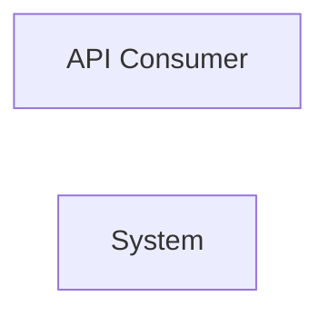

> **Model Completeness: F (14%)**
> Some sections may be empty due to missing model entities.
> - No interfaces defined on components → interface-spec doc empty
> - No requirements defined
> - Actors defined but missing goals/descriptions
> - 92/92 components missing description/responsibilities
> Run the extraction pipeline or manually add behaviors/interfaces/constraints.

# Concept of Operations: System

## System Overview

System provides 6 capabilities implemented across 92 components.

**Core Capabilities:**

- **HTTP Route Definitions**
- **gRPC Services**
- **Package Group Management**
- **Package Group Management**
- **Command Line Interface Handler**
- **Command Line Executor**

## Stakeholders

| Actor | Type | Goals |
|-------|------|-------|
| API Consumer | human | — |

## Operational Scenarios

### System Workflows

- **GET **: —
- **GET bookmarklets/**: —
- **GET tags/**: —
- **GET filters/**: —
- **GET views/**: —
- **GET views/<view>/**: —
- **GET models/**: —
- **GET ^models/(?P<app_label>[^.]+)\.(?P<model_name>[^/]+)/$**: —
- **GET templates/<path:template>/**: —
- **GET login/**: —
- **GET logout/**: —
- **GET password_change/**: —
- **GET password_change/done/**: —
- **GET password_reset/**: —
- **GET password_reset/done/**: —
- **GET reset/<uidb64>/<token>/**: —
- **GET reset/done/**: —
- **GET <path:url>**: —
- **CLI: Test Guided Round Trip**: —
- **CLI: Test Enriched Round Trip**: —
- *...and 5 more workflows*

## System Context

### External Interfaces

| Interface | Type | Provider | Consumer |
|-----------|------|----------|----------|
| runner CLI | internal | — | — |

## Operational Constraints

*No constraints defined in the model.*
