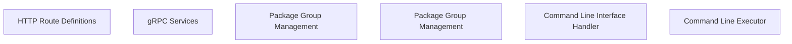

> **Model Completeness: F (14%)**
> Some sections may be empty due to missing model entities.
> - No interfaces defined on components → interface-spec doc empty
> - No requirements defined
> - Actors defined but missing goals/descriptions
> - 92/92 components missing description/responsibilities
> Run the extraction pipeline or manually add behaviors/interfaces/constraints.

# Functional Analysis: System

## Capability Inventory

| ID | Capability | Priority | Status | Description |
|----|-----------|----------|--------|-------------|
| CAP-1 | HTTP Route Definitions | medium | ACTIVE | — |
| CAP-2 | gRPC Services | medium | ACTIVE | — |
| CAP-3 | Package Group Management | medium | ACTIVE | — |
| CAP-4 | Package Group Management | medium | ACTIVE | — |
| CAP-5 | Command Line Interface Handler | medium | ACTIVE | — |
| CAP-6 | Command Line Executor | medium | ACTIVE | — |

## Functional Decomposition

## Capability-Component Mapping

| Capability | Realized By | Component Kind |
|-----------|------------|----------------|
| HTTP Route Definitions | *unrealized* | — |
| gRPC Services | *unrealized* | — |
| Command Line Interface Handler | *unrealized* | — |
| Command Line Executor | *unrealized* | — |

## Behavioral Coverage

Total behaviors: 25

**Untraced behaviors:** 25
- GET  (BEH-1)
- GET bookmarklets/ (BEH-2)
- GET tags/ (BEH-3)
- GET filters/ (BEH-4)
- GET views/ (BEH-5)
- GET views/<view>/ (BEH-6)
- GET models/ (BEH-7)
- GET ^models/(?P<app_label>[^.]+)\.(?P<model_name>[^/]+)/$ (BEH-8)
- GET templates/<path:template>/ (BEH-9)
- GET login/ (BEH-10)
- *...and 15 more*
