# Functional Analysis: architecture-model-standard
## Capability Inventory
| ID | Capability | Priority | Status | Description |
|----|-----------|----------|--------|-------------|
| CAP-1 | Validate Architecture Models | medium | ACTIVE | Check model correctness, completeness, hierarchy consistency, and domain rules |
| CAP-2 | Extract Architecture from Code | medium | ACTIVE | Scan source code AST and derive components, relationships, behaviors automatically |
| CAP-3 | Run Modular Extraction Pipeline | medium | ACTIVE | Execute 10-stage pipeline (observe→infer→allocate→relate→specify→contract→validate→decompose→synthesize→emit) |
| CAP-4 | Generate Reality Manifest | medium | ACTIVE | Scan source files to produce structural facts (functions, imports, classes, routes, tests) |
| CAP-5 | Generate SE Documentation | medium | ACTIVE | Produce functional analysis, logical architecture, use cases, requirements, V&V, operations docs |
| CAP-6 | Author Model from Requirements | medium | ACTIVE | Parse requirements document into a concept-phase architecture model |
| CAP-7 | Slice and Query Models | medium | ACTIVE | Filter model by block, layer, status, artifact for focused context delivery |
| CAP-8 | Diff Model Versions | medium | ACTIVE | Compare two model versions showing additions, removals, and changes |
| CAP-9 | Decompose Models Hierarchically | medium | ACTIVE | Break coarse models into per-system sub-models with parent/child relationships |
| CAP-10 | Enrich Models with Code Intelligence | medium | ACTIVE | Auto-populate signatures, constants, test contracts, behaviors from source |
| CAP-11 | Assess Regen Readiness | medium | ACTIVE | Score how well a model captures enough detail to regenerate code |
| CAP-12 | Check Development Gate | medium | ACTIVE | Verify code reality is tracking toward authored architecture intent |
| CAP-13 | Detect and Fix Model Drift | medium | ACTIVE | Compare model against current code, report coverage gaps |
| CAP-14 | Manage Global Learnings | medium | ACTIVE | Store, retrieve, and apply heuristics/archetypes/workflows across pipeline runs |
| CAP-15 | Export for AI Consumption | medium | ACTIVE | Produce flat-file exports optimized for token-limited AI environments |
## Functional Decomposition

```mermaid
graph TD
    CAP-1["Validate Architecture Models"]
    CAP-2["Extract Architecture from Code"]
    CAP-3["Run Modular Extraction Pipeline"]
    CAP-4["Generate Reality Manifest"]
    CAP-5["Generate SE Documentation"]
    CAP-6["Author Model from Requirements"]
    CAP-7["Slice and Query Models"]
    CAP-8["Diff Model Versions"]
    CAP-9["Decompose Models Hierarchically"]
    CAP-10["Enrich Models with Code Intelligence"]
    CAP-11["Assess Regen Readiness"]
    CAP-12["Check Development Gate"]
    CAP-13["Detect and Fix Model Drift"]
    CAP-14["Manage Global Learnings"]
    CAP-15["Export for AI Consumption"]
```

## Capability-Component Mapping
| Capability | Realized By | Component Kind |
|-----------|------------|----------------|
| Validate Architecture Models | Validation (COMP-1.2) | library |
| Extract Architecture from Code | Extract (COMP-6) | library |
| Run Modular Extraction Pipeline | Pipeline (COMP-2) | service |
| Generate Reality Manifest | Manifest (COMP-3) | library |
| Generate SE Documentation | SE Document Suite (COMP-4.2) | library |
| Author Model from Requirements | Authoring (COMP-7) | library |
| Slice and Query Models | Model Operations (COMP-1.4) | library |
| Diff Model Versions | Model Operations (COMP-1.4) | library |
| Decompose Models Hierarchically | Decomposition (COMP-5.2) | service |
| Enrich Models with Code Intelligence | Enrichment (COMP-5.1) | service |
| Assess Regen Readiness | Quality Metrics (COMP-1.5) | library |
| Check Development Gate | Authoring (COMP-7) | library |
| Detect and Fix Model Drift | Model Operations (COMP-1.4) | library |
| Manage Global Learnings | Pipeline Learning (COMP-11) | library |
| Export for AI Consumption | Export (COMP-10) | library |
## Behavioral Coverage
Total behaviors: 25

**Untraced behaviors:** 25
- GET  (BEH-1)
- GET bookmarklets/ (BEH-2)
- GET tags/ (BEH-3)
- GET filters/ (BEH-4)
- GET views/ (BEH-5)
- GET views/<view>/ (BEH-6)
- GET models/ (BEH-7)
- GET ^models/(?P<app_label>[^.]+)\.(?P<model_name>[^/]+)/$ (BEH-8)
- GET templates/<path:template>/ (BEH-9)
- GET login/ (BEH-10)
- *...and 15 more*

---

---