# Logical Architecture: architecture-model-standard

## Layer Structure

*No layers defined.*

## Component Allocation

### application

| Component | Kind | Files | Responsibilities |
|-----------|------|-------|------------------|
| Documentation (COMP-4) | library | 1 files | — |

*Intent:* Generate human-readable and AI-consumable architecture documentation from models automatically

*Trade-offs:*
- Template-based generation (fast, consistent) vs. LLM-generated prose (richer)
- Document completeness vs. generation speed
- Preserving user edits vs. full regeneration freshness

| Core Doc Generators (COMP-4.1) | library | 11 files | — |
| SE Document Suite (COMP-4.2) | library | 21 files | — |
| Orchestration (COMP-5) | service | 1 files | — |

*Intent:* Compose lower-level operations into complete workflows that transform models end-to-end

*Trade-offs:*
- Automated enrichment (convenient) vs. manual curation (precise)
- Aggressive decomposition vs. keeping small systems inline
- Behavior cap (40 per component) vs. complete behavioral coverage

| Enrichment (COMP-5.1) | service | 7 files | — |
| Decomposition (COMP-5.2) | service | 6 files | — |
| Authoring (COMP-7) | library | 3 files | — |

*Intent:* Enable architecture-first development by creating models before code and gating progress against them

*Trade-offs:*
- Structured parsing (reliable) vs. LLM-based understanding (flexible)
- Strict gate enforcement vs. advisory-only feedback
- Requirements granularity vs. model abstraction level

| Export (COMP-10) | library | 3 files | — |

*Intent:* Package architecture models into portable, self-contained bundles for token-limited AI environments

*Trade-offs:*
- Complete export (large) vs. minimal export (fits token budgets)
- Directory-based export vs. single archive (support both)
- Including all artifacts vs. selective export based on use case

### domain

| Component | Kind | Files | Responsibilities |
|-----------|------|-------|------------------|
| Pipeline (COMP-2) | service | 1 files | — |

*Intent:* Automate the entire code-to-model extraction process as a repeatable, cacheable pipeline

*Trade-offs:*
- Stage granularity (10 stages) vs. simpler monolithic extraction
- Cache correctness vs. cache invalidation complexity
- Determinism vs. allowing LLM enrichment between stages

| Pipeline Coordination (COMP-2.1) | service | 7 files | — |
| Observation Stages (COMP-2.2) | service | 4 files | — |
| Allocation & Relation Stages (COMP-2.3) | service | 4 files | — |
| Specification & Contract Stages (COMP-2.4) | service | 6 files | — |
| Synthesis & Emit Stages (COMP-2.5) | service | 7 files | — |
| Manifest (COMP-3) | library | 2 files | — |

*Intent:* Produce ground-truth code inventories via AST scanning so architecture claims can be verified

*Trade-offs:*
- AST-only analysis (fast, deterministic) vs. runtime analysis (more accurate)
- Language-specific scanners vs. universal parsing (chose per-language for accuracy)
- Scan depth vs. performance on large repos

| Scanners (COMP-3.1) | library | 8 files | — |
| Graph & Analysis (COMP-3.2) | library | 5 files | — |
| Grouping & Generation (COMP-3.3) | library | 6 files | — |
| Extract (COMP-6) | library | 5 files | — |

*Intent:* Convert raw code artifacts into structured architecture model entities

*Trade-offs:*
- Framework-specific detection (accurate) vs. generic heuristics (portable)
- Extracting from code vs. from documentation (chose both with priority on code)
- Precision vs. recall in constraint detection

| Pipeline Learning (COMP-11) | library | 3 files | — |

### foundation

| Component | Kind | Files | Responsibilities |
|-----------|------|-------|------------------|
| Core (COMP-1) | library | 1 files | — |

*Intent:* Provide the canonical type system and fundamental operations that all other subsystems depend on

*Trade-offs:*
- Rich type system vs. schema simplicity for external consumers
- Strict validation vs. permissive parsing for backward compatibility
- Monolithic core vs. fine-grained packages (chose monolithic for import simplicity)

| Type System (COMP-1.1) | library | 1 files | — |
| Validation (COMP-1.2) | library | 2 files | — |
| Parser & Persistence (COMP-1.3) | library | 5 files | — |
| Model Operations (COMP-1.4) | library | 8 files | — |
| Quality Metrics (COMP-1.5) | library | 5 files | — |

### infrastructure

| Component | Kind | Files | Responsibilities |
|-----------|------|-------|------------------|
| Configuration (COMP-9) | library | 6 files | — |

*Intent:* Provide discoverable, zero-config project settings with extensibility via domain profiles

*Trade-offs:*
- Convention-over-configuration (easy start) vs. explicit config (predictable)
- Built-in profiles vs. user-defined profiles (support both)
- Schema strictness vs. forward compatibility with new fields

| Utilities (COMP-12) | library | 6 files | — |

*Intent:* Provide cross-cutting utilities that prevent duplication across subsystems

*Trade-offs:*
- Shared utilities (DRY) vs. subsystem autonomy (decoupled)
- Monitoring overhead vs. operational visibility
- General-purpose utilities vs. domain-specific helpers

### interface

| Component | Kind | Files | Responsibilities |
|-----------|------|-------|------------------|
| CLI (COMP-8) | service | 5 files | — |

*Intent:* Expose all architecture operations as CLI commands for developers and CI/CD pipelines

*Trade-offs:*
- Single monolithic CLI vs. per-subsystem CLIs (chose monolithic for discoverability)
- Rich interactive output vs. machine-parseable output (support both via flags)
- Exposing all operations vs. curating a minimal command set

## Inter-Component Interfaces

| Interface | Type | Protocol | Provider | Consumer |
|-----------|------|----------|----------|----------|
| main CLI | internal | — | — | — |
| runner CLI | internal | — | — | — |
| COMP-4-7 Library API | internal | — | — | — |
| COMP-3-1 Library API | internal | — | — | — |
| COMP-4-1 Library API | internal | — | — | — |
| COMP-4-2 Library API | internal | — | — | — |
| COMP-4-3 Library API | internal | — | — | — |
| COMP-4-4 Library API | internal | — | — | — |
| COMP-4-5 Library API | internal | — | — | — |
| COMP-4-6 Library API | internal | — | — | — |
| COMP-4-8 Library API | internal | — | — | — |
| COMP-4-9 Library API | internal | — | — | — |
| COMP-4-10 Library API | internal | — | — | — |
| COMP-4-11 Library API | internal | — | — | — |
| COMP-4-12 Library API | internal | — | — | — |
| COMP-4-13 Library API | internal | — | — | — |
| Core API | internal | — | — | — |
| Type System API | internal | — | — | — |
| Validation API | internal | — | — | — |
| Parser & Persistence API | internal | — | — | — |
| Model Operations API | internal | — | — | — |
| Quality Metrics API | internal | — | — | — |
| Pipeline API | internal | — | — | — |
| Pipeline Coordination API | internal | — | — | — |
| Observation Stages API | internal | — | — | — |
| Allocation & Relation Stages API | internal | — | — | — |
| Specification & Contract Stages API | internal | — | — | — |
| Synthesis & Emit Stages API | internal | — | — | — |
| Scanners API | internal | — | — | — |
| Graph & Analysis API | internal | — | — | — |
| Grouping & Generation API | internal | — | — | — |
| Core Doc Generators API | internal | — | — | — |
| SE Document Suite API | internal | — | — | — |
| Orchestration API | internal | — | — | — |
| Enrichment API | internal | — | — | — |
| Decomposition API | internal | — | — | — |
| Extract API | internal | — | — | — |
| Authoring API | internal | — | — | — |
| CLI API | internal | — | — | — |
| Configuration API | internal | — | — | — |
| Export API | internal | — | — | — |
| Pipeline Learning API | internal | — | — | — |
| Utilities API | internal | — | — | — |

## Dependency Graph

```mermaid
graph TD
    COMP-2.1["Pipeline Coordination"]
    COMP-1.1["Type System"]
    COMP-2.1 --> COMP-1.1
    COMP-2.2["Observation Stages"]
    COMP-3.1["Scanners"]
    COMP-2.2 --> COMP-3.1
    COMP-2.3["Allocation & Relation Stages"]
    COMP-2.3 --> COMP-1.1
    COMP-2.4["Specification & Contract Stages"]
    COMP-1.2["Validation"]
    COMP-2.4 --> COMP-1.2
    COMP-2.5["Synthesis & Emit Stages"]
    COMP-1.3["Parser & Persistence"]
    COMP-2.5 --> COMP-1.3
    COMP-9["Configuration"]
    COMP-3.1 --> COMP-9
    COMP-3.2["Graph & Analysis"]
    COMP-3.2 --> COMP-3.1
    COMP-3.3["Grouping & Generation"]
    COMP-3.3 --> COMP-3.2
    COMP-4.1["Core Doc Generators"]
    COMP-4.1 --> COMP-1.1
    COMP-4.2["SE Document Suite"]
    COMP-4.2 --> COMP-4.1
    COMP-5.1["Enrichment"]
    COMP-3["Manifest"]
    COMP-5.1 --> COMP-3
    COMP-5.1 --> COMP-1.1
    COMP-5.2["Decomposition"]
    COMP-1.5["Quality Metrics"]
    COMP-5.2 --> COMP-1.5
    COMP-6["Extract"]
    COMP-6 --> COMP-3.1
    COMP-6 --> COMP-9
    COMP-7["Authoring"]
    COMP-7 --> COMP-1.1
    COMP-7 --> COMP-3
    COMP-8["CLI"]
    COMP-1["Core"]
    COMP-8 --> COMP-1
    COMP-2["Pipeline"]
    COMP-8 --> COMP-2
    COMP-8 --> COMP-3
    COMP-4["Documentation"]
    COMP-8 --> COMP-4
    COMP-5["Orchestration"]
    COMP-8 --> COMP-5
    COMP-8 --> COMP-7
    COMP-10["Export"]
    COMP-10 --> COMP-1.3
    COMP-11["Pipeline Learning"]
    COMP-11 --> COMP-9
    COMP-12["Utilities"]
    COMP-12 --> COMP-9
```

