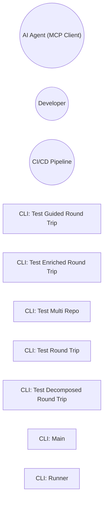

# Use Cases: architecture-model-standard

## Actor-Goal Matrix

| Actor | Goals |
|-------|-------|
| AI Agent (MCP Client) | Load and query architecture models; Validate model correctness; Propose model updates; Trace change impact |
| Developer | Define system architecture; Validate models against code; Generate documentation; Track architectural drift |
| CI/CD Pipeline | Run validation checks on PRs; Generate architecture docs; Detect model drift |

## Use Case Specifications

### UC: CLI: Test Guided Round Trip

**ID:** BEH-19
**Main Flow:**
  1. ArgumentParser
  2. add_argument
  3. parse_args
  4. run
  5. run_test_guided

### UC: CLI: Test Enriched Round Trip

**ID:** BEH-20
**Main Flow:**
  1. ArgumentParser
  2. add_argument
  3. parse_args
  4. list
  5. len

### UC: CLI: Test Multi Repo

**ID:** BEH-21
**Main Flow:**
  1. ArgumentParser
  2. add_argument
  3. parse_args
  4. print
  5. mkdir

### UC: CLI: Test Round Trip

**ID:** BEH-22
**Main Flow:**
  1. ArgumentParser
  2. add_argument
  3. parse_args
  4. print
  5. load_training_examples

### UC: CLI: Test Decomposed Round Trip

**ID:** BEH-23
**Main Flow:**
  1. ArgumentParser
  2. add_argument
  3. parse_args
  4. list
  5. len

### UC: CLI: Main

**ID:** BEH-24
**Main Flow:**
  1. ArgumentParser
  2. add_subparsers
  3. add_parser
  4. add_argument
  5. parse_args

### UC: CLI: Runner

**ID:** BEH-25
**Main Flow:**
  1. ArgumentParser
  2. add_argument
  3. parse_args
  4. run_benchmark

## Use Case Diagram

