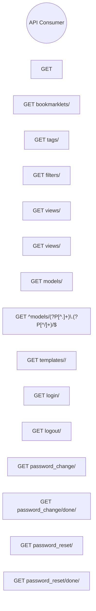

> **Model Completeness: F (14%)**
> Some sections may be empty due to missing model entities.
> - No interfaces defined on components → interface-spec doc empty
> - No requirements defined
> - Actors defined but missing goals/descriptions
> - 92/92 components missing description/responsibilities
> Run the extraction pipeline or manually add behaviors/interfaces/constraints.

# Use Cases: System
## Actor-Goal Matrix
| Actor | Goals |
|-------|-------|
| API Consumer | — |
## Use Case Specifications
### UC: GET 

**ID:** BEH-1

### UC: GET bookmarklets/

**ID:** BEH-2

### UC: GET tags/

**ID:** BEH-3

### UC: GET filters/

**ID:** BEH-4

### UC: GET views/

**ID:** BEH-5

### UC: GET views/<view>/

**ID:** BEH-6

### UC: GET models/

**ID:** BEH-7

### UC: GET ^models/(?P<app_label>[^.]+)\.(?P<model_name>[^/]+)/$

**ID:** BEH-8

### UC: GET templates/<path:template>/

**ID:** BEH-9

### UC: GET login/

**ID:** BEH-10

### UC: GET logout/

**ID:** BEH-11

### UC: GET password_change/

**ID:** BEH-12

### UC: GET password_change/done/

**ID:** BEH-13

### UC: GET password_reset/

**ID:** BEH-14

### UC: GET password_reset/done/

**ID:** BEH-15

### UC: GET reset/<uidb64>/<token>/

**ID:** BEH-16

### UC: GET reset/done/

**ID:** BEH-17

### UC: GET <path:url>

**ID:** BEH-18

### UC: CLI: Test Guided Round Trip

**ID:** BEH-19

### UC: CLI: Test Enriched Round Trip

**ID:** BEH-20
## Use Case Diagram


---

---

## LLM Review

*Reviewed: 2026-08-18T23:37:59.635738+00:00 | Duration: 7444ms*

**Summary:** This use cases document is extremely incomplete (14% model completeness) and provides no meaningful architectural value — use cases are merely auto-extracted URL endpoints with no descriptions, preconditions, postconditions, flows, or actor-goal mappings.

- The use cases are raw Django admin URL routes mechanically extracted rather than actual user-facing behaviors; they lack primary flows, alternative flows, preconditions, and postconditions that would make them useful specifications.
- The Actor-Goal Matrix lists "API Consumer" with no goals ("—"), making the actor definition pointless and indicating the extraction pipeline failed to connect behaviors to actors.
- The Mermaid diagram is truncated (only shows BEH-1 through BEH-15) and has no edges connecting the actor to any use case, rendering it non-functional.

<details>
<summary>Review details</summary>

**Prompt sent (truncated):**
```
Review the following architecture artifact 'docs/se/use-cases.md'.
Respond ONLY in this format:
SUMMARY: <one paragraph overall assessment>
COMMENT: <specific observation>
COMMENT: <another observation>

---
---
document: Use Cases
system: System
system_id: SYS-unknown
generated_at: 2026-08-18T23:36:29Z
generator_version: 0.3.0
model_hash: 41fb0d4bec16
edition: 7
---

> **Model Completeness: F (14%)**
> Some sections may be empty due to missing model entities.
> - No interfaces defined on compon
```

**Full LLM response:**
```
SUMMARY: This use cases document is extremely incomplete (14% model completeness) and provides no meaningful architectural value — use cases are merely auto-extracted URL endpoints with no descriptions, preconditions, postconditions, flows, or actor-goal mappings.

COMMENT: The use cases are raw Django admin URL routes mechanically extracted rather than actual user-facing behaviors; they lack primary flows, alternative flows, preconditions, and postconditions that would make them useful specifications.

COMMENT: The Actor-Goal Matrix lists "API Consumer" with no goals ("—"), making the actor definition pointless and indicating the extraction pipeline failed to connect behaviors to actors.

COMMENT: The Mermaid diagram is truncated (only shows BEH-1 through BEH-15) and has no edges connecting the actor to any use case, rendering it non-functional.
```

</details>
