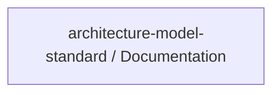

# Concept of Operations: architecture-model-standard / Documentation

## System Overview

architecture-model-standard / Documentation provides 1 capabilities implemented across 3 components.

**Core Capabilities:**

- **Generate SE Documentation** - Produce functional analysis, logical architecture, use cases, requirements, V&V, operations docs

## Stakeholders

*No actors defined in the model.*

## Operational Scenarios

*No behaviors defined in the model.*

## System Context

### External Interfaces

| Interface | Type | Provider | Consumer |
|-----------|------|----------|----------|
| main CLI | internal | — | — |
| COMP-4-7 Library API | internal | — | — |
| COMP-4-1 Library API | internal | — | — |
| COMP-4-2 Library API | internal | — | — |
| COMP-4-3 Library API | internal | — | — |
| COMP-4-4 Library API | internal | — | — |
| COMP-4-5 Library API | internal | — | — |
| COMP-4-6 Library API | internal | — | — |
| COMP-4-8 Library API | internal | — | — |
| COMP-4-9 Library API | internal | — | — |
| COMP-4-10 Library API | internal | — | — |
| COMP-4-11 Library API | internal | — | — |
| COMP-4-12 Library API | internal | — | — |
| COMP-4-13 Library API | internal | — | — |
| Core Doc Generators API | internal | — | — |
| SE Document Suite API | internal | — | — |

## Operational Constraints

*No constraints defined in the model.*

---
## Traceability

**Source entities:** `CAP-5`
**LLM Review:** — Not yet reviewed
**Generated by:** Pipeline emit stage → SE doc generator
