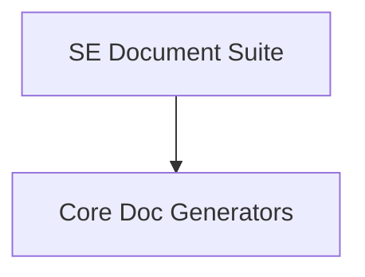

# Logical Architecture: architecture-model-standard / Documentation

## Layer Structure

*No layers defined.*

## Component Allocation

### application

| Component | Kind | Files | Responsibilities |
|-----------|------|-------|------------------|
| Documentation (COMP-4) | library | 1 files | — |
| Core Doc Generators (COMP-4.1) | library | 11 files | — |
| SE Document Suite (COMP-4.2) | library | 21 files | — |

## Inter-Component Interfaces

| Interface | Type | Protocol | Provider | Consumer |
|-----------|------|----------|----------|----------|
| main CLI | internal | — | — | — |
| COMP-4-7 Library API | internal | — | — | — |
| COMP-4-1 Library API | internal | — | — | — |
| COMP-4-2 Library API | internal | — | — | — |
| COMP-4-3 Library API | internal | — | — | — |
| COMP-4-4 Library API | internal | — | — | — |
| COMP-4-5 Library API | internal | — | — | — |
| COMP-4-6 Library API | internal | — | — | — |
| COMP-4-8 Library API | internal | — | — | — |
| COMP-4-9 Library API | internal | — | — | — |
| COMP-4-10 Library API | internal | — | — | — |
| COMP-4-11 Library API | internal | — | — | — |
| COMP-4-12 Library API | internal | — | — | — |
| COMP-4-13 Library API | internal | — | — | — |
| Core Doc Generators API | internal | — | — | — |
| SE Document Suite API | internal | — | — | — |

## Dependency Graph

---
## Traceability

**Source entities:** `COMP-4`, `COMP-4.1`, `COMP-4.2`, `IF-1`, `IF-3`, `IF-5`, `IF-6`, `IF-7`, `IF-8`, `IF-9`, `IF-10`, `IF-11`, `IF-12`, `IF-13`, `IF-14` ... (+3 more)
**LLM Review:** — Not yet reviewed
**Generated by:** Pipeline emit stage → SE doc generator
