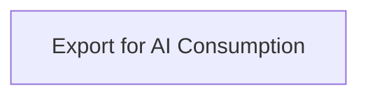

# Functional Analysis: architecture-model-standard / Export

## Capability Inventory

| ID | Capability | Priority | Status | Description |
|----|-----------|----------|--------|-------------|
| CAP-15 | Export for AI Consumption | medium | ACTIVE | Produce flat-file exports optimized for token-limited AI environments |

## Functional Decomposition

## Capability-Component Mapping

| Capability | Realized By | Component Kind |
|-----------|------------|----------------|
| Export for AI Consumption | Export (COMP-10) | library |

## Behavioral Coverage

*No behaviors defined.*

---
## Traceability

**Source entities:** `CAP-15`
**LLM Review:** — Not yet reviewed
**Generated by:** Pipeline emit stage → SE doc generator
