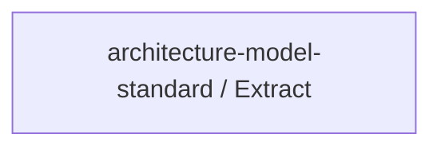

# Concept of Operations: architecture-model-standard / Extract

## System Overview

architecture-model-standard / Extract provides 1 capabilities implemented across 1 components.

**Core Capabilities:**

- **Extract Architecture from Code** - Scan source code AST and derive components, relationships, behaviors automatically

## Stakeholders

*No actors defined in the model.*

## Operational Scenarios

*No behaviors defined in the model.*

## System Context

### External Interfaces

| Interface | Type | Provider | Consumer |
|-----------|------|----------|----------|
| Extract API | internal | — | — |

## Operational Constraints

*No constraints defined in the model.*

---
## Traceability

**Source entities:** `CAP-2`
**LLM Review:** — Not yet reviewed
**Generated by:** Pipeline emit stage → SE doc generator
