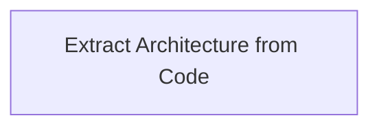

# Functional Analysis: architecture-model-standard / Extract

## Capability Inventory

| ID | Capability | Priority | Status | Description |
|----|-----------|----------|--------|-------------|
| CAP-2 | Extract Architecture from Code | medium | ACTIVE | Scan source code AST and derive components, relationships, behaviors automatically |

## Functional Decomposition

## Capability-Component Mapping

| Capability | Realized By | Component Kind |
|-----------|------------|----------------|
| Extract Architecture from Code | Extract (COMP-6) | library |

## Behavioral Coverage

*No behaviors defined.*

---
## Traceability

**Source entities:** `CAP-2`
**LLM Review:** — Not yet reviewed
**Generated by:** Pipeline emit stage → SE doc generator
