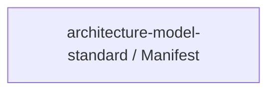

# Concept of Operations: architecture-model-standard / Manifest

## System Overview

architecture-model-standard / Manifest provides 1 capabilities implemented across 4 components.

**Core Capabilities:**

- **Generate Reality Manifest** - Scan source files to produce structural facts (functions, imports, classes, routes, tests)

## Stakeholders

*No actors defined in the model.*

## Operational Scenarios

*No behaviors defined in the model.*

## System Context

### External Interfaces

| Interface | Type | Provider | Consumer |
|-----------|------|----------|----------|
| runner CLI | internal | — | — |
| COMP-3-1 Library API | internal | — | — |
| Scanners API | internal | — | — |
| Graph & Analysis API | internal | — | — |
| Grouping & Generation API | internal | — | — |

## Operational Constraints

*No constraints defined in the model.*

---
## Traceability

**Source entities:** `CAP-4`
**LLM Review:** — Not yet reviewed
**Generated by:** Pipeline emit stage → SE doc generator
