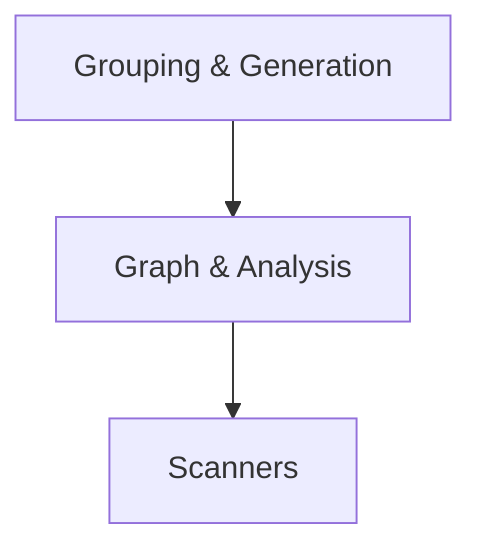

# Logical Architecture: architecture-model-standard / Manifest

## Layer Structure

*No layers defined.*

## Component Allocation

### domain

| Component | Kind | Files | Responsibilities |
|-----------|------|-------|------------------|
| Manifest (COMP-3) | library | 2 files | — |
| Scanners (COMP-3.1) | library | 8 files | — |
| Graph & Analysis (COMP-3.2) | library | 5 files | — |
| Grouping & Generation (COMP-3.3) | library | 6 files | — |

## Inter-Component Interfaces

| Interface | Type | Protocol | Provider | Consumer |
|-----------|------|----------|----------|----------|
| runner CLI | internal | — | — | — |
| COMP-3-1 Library API | internal | — | — | — |
| Scanners API | internal | — | — | — |
| Graph & Analysis API | internal | — | — | — |
| Grouping & Generation API | internal | — | — | — |

## Dependency Graph

---
## Traceability

**Source entities:** `COMP-3`, `COMP-3.1`, `COMP-3.2`, `COMP-3.3`, `IF-2`, `IF-4`, `IF-auto-COMP-3.1`, `IF-auto-COMP-3.2`, `IF-auto-COMP-3.3`
**LLM Review:** — Not yet reviewed
**Generated by:** Pipeline emit stage → SE doc generator
