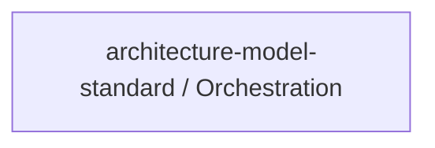

> **Model Completeness: D (42%)**
> Some sections may be empty due to missing model entities.
> - 3/3 components have no behavioral specification
> - Only 1/3 components have linked requirements
> - No actors defined → conops stakeholder section empty
> - No constraints defined → operations manual empty
> Run the extraction pipeline or manually add behaviors/interfaces/constraints.

# Concept of Operations: architecture-model-standard / Orchestration

## System Overview

architecture-model-standard / Orchestration provides 2 capabilities implemented across 3 components.

**Core Capabilities:**

- **Decompose Models Hierarchically** - Break coarse models into per-system sub-models with parent/child relationships
- **Enrich Models with Code Intelligence** - Auto-populate signatures, constants, test contracts, behaviors from source

## Stakeholders

*No actors defined in the model.*

## Operational Scenarios

*No behaviors defined in the model.*

## System Context

### External Interfaces

| Interface | Type | Provider | Consumer |
|-----------|------|----------|----------|
| Orchestration API | internal | — | — |
| Enrichment API | internal | — | — |
| Decomposition API | internal | — | — |

## Operational Constraints

*No constraints defined in the model.*

---
## Traceability

**Source entities:** `CAP-9`, `CAP-10`
**LLM Review:** — Not yet reviewed
**Generated by:** Pipeline emit stage → SE doc generator
