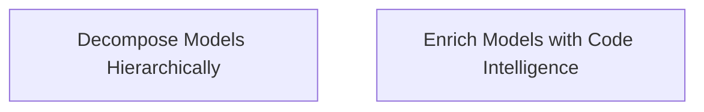

> **Model Completeness: D (42%)**
> Some sections may be empty due to missing model entities.
> - 3/3 components have no behavioral specification
> - Only 1/3 components have linked requirements
> - No actors defined → conops stakeholder section empty
> - No constraints defined → operations manual empty
> Run the extraction pipeline or manually add behaviors/interfaces/constraints.

# Functional Analysis: architecture-model-standard / Orchestration

## Capability Inventory

| ID | Capability | Priority | Status | Description |
|----|-----------|----------|--------|-------------|
| CAP-9 | Decompose Models Hierarchically | medium | ACTIVE | Break coarse models into per-system sub-models with parent/child relationships |
| CAP-10 | Enrich Models with Code Intelligence | medium | ACTIVE | Auto-populate signatures, constants, test contracts, behaviors from source |

## Functional Decomposition

## Capability-Component Mapping

| Capability | Realized By | Component Kind |
|-----------|------------|----------------|
| Decompose Models Hierarchically | Decomposition (COMP-5.2) | service |
| Enrich Models with Code Intelligence | Enrichment (COMP-5.1) | service |

## Behavioral Coverage

*No behaviors defined.*

---
## Traceability

**Source entities:** `CAP-9`, `CAP-10`
**LLM Review:** — Not yet reviewed
**Generated by:** Pipeline emit stage → SE doc generator
