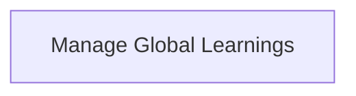

> **Model Completeness: D (35%)**
> Some sections may be empty due to missing model entities.
> - 1/1 components have no behavioral specification
> - No requirements defined
> - No actors defined → conops stakeholder section empty
> - No constraints defined → operations manual empty
> Run the extraction pipeline or manually add behaviors/interfaces/constraints.

# Functional Analysis: architecture-model-standard / Pipeline Learning

## Capability Inventory

| ID | Capability | Priority | Status | Description |
|----|-----------|----------|--------|-------------|
| CAP-14 | Manage Global Learnings | medium | ACTIVE | Store, retrieve, and apply heuristics/archetypes/workflows across pipeline runs |

## Functional Decomposition

## Capability-Component Mapping

| Capability | Realized By | Component Kind |
|-----------|------------|----------------|
| Manage Global Learnings | Pipeline Learning (COMP-11) | library |

## Behavioral Coverage

*No behaviors defined.*

---
## Traceability

**Source entities:** `CAP-14`
**LLM Review:** — Not yet reviewed
**Generated by:** Pipeline emit stage → SE doc generator
