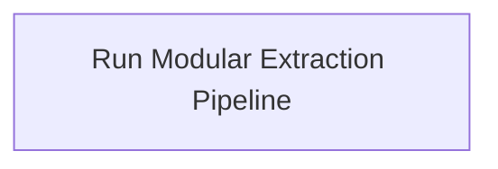

# Functional Analysis: architecture-model-standard / Pipeline

## Capability Inventory

| ID | Capability | Priority | Status | Description |
|----|-----------|----------|--------|-------------|
| CAP-3 | Run Modular Extraction Pipeline | medium | ACTIVE | Execute 10-stage pipeline (observe→infer→allocate→relate→specify→contract→validate→decompose→synthesize→emit) |

## Functional Decomposition

## Capability-Component Mapping

| Capability | Realized By | Component Kind |
|-----------|------------|----------------|
| Run Modular Extraction Pipeline | Pipeline (COMP-2) | service |

## Behavioral Coverage

*No behaviors defined.*

---
## Traceability

**Source entities:** `CAP-3`
**LLM Review:** — Not yet reviewed
**Generated by:** Pipeline emit stage → SE doc generator
