> **Model Completeness: F (27%)**
> Some sections may be empty due to missing model entities.
> - No interfaces defined on components → interface-spec doc empty
> - No requirements defined
> - Actors defined but missing goals/descriptions
> - 10/10 components missing description/responsibilities
> Run the extraction pipeline or manually add behaviors/interfaces/constraints.

# Functional Analysis: Scripts (dev_simulation)

## Capability Inventory

| ID | Capability | Priority | Status | Description |
|----|-----------|----------|--------|-------------|
| CAP-1 | Root Management | medium | ACTIVE | — |
| CAP-2 | Bookmarklet Management | medium | ACTIVE | — |
| CAP-3 | Tag Management | medium | ACTIVE | — |
| CAP-4 | Filter Management | medium | ACTIVE | — |
| CAP-5 | View Management | medium | ACTIVE | — |
| CAP-6 | Model Management | medium | ACTIVE | — |
| CAP-7 | ^Model Management | medium | ACTIVE | — |
| CAP-8 | Template Management | medium | ACTIVE | — |
| CAP-9 | Login Management | medium | ACTIVE | — |
| CAP-10 | Logout Management | medium | ACTIVE | — |
| CAP-11 | Password Change Management | medium | ACTIVE | — |
| CAP-12 | Password Reset Management | medium | ACTIVE | — |
| CAP-13 | Reset Management | medium | ACTIVE | — |
| CAP-14 | <Path:Url> Management | medium | ACTIVE | — |
| CAP-15 | Checkout | medium | ACTIVE | — |
| CAP-16 | Cohesion | medium | ACTIVE | — |
| CAP-17 | Drift Tracker | medium | ACTIVE | — |
| CAP-18 | Extractor | medium | ACTIVE | — |
| CAP-19 | Llm Predictor | medium | ACTIVE | — |
| CAP-20 | Regen Scorer | medium | ACTIVE | — |
| CAP-21 | Report | medium | ACTIVE | — |
| CAP-22 | Runner | medium | ACTIVE | — |
| CAP-23 | Slice Evaluator | medium | ACTIVE | — |
| CAP-24 | CLI Runner | medium | ACTIVE | — |

## Functional Decomposition

```mermaid
graph TD
    CAP-1["Root Management"]
    CAP-2["Bookmarklet Management"]
    CAP-3["Tag Management"]
    CAP-4["Filter Management"]
    CAP-5["View Management"]
    CAP-6["Model Management"]
    CAP-7["^Model Management"]
    CAP-8["Template Management"]
    CAP-9["Login Management"]
    CAP-10["Logout Management"]
    CAP-11["Password Change Management"]
    CAP-12["Password Reset Management"]
    CAP-13["Reset Management"]
    CAP-14["<Path:Url> Management"]
    CAP-15["Checkout"]
    CAP-16["Cohesion"]
    CAP-17["Drift Tracker"]
    CAP-18["Extractor"]
    CAP-19["Llm Predictor"]
    CAP-20["Regen Scorer"]
    CAP-21["Report"]
    CAP-22["Runner"]
    CAP-23["Slice Evaluator"]
    CAP-24["CLI Runner"]
```

## Capability-Component Mapping

| Capability | Realized By | Component Kind |
|-----------|------------|----------------|
| Root Management | *unrealized* | — |
| Bookmarklet Management | *unrealized* | — |
| Tag Management | *unrealized* | — |
| Filter Management | *unrealized* | — |
| View Management | *unrealized* | — |
| Model Management | *unrealized* | — |
| ^Model Management | *unrealized* | — |
| Template Management | *unrealized* | — |
| Login Management | *unrealized* | — |
| Logout Management | *unrealized* | — |
| Password Change Management | *unrealized* | — |
| Password Reset Management | *unrealized* | — |
| Reset Management | *unrealized* | — |
| <Path:Url> Management | *unrealized* | — |
| Checkout | Checkout (scripts-dev-simulation-COMP-1) | service |
| Cohesion | Cohesion (scripts-dev-simulation-COMP-2) | service |
| Drift Tracker | Drift Tracker (scripts-dev-simulation-COMP-3) | service |
| Extractor | Extractor (scripts-dev-simulation-COMP-4) | service |
| Llm Predictor | Llm Predictor (scripts-dev-simulation-COMP-5) | service |
| Regen Scorer | Regen Scorer (scripts-dev-simulation-COMP-6) | service |
| Report | Report (scripts-dev-simulation-COMP-7) | service |
| Runner | *unrealized* | — |
| Slice Evaluator | Slice Evaluator (scripts-dev-simulation-COMP-9) | service |
| CLI Runner | Runner (scripts-dev-simulation-COMP-8) | service |

## Behavioral Coverage

Total behaviors: 19

**Untraced behaviors:** 19
- GET  (BEH-1)
- GET bookmarklets/ (BEH-2)
- GET tags/ (BEH-3)
- GET filters/ (BEH-4)
- GET views/ (BEH-5)
- GET views/<view>/ (BEH-6)
- GET models/ (BEH-7)
- GET ^models/(?P<app_label>[^.]+)\.(?P<model_name>[^/]+)/$ (BEH-8)
- GET templates/<path:template>/ (BEH-9)
- GET password_change/ (BEH-12)
- *...and 9 more*
