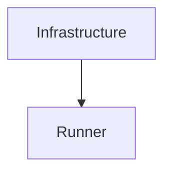

> **Model Completeness: F (27%)**
> Some sections may be empty due to missing model entities.
> - No interfaces defined on components → interface-spec doc empty
> - No requirements defined
> - Actors defined but missing goals/descriptions
> - 10/10 components missing description/responsibilities
> Run the extraction pipeline or manually add behaviors/interfaces/constraints.

# Logical Architecture: Scripts (dev_simulation)

## Layer Structure

| Order | Layer | Technologies | Directories |
|-------|-------|-------------|-------------|
| 0 | infra | — | — |

## Component Allocation

### unassigned

| Component | Kind | Files | Responsibilities |
|-----------|------|-------|------------------|
| Checkout (scripts-dev-simulation-COMP-1) | service | 1 files | — |
| Cohesion (scripts-dev-simulation-COMP-2) | service | 1 files | — |
| Drift Tracker (scripts-dev-simulation-COMP-3) | service | 1 files | — |
| Extractor (scripts-dev-simulation-COMP-4) | service | 1 files | — |
| Llm Predictor (scripts-dev-simulation-COMP-5) | service | 1 files | — |
| Regen Scorer (scripts-dev-simulation-COMP-6) | service | 1 files | — |
| Report (scripts-dev-simulation-COMP-7) | service | 1 files | — |
| Runner (scripts-dev-simulation-COMP-8) | service | 1 files | — |
| Slice Evaluator (scripts-dev-simulation-COMP-9) | service | 1 files | — |
| Infrastructure (scripts-dev-simulation-COMP-10) | service | 1 files | — |

## Inter-Component Interfaces

| Interface | Type | Protocol | Provider | Consumer |
|-----------|------|----------|----------|----------|
| runner CLI | internal | — | — | — |

## Dependency Graph

