> **Model Completeness: F (25%)**
> Some sections may be empty due to missing model entities.
> - No interfaces defined on components → interface-spec doc empty
> - No requirements defined
> - Actors defined but missing goals/descriptions
> - 16/16 components missing description/responsibilities
> Run the extraction pipeline or manually add behaviors/interfaces/constraints.

# Logical Architecture: Src (core)

## Layer Structure

| Order | Layer | Technologies | Directories |
|-------|-------|-------------|-------------|
| 0 | data | — | — |

## Component Allocation

### unassigned

| Component | Kind | Files | Responsibilities |
|-----------|------|-------|------------------|
| Cluster (src-core-COMP-15) | service | 1 files | — |
| Completeness (src-core-COMP-16) | service | 1 files | — |
| Compression (src-core-COMP-17) | service | 1 files | — |
| Confidence (src-core-COMP-18) | service | 1 files | — |
| Corrections (src-core-COMP-19) | service | 1 files | — |
| Coverage (src-core-COMP-20) | service | 1 files | — |
| Decomposer (src-core-COMP-21) | service | 1 files | — |
| Differ (src-core-COMP-22) | service | 1 files | — |
| Merger (src-core-COMP-23) | service | 1 files | — |
| Parser (src-core-COMP-24) | service | 1 files | — |
| Regen Readiness (src-core-COMP-25) | service | 1 files | — |
| Representativeness (src-core-COMP-26) | service | 1 files | — |
| Slicer (src-core-COMP-27) | service | 1 files | — |
| Source Block Assign (src-core-COMP-28) | service | 3 files | — |
| Validator (src-core-COMP-30) | service | 1 files | — |
| Visualize (src-core-COMP-31) | service | 1 files | — |

## Inter-Component Interfaces

*No interfaces defined.*

## Dependency Graph

```mermaid
graph TD
    src-core-COMP-21["Decomposer"]
    src-core-COMP-17["Compression"]
    src-core-COMP-21 --> src-core-COMP-17
    src-core-COMP-28["Source Block Assign"]
    src-core-COMP-28 --> src-core-COMP-17
    src-core-COMP-26["Representativeness"]
    src-core-COMP-21 --> src-core-COMP-26
    src-core-COMP-18["Confidence"]
    src-core-COMP-18 --> src-core-COMP-28
    src-core-COMP-15["Cluster"]
    src-core-COMP-28 --> src-core-COMP-15
    src-core-COMP-16["Completeness"]
    src-core-COMP-21 --> src-core-COMP-16
    src-core-COMP-28 --> src-core-COMP-16
    src-core-COMP-19["Corrections"]
    src-core-COMP-18 --> src-core-COMP-19
    src-core-COMP-22["Differ"]
    src-core-COMP-26 --> src-core-COMP-22
    src-core-COMP-26 --> src-core-COMP-28
    src-core-COMP-21 --> src-core-COMP-19
    src-core-COMP-25["Regen Readiness"]
    src-core-COMP-25 --> src-core-COMP-21
    src-core-COMP-18 --> src-core-COMP-25
    src-core-COMP-25 --> src-core-COMP-18
    src-core-COMP-25 --> src-core-COMP-22
    src-core-COMP-23["Merger"]
    src-core-COMP-25 --> src-core-COMP-23
    src-core-COMP-20["Coverage"]
    src-core-COMP-25 --> src-core-COMP-20
    src-core-COMP-31["Visualize"]
    src-core-COMP-28 --> src-core-COMP-31
    src-core-COMP-28 --> src-core-COMP-26
    src-core-COMP-18 --> src-core-COMP-22
    src-core-COMP-26 --> src-core-COMP-21
    src-core-COMP-18 --> src-core-COMP-23
    src-core-COMP-27["Slicer"]
    src-core-COMP-25 --> src-core-COMP-27
    src-core-COMP-30["Validator"]
    src-core-COMP-30 --> src-core-COMP-28
    src-core-COMP-26 --> src-core-COMP-25
    src-core-COMP-21 --> src-core-COMP-22
    src-core-COMP-21 --> src-core-COMP-28
    src-core-COMP-20 --> src-core-COMP-28
    src-core-COMP-26 --> src-core-COMP-18
    src-core-COMP-26 --> src-core-COMP-23
    src-core-COMP-25 --> src-core-COMP-30
    src-core-COMP-26 --> src-core-COMP-20
    src-core-COMP-27 --> src-core-COMP-28
    src-core-COMP-28 --> src-core-COMP-19
    src-core-COMP-26 --> src-core-COMP-27
    src-core-COMP-18 --> src-core-COMP-21
    src-core-COMP-28 --> src-core-COMP-21
    src-core-COMP-21 --> src-core-COMP-25
    src-core-COMP-26 --> src-core-COMP-30
    src-core-COMP-28 --> src-core-COMP-25
    src-core-COMP-18 --> src-core-COMP-20
    src-core-COMP-26 --> src-core-COMP-15
    src-core-COMP-21 --> src-core-COMP-18
    src-core-COMP-28 --> src-core-COMP-18
    src-core-COMP-22 --> src-core-COMP-28
    src-core-COMP-23 --> src-core-COMP-28
    src-core-COMP-24["Parser"]
    src-core-COMP-25 --> src-core-COMP-24
    src-core-COMP-21 --> src-core-COMP-23
    src-core-COMP-28 --> src-core-COMP-22
    src-core-COMP-21 --> src-core-COMP-20
    src-core-COMP-28 --> src-core-COMP-23
    src-core-COMP-18 --> src-core-COMP-27
    src-core-COMP-21 --> src-core-COMP-27
    src-core-COMP-28 --> src-core-COMP-27
    src-core-COMP-25 --> src-core-COMP-17
    src-core-COMP-18 --> src-core-COMP-30
    src-core-COMP-25 --> src-core-COMP-15
    src-core-COMP-25 --> src-core-COMP-16
    src-core-COMP-26 --> src-core-COMP-24
    src-core-COMP-21 --> src-core-COMP-30
    src-core-COMP-18 --> src-core-COMP-15
    src-core-COMP-28 --> src-core-COMP-30
    src-core-COMP-18 --> src-core-COMP-16
    src-core-COMP-24 --> src-core-COMP-28
    src-core-COMP-21 --> src-core-COMP-15
    src-core-COMP-26 --> src-core-COMP-31
    src-core-COMP-25 --> src-core-COMP-19
    src-core-COMP-26 --> src-core-COMP-17
    src-core-COMP-26 --> src-core-COMP-16
    src-core-COMP-28 --> src-core-COMP-20
    src-core-COMP-18 --> src-core-COMP-24
    src-core-COMP-25 --> src-core-COMP-31
    src-core-COMP-26 --> src-core-COMP-19
    src-core-COMP-25 --> src-core-COMP-26
    src-core-COMP-21 --> src-core-COMP-24
    src-core-COMP-28 --> src-core-COMP-24
    src-core-COMP-18 --> src-core-COMP-31
    src-core-COMP-18 --> src-core-COMP-17
    src-core-COMP-18 --> src-core-COMP-26
    src-core-COMP-25 --> src-core-COMP-28
    src-core-COMP-21 --> src-core-COMP-31
```

