> **Model Completeness: F (0%)**
> Some sections may be empty due to missing model entities.
> - No components defined
> Run the extraction pipeline or manually add behaviors/interfaces/constraints.

# Functional Analysis: Src (extract)

## Capability Inventory

| ID | Capability | Priority | Status | Description |
|----|-----------|----------|--------|-------------|
| CAP-1 | Root Management | medium | ACTIVE | — |
| CAP-2 | Bookmarklet Management | medium | ACTIVE | — |
| CAP-3 | Tag Management | medium | ACTIVE | — |
| CAP-4 | Filter Management | medium | ACTIVE | — |
| CAP-5 | View Management | medium | ACTIVE | — |
| CAP-6 | Model Management | medium | ACTIVE | — |
| CAP-7 | ^Model Management | medium | ACTIVE | — |
| CAP-8 | Template Management | medium | ACTIVE | — |
| CAP-9 | Login Management | medium | ACTIVE | — |
| CAP-10 | Logout Management | medium | ACTIVE | — |
| CAP-11 | Password Change Management | medium | ACTIVE | — |
| CAP-12 | Password Reset Management | medium | ACTIVE | — |
| CAP-13 | Reset Management | medium | ACTIVE | — |
| CAP-14 | <Path:Url> Management | medium | ACTIVE | — |
| CAP-15 | Constraint Detector | medium | ACTIVE | — |
| CAP-16 | From Artifacts | medium | ACTIVE | — |
| CAP-17 | From Code | medium | ACTIVE | — |
| CAP-18 | Route Detector | medium | ACTIVE | — |
| CAP-19 | Table Parser | medium | ACTIVE | — |

## Functional Decomposition

```mermaid
graph TD
    CAP-1["Root Management"]
    CAP-2["Bookmarklet Management"]
    CAP-3["Tag Management"]
    CAP-4["Filter Management"]
    CAP-5["View Management"]
    CAP-6["Model Management"]
    CAP-7["^Model Management"]
    CAP-8["Template Management"]
    CAP-9["Login Management"]
    CAP-10["Logout Management"]
    CAP-11["Password Change Management"]
    CAP-12["Password Reset Management"]
    CAP-13["Reset Management"]
    CAP-14["<Path:Url> Management"]
    CAP-15["Constraint Detector"]
    CAP-16["From Artifacts"]
    CAP-17["From Code"]
    CAP-18["Route Detector"]
    CAP-19["Table Parser"]
```

## Capability-Component Mapping

*No realizes relationships defined.*

## Behavioral Coverage

Total behaviors: 18

**Untraced behaviors:** 18
- GET  (BEH-1)
- GET bookmarklets/ (BEH-2)
- GET tags/ (BEH-3)
- GET filters/ (BEH-4)
- GET views/ (BEH-5)
- GET views/<view>/ (BEH-6)
- GET models/ (BEH-7)
- GET ^models/(?P<app_label>[^.]+)\.(?P<model_name>[^/]+)/$ (BEH-8)
- GET templates/<path:template>/ (BEH-9)
- GET password_change/ (BEH-12)
- *...and 8 more*
