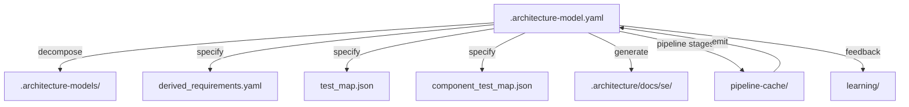

> **Model Completeness: F (25%)**
> Some sections may be empty due to missing model entities.
> - No interfaces defined on components → interface-spec doc empty
> - No requirements defined
> - Actors defined but missing goals/descriptions
> - 17/17 components missing description/responsibilities
> Run the extraction pipeline or manually add behaviors/interfaces/constraints.

# Artifact Traceability Map: Src (manifest)

## 1. Entity Inventory

| Entity Type | Count | Feeds SE Documents |
|-------------|-------|--------------------|
| Components | 17 | Logical Architecture, Maintenance Manual, Operations Manual, Interface Specification |
| Capabilities | 33 | ConOps, Functional Analysis, Requirements Analysis |
| Behaviors | 18 | Use Cases, Functional Analysis, Verification & Validation |
| Interfaces | 0 | Interface Specification, Logical Architecture |
| Constraints | 0 | Requirements Analysis, Risk Assessment |
| Requirements | 0 | Requirements Analysis, Verification & Validation |
| Actors | 1 | ConOps, Use Cases |
| Layers | 1 | Logical Architecture |

## 2. Artifact Dependency Graph

## 3. Entity-to-Artifact Traceability Matrix

| Artifact | Components | Capabilities | Behaviors | Interfaces | Constraints | Requirements | Actors | Layers |
|---|---|---|---|---|---|---|---|---|
| ConOps | | **33** | | | | | **1** | |
| Functional Analysis | | **33** | **18** | | | | | |
| Interface Specification | **17** | | | — | | | | |
| Logical Architecture | **17** | | | — | | | | **1** |
| Maintenance Manual | **17** | | | | | | | |
| Operations Manual | **17** | | | | | | | |
| Requirements Analysis | | **33** | | | — | — | | |
| Risk Assessment | | | | | — | | | |
| Use Cases | | | **18** | | | | **1** | |
| Verification & Validation | | | **18** | | | — | | |

## 4. Relationship Distribution

| Relationship Type | Count | Connects |
|-------------------|-------|----------|
| depends-on | 177 | Component → Component |
| realizes | 17 | Component → Capability |
| contains | 17 | Unknown → Component |

## 5. Traceability Gaps

- **Interfaces** — 0 entities; leaves gaps in: Interface Specification, Logical Architecture
- **Constraints** — 0 entities; leaves gaps in: Requirements Analysis, Risk Assessment
- **Requirements** — 0 entities; leaves gaps in: Requirements Analysis, Verification & Validation
- **allocated-to** relationship type missing — weakens cross-entity traceability
- **constrained-by** relationship type missing — weakens cross-entity traceability

## 6. Architecture Artifact Inventory

### Architecture Models

| Path | Size | LLM Reviewed |
|------|------|-------------|
| `.architecture/.architecture-models/.architecture-model.yaml` | 30.0KB | — |
| `.architecture-archive/.architecture-model.yaml` | 286.9KB | — |
| `.architecture-archive/dot-architecture-models/S1/.architecture-model.yaml` | 5.8KB | — |
| `.architecture-archive/dot-architecture-models/S10/.architecture-model.yaml` | 48.7KB | — |
| `.architecture-archive/dot-architecture-models/S11/.architecture-model.yaml` | 5.0KB | — |
| `.architecture-archive/dot-architecture-models/S12/.architecture-model.yaml` | 2.3KB | — |
| `.architecture-archive/dot-architecture-models/S14/.architecture-model.yaml` | 3.3KB | — |
| `.architecture-archive/dot-architecture-models/S2/.architecture-model.yaml` | 8.7KB | — |
| `.architecture-archive/dot-architecture-models/S3/.architecture-model.yaml` | 8.2KB | — |
| `.architecture-archive/dot-architecture-models/S4/.architecture-model.yaml` | 79.1KB | — |
| `.architecture-archive/dot-architecture-models/S6/.architecture-model.yaml` | 17.7KB | — |
| `.architecture-archive/dot-architecture-models/S7/.architecture-model.yaml` | 23.2KB | — |
| `.architecture-archive/dot-architecture-models/S8/.architecture-model.yaml` | 3.4KB | — |
| `.architecture-archive/dot-architecture-models/S9/.architecture-model.yaml` | 47.7KB | — |
| `.architecture-archive/dot-architecture-models/cli/.architecture-model.yaml` | 21.4KB | — |
| `.architecture-archive/dot-architecture-models/config/.architecture-model.yaml` | 16.2KB | — |
| `.architecture-archive/dot-architecture-models/core/.architecture-model.yaml` | 67.8KB | — |
| `.architecture-archive/dot-architecture-models/extract/.architecture-model.yaml` | 11.6KB | — |
| `.architecture-archive/dot-architecture-models/manifest/.architecture-model.yaml` | 70.0KB | — |
| `.architecture-archive/dot-architecture-models/orchestration/.architecture-model.yaml` | 13.4KB | — |
| `.architecture-model.yaml` | 56.7KB | — |
| `.architecture-models/.architecture-model.yaml` | 14.7KB | — |
| `.architecture-models/S1/.architecture-model.yaml` | 948B | — |
| `.architecture-models/S10/.architecture-model.yaml` | 2.7KB | — |
| `.architecture-models/S11/.architecture-model.yaml` | 592B | — |
| `.architecture-models/S12/.architecture-model.yaml` | 4.3KB | — |
| `.architecture-models/S13/.architecture-model.yaml` | 829B | — |
| `.architecture-models/S15/.architecture-model.yaml` | 620B | — |
| `.architecture-models/S2/.architecture-model.yaml` | 1.5KB | — |
| `.architecture-models/S3/.architecture-model.yaml` | 1.1KB | — |
| `.architecture-models/S4/.architecture-model.yaml` | 3.8KB | — |
| `.architecture-models/S6/.architecture-model.yaml` | 1.4KB | — |
| `.architecture-models/S7/.architecture-model.yaml` | 916B | — |
| `.architecture-models/S8/.architecture-model.yaml` | 1.2KB | — |
| `.architecture-models/S9/.architecture-model.yaml` | 2.7KB | — |
| `.architecture-models/scripts-core/.architecture-model.yaml` | 3.1KB | — |
| `.architecture-models/scripts-dev-simulation/.architecture-model.yaml` | 6.1KB | — |
| `.architecture-models/src-core/.architecture-model.yaml` | 12.4KB | — |
| `.architecture-models/src-extract/.architecture-model.yaml` | 3.1KB | — |
| `.architecture-models/src-manifest/.architecture-model.yaml` | 20.6KB | — |
| `.architecture-models/src-orchestration/.architecture-model.yaml` | 9.7KB | — |
| `.architecture-models/src-pipeline/.architecture-model.yaml` | 19.8KB | — |
| `projects/django/.architecture/.architecture-models/.architecture-model.yaml` | 7.9KB | — |
| `projects/django/.architecture/.architecture-models/conf-locale/.architecture-model.yaml` | 17.0KB | — |
| `projects/django/.architecture/.architecture-models/core-cache/.architecture-model.yaml` | 7.5KB | — |
| `projects/django/.architecture/.architecture-models/core-checks/.architecture-model.yaml` | 12.6KB | — |
| `projects/django/.architecture/.architecture-models/core-core/.architecture-model.yaml` | 3.1KB | — |
| `projects/django/.architecture/.architecture-models/core-files/.architecture-model.yaml` | 10.1KB | — |
| `projects/django/.architecture/.architecture-models/core-mail/.architecture-model.yaml` | 9.6KB | — |
| `projects/django/.architecture/.architecture-models/core-management-core-serializers-tasks-template-backends-template-core-template-loaders-forms-db-models-db-migrations-db-backends/.architecture-model.yaml` | 828.5KB | — |
| `projects/django/.architecture/.architecture-models/django-conf/.architecture-model.yaml` | 19.3KB | — |
| `projects/django/.architecture/.architecture-models/django-contrib/.architecture-model.yaml` | 400.3KB | — |
| `projects/django/.architecture/.architecture-models/django-core-2-related-3-related-4-related-5-related-6-related-7-related/.architecture-model.yaml` | 420.0KB | — |
| `projects/django/.architecture/.architecture-models/django-db/.architecture-model.yaml` | 108.3KB | — |
| `projects/django/.architecture/.architecture-models/django-template/.architecture-model.yaml` | 16.7KB | — |
| `projects/django/.architecture/.architecture-models/django-utils/.architecture-model.yaml` | 104.6KB | — |
| `projects/django/.architecture/.architecture-models/django-views/.architecture-model.yaml` | 17.6KB | — |
| `projects/django/.architecture/.architecture-models/middleware-templatetags-utils-utils-urls-views-core-views-generic-views-decorators/.architecture-model.yaml` | 466.6KB | — |
| `projects/django/.architecture/.architecture-models/tests/.architecture-model.yaml` | 3.6KB | — |
| `projects/textual/.architecture/.architecture-models/.architecture-model.yaml` | 3.5KB | — |
| `projects/textual/.architecture/.architecture-models/css-core/.architecture-model.yaml` | 35.4KB | — |
| `projects/textual/.architecture/.architecture-models/css-css/.architecture-model.yaml` | 13.5KB | — |
| `projects/textual/.architecture/.architecture-models/document/.architecture-model.yaml` | 5.4KB | — |
| `projects/textual/.architecture/.architecture-models/drivers/.architecture-model.yaml` | 4.0KB | — |
| `projects/textual/.architecture/.architecture-models/drivers-core/.architecture-model.yaml` | 5.2KB | — |
| `projects/textual/.architecture/.architecture-models/drivers-drivers/.architecture-model.yaml` | 5.5KB | — |
| `projects/textual/.architecture/.architecture-models/infrastructure/.architecture-model.yaml` | 16.9KB | — |
| `projects/textual/.architecture/.architecture-models/layouts/.architecture-model.yaml` | 4.5KB | — |
| `projects/textual/.architecture/.architecture-models/layouts-widgets-core/.architecture-model.yaml` | 201.4KB | — |
| `projects/textual/.architecture/.architecture-models/renderables/.architecture-model.yaml` | 3.2KB | — |
| `projects/textual/.architecture/.architecture-models/renderables-renderables/.architecture-model.yaml` | 4.8KB | — |
| `projects/textual/.architecture/.architecture-models/src-core/.architecture-model.yaml` | 443.8KB | — |
| `projects/textual/.architecture/.architecture-models/src-css/.architecture-model.yaml` | 13.5KB | — |
| `projects/textual/.architecture/.architecture-models/src-document/.architecture-model.yaml` | 445B | — |
| `projects/textual/.architecture/.architecture-models/src-drivers/.architecture-model.yaml` | 5.1KB | — |
| `projects/textual/.architecture/.architecture-models/src-layouts/.architecture-model.yaml` | 379B | — |
| `projects/textual/.architecture/.architecture-models/src-renderables/.architecture-model.yaml` | 4.2KB | — |
| `projects/textual/.architecture/.architecture-models/src-widgets/.architecture-model.yaml` | 90.8KB | — |
| `projects/textual/.architecture/.architecture-models/widgets-core/.architecture-model.yaml` | 106.7KB | — |
| `projects/textual/.architecture/.architecture-models/widgets-widgets/.architecture-model.yaml` | 99.4KB | — |
| `projects/textual/.architecture-model.yaml` | 3.2KB | — |

### System Manifests

| Path | Size | LLM Reviewed |
|------|------|-------------|
| `.architecture/manifest.json` | 493.7KB | — |
| `.architecture-archive/dot-architecture/manifest.json` | 399.4KB | — |
| `.architecture-archive/dot-architecture-models/S0/manifest.json` | 17.0KB | — |
| `.architecture-archive/dot-architecture-models/S1/manifest.json` | 413.5KB | — |
| `.architecture-archive/dot-architecture-models/S10/manifest.json` | 79.3KB | — |
| `.architecture-archive/dot-architecture-models/S11/manifest.json` | 6.6KB | — |
| `.architecture-archive/dot-architecture-models/S12/manifest.json` | 4.4KB | — |
| `.architecture-archive/dot-architecture-models/S13/manifest.json` | 968B | — |
| `.architecture-archive/dot-architecture-models/S14/manifest.json` | 3.6KB | — |
| `.architecture-archive/dot-architecture-models/S2/manifest.json` | 413.5KB | — |
| `.architecture-archive/dot-architecture-models/S3/manifest.json` | 27.6KB | — |
| `.architecture-archive/dot-architecture-models/S4/manifest.json` | 98.2KB | — |
| `.architecture-archive/dot-architecture-models/S5/manifest.json` | 967B | — |
| `.architecture-archive/dot-architecture-models/S6/manifest.json` | 27.6KB | — |
| `.architecture-archive/dot-architecture-models/S7/manifest.json` | 11.0KB | — |
| `.architecture-archive/dot-architecture-models/S8/manifest.json` | 5.8KB | — |
| `.architecture-archive/dot-architecture-models/S9/manifest.json` | 87.1KB | — |
| `.architecture-archive/dot-architecture-models/cli/manifest.json` | 10.5KB | — |
| `.architecture-archive/dot-architecture-models/config/manifest.json` | 10.6KB | — |
| `.architecture-archive/dot-architecture-models/core/manifest.json` | 54.6KB | — |
| `.architecture-archive/dot-architecture-models/extract/manifest.json` | 4.8KB | — |
| `.architecture-archive/dot-architecture-models/manifest/manifest.json` | 46.5KB | — |
| `.architecture-archive/dot-architecture-models/manifest.json` | 171.9KB | — |
| `.architecture-archive/dot-architecture-models/orchestration/manifest.json` | 8.0KB | — |
| `.architecture-models/S0/manifest.json` | 16.3KB | — |
| `.architecture-models/S1/manifest.json` | 503.8KB | — |
| `.architecture-models/S10/manifest.json` | 79.3KB | — |
| `.architecture-models/S11/manifest.json` | 6.6KB | — |
| `.architecture-models/S12/manifest.json` | 66.0KB | — |
| `.architecture-models/S13/manifest.json` | 4.4KB | — |
| `.architecture-models/S14/manifest.json` | 968B | — |
| `.architecture-models/S15/manifest.json` | 3.6KB | — |
| `.architecture-models/S2/manifest.json` | 503.8KB | — |
| `.architecture-models/S3/manifest.json` | 503.8KB | — |
| `.architecture-models/S4/manifest.json` | 20.0KB | — |
| `.architecture-models/S5/manifest.json` | 967B | — |
| `.architecture-models/S6/manifest.json` | 27.6KB | — |
| `.architecture-models/S7/manifest.json` | 11.0KB | — |
| `.architecture-models/S8/manifest.json` | 20.0KB | — |
| `.architecture-models/S9/manifest.json` | 87.1KB | — |
| `.architecture-models/scripts-core/manifest.json` | 619B | — |
| `.architecture-models/scripts-dev-simulation/manifest.json` | 1.1KB | — |
| `.architecture-models/src-core/manifest.json` | 2.0KB | — |
| `.architecture-models/src-extract/manifest.json` | 622B | — |
| `.architecture-models/src-manifest/manifest.json` | 2.3KB | — |
| `.architecture-models/src-orchestration/manifest.json` | 1.6KB | — |
| `.architecture-models/src-pipeline/manifest.json` | 3.8KB | — |
| `projects/django/.architecture/.architecture-models/conf-locale/manifest.json` | 8.7KB | — |
| `projects/django/.architecture/.architecture-models/core-cache/manifest.json` | 873B | — |
| `projects/django/.architecture/.architecture-models/core-checks/manifest.json` | 1.6KB | — |
| `projects/django/.architecture/.architecture-models/core-core/manifest.json` | 684B | — |
| `projects/django/.architecture/.architecture-models/core-files/manifest.json` | 1.3KB | — |
| `projects/django/.architecture/.architecture-models/core-mail/manifest.json` | 1.1KB | — |
| `projects/django/.architecture/.architecture-models/core-management-core-serializers-tasks-template-backends-template-core-template-loaders-forms-db-models-db-migrations-db-backends/manifest.json` | 19.1KB | — |
| `projects/django/.architecture/.architecture-models/django-conf/manifest.json` | 9.2KB | — |
| `projects/django/.architecture/.architecture-models/django-contrib/manifest.json` | 31.7KB | — |
| `projects/django/.architecture/.architecture-models/django-core-2-related-3-related-4-related-5-related-6-related-7-related/manifest.json` | 15.7KB | — |
| `projects/django/.architecture/.architecture-models/django-db/manifest.json` | 11.9KB | — |
| `projects/django/.architecture/.architecture-models/django-template/manifest.json` | 2.5KB | — |
| `projects/django/.architecture/.architecture-models/django-utils/manifest.json` | 4.5KB | — |
| `projects/django/.architecture/.architecture-models/django-views/manifest.json` | 2.0KB | — |
| `projects/django/.architecture/.architecture-models/middleware-templatetags-utils-utils-urls-views-core-views-generic-views-decorators/manifest.json` | 8.3KB | — |
| `projects/django/.architecture/.architecture-models/tests/manifest.json` | 1.3KB | — |
| `projects/textual/.architecture/.architecture-models/css-core/manifest.json` | 2.9KB | — |
| `projects/textual/.architecture/.architecture-models/css-css/manifest.json` | 1.9KB | — |
| `projects/textual/.architecture/.architecture-models/document/manifest.json` | 960B | — |
| `projects/textual/.architecture/.architecture-models/drivers/manifest.json` | 1.2KB | — |
| `projects/textual/.architecture/.architecture-models/drivers-core/manifest.json` | 777B | — |
| `projects/textual/.architecture/.architecture-models/drivers-drivers/manifest.json` | 1.2KB | — |
| `projects/textual/.architecture/.architecture-models/infrastructure/manifest.json` | 2.0KB | — |
| `projects/textual/.architecture/.architecture-models/layouts/manifest.json` | 914B | — |
| `projects/textual/.architecture/.architecture-models/layouts-widgets-core/manifest.json` | 7.3KB | — |
| `projects/textual/.architecture/.architecture-models/renderables/manifest.json` | 1.1KB | — |
| `projects/textual/.architecture/.architecture-models/renderables-renderables/manifest.json` | 1.1KB | — |
| `projects/textual/.architecture/.architecture-models/src-core/manifest.json` | 11.4KB | — |
| `projects/textual/.architecture/.architecture-models/src-css/manifest.json` | 1.9KB | — |
| `projects/textual/.architecture/.architecture-models/src-document/manifest.json` | 677B | — |
| `projects/textual/.architecture/.architecture-models/src-drivers/manifest.json` | 1.2KB | — |
| `projects/textual/.architecture/.architecture-models/src-layouts/manifest.json` | 531B | — |
| `projects/textual/.architecture/.architecture-models/src-renderables/manifest.json` | 1.1KB | — |
| `projects/textual/.architecture/.architecture-models/src-widgets/manifest.json` | 5.9KB | — |
| `projects/textual/.architecture/.architecture-models/widgets-core/manifest.json` | 4.7KB | — |
| `projects/textual/.architecture/.architecture-models/widgets-widgets/manifest.json` | 5.8KB | — |

### SE Documents

| Path | Size | LLM Reviewed |
|------|------|-------------|
| `.architecture-models/docs/se/artifact-traceability.md` | 83.8KB | — |
| `.architecture-models/docs/se/conops.md` | 5.3KB | — |
| `.architecture-models/docs/se/data-model.md` | 2.9KB | — |
| `.architecture-models/docs/se/deployment-guide.md` | 1.6KB | — |
| `.architecture-models/docs/se/functional-analysis.md` | 4.5KB | — |
| `.architecture-models/docs/se/index.md` | 721B | — |
| `.architecture-models/docs/se/interface-specification.md` | 6.2KB | — |
| `.architecture-models/docs/se/logical-architecture.md` | 28.4KB | — |
| `.architecture-models/docs/se/maintenance-manual.md` | 13.5KB | — |
| `.architecture-models/docs/se/operations-manual.md` | 2.7KB | — |
| `.architecture-models/docs/se/requirements-analysis.md` | 4.2KB | — |
| `.architecture-models/docs/se/risk-assessment.md` | 1.4KB | — |
| `.architecture-models/docs/se/security-analysis.md` | 476B | — |
| `.architecture-models/docs/se/use-cases.md` | 2.4KB | — |
| `.architecture-models/docs/se/verification-validation.md` | 7.2KB | — |
| `.architecture/.architecture-models/docs/se/artifact-traceability.md` | 78.6KB | — |
| `.architecture/.architecture-models/docs/se/conops.md` | 5.3KB | — |
| `.architecture/.architecture-models/docs/se/deployment-guide.md` | 1.6KB | — |
| `.architecture/.architecture-models/docs/se/functional-analysis.md` | 4.5KB | — |
| `.architecture/.architecture-models/docs/se/index.md` | 721B | — |
| `.architecture/.architecture-models/docs/se/interface-specification.md` | 6.2KB | — |
| `.architecture/.architecture-models/docs/se/logical-architecture.md` | 6.3KB | — |
| `.architecture/.architecture-models/docs/se/maintenance-manual.md` | 13.5KB | — |
| `.architecture/.architecture-models/docs/se/operations-manual.md` | 2.7KB | — |
| `.architecture/.architecture-models/docs/se/requirements-analysis.md` | 4.1KB | — |
| `.architecture/.architecture-models/docs/se/risk-assessment.md` | 1.4KB | — |
| `.architecture/.architecture-models/docs/se/security-analysis.md` | 512B | — |
| `.architecture/.architecture-models/docs/se/use-cases.md` | 2.4KB | — |
| `.architecture/.architecture-models/docs/se/verification-validation.md` | 2.7KB | — |
| `.architecture-models/scripts-core/docs/se/artifact-traceability.md` | 78.9KB | — |
| `.architecture-models/scripts-core/docs/se/conops.md` | 1.8KB | — |
| `.architecture-models/scripts-core/docs/se/functional-analysis.md` | 2.8KB | — |
| `.architecture-models/scripts-core/docs/se/index.md` | 603B | — |
| `.architecture-models/scripts-core/docs/se/interface-specification.md` | 613B | — |
| `.architecture-models/scripts-core/docs/se/logical-architecture.md` | 606B | — |
| `.architecture-models/scripts-core/docs/se/maintenance-manual.md` | 704B | — |
| `.architecture-models/scripts-core/docs/se/operations-manual.md` | 1.1KB | — |
| `.architecture-models/scripts-core/docs/se/requirements-analysis.md` | 2.1KB | — |
| `.architecture-models/scripts-core/docs/se/risk-assessment.md` | 3.5KB | — |
| `.architecture-models/scripts-core/docs/se/use-cases.md` | 2.2KB | — |
| `.architecture-models/scripts-core/docs/se/verification-validation.md` | 884B | — |
| `.architecture-models/scripts-dev-simulation/docs/se/artifact-traceability.md` | 79.1KB | — |
| `.architecture-models/scripts-dev-simulation/docs/se/conops.md` | 2.3KB | — |
| `.architecture-models/scripts-dev-simulation/docs/se/functional-analysis.md` | 4.5KB | — |
| `.architecture-models/scripts-dev-simulation/docs/se/index.md` | 603B | — |
| `.architecture-models/scripts-dev-simulation/docs/se/interface-specification.md` | 969B | — |
| `.architecture-models/scripts-dev-simulation/docs/se/logical-architecture.md` | 2.0KB | — |
| `.architecture-models/scripts-dev-simulation/docs/se/maintenance-manual.md` | 3.2KB | — |
| `.architecture-models/scripts-dev-simulation/docs/se/operations-manual.md` | 1.4KB | — |
| `.architecture-models/scripts-dev-simulation/docs/se/requirements-analysis.md` | 1.9KB | — |
| `.architecture-models/scripts-dev-simulation/docs/se/risk-assessment.md` | 3.0KB | — |
| `.architecture-models/scripts-dev-simulation/docs/se/use-cases.md` | 2.5KB | — |
| `.architecture-models/scripts-dev-simulation/docs/se/verification-validation.md` | 1.8KB | — |
| `.architecture-models/src-core/docs/se/artifact-traceability.md` | 79.1KB | — |
| `.architecture-models/src-core/docs/se/conops.md` | 2.1KB | — |
| `.architecture-models/src-core/docs/se/data-model.md` | 634B | — |
| `.architecture-models/src-core/docs/se/functional-analysis.md` | 5.3KB | — |
| `.architecture-models/src-core/docs/se/index.md` | 665B | — |
| `.architecture-models/src-core/docs/se/interface-specification.md` | 786B | — |
| `.architecture-models/src-core/docs/se/logical-architecture.md` | 5.8KB | — |
| `.architecture-models/src-core/docs/se/maintenance-manual.md` | 8.1KB | — |
| `.architecture-models/src-core/docs/se/operations-manual.md` | 1.3KB | — |
| `.architecture-models/src-core/docs/se/requirements-analysis.md` | 1.9KB | — |
| `.architecture-models/src-core/docs/se/risk-assessment.md` | 5.8KB | — |
| `.architecture-models/src-core/docs/se/use-cases.md` | 2.4KB | — |
| `.architecture-models/src-core/docs/se/verification-validation.md` | 2.1KB | — |
| `.architecture-models/src-extract/docs/se/artifact-traceability.md` | 4.0KB | — |
| `.architecture-models/src-extract/docs/se/conops.md` | 1.7KB | — |
| `.architecture-models/src-extract/docs/se/functional-analysis.md` | 2.6KB | — |
| `.architecture-models/src-extract/docs/se/index.md` | 603B | — |
| `.architecture-models/src-extract/docs/se/interface-specification.md` | 611B | — |
| `.architecture-models/src-extract/docs/se/logical-architecture.md` | 604B | — |
| `.architecture-models/src-extract/docs/se/maintenance-manual.md` | 702B | — |
| `.architecture-models/src-extract/docs/se/operations-manual.md` | 1.1KB | — |
| `.architecture-models/src-extract/docs/se/requirements-analysis.md` | 2.0KB | — |
| `.architecture-models/src-extract/docs/se/risk-assessment.md` | 3.4KB | — |
| `.architecture-models/src-extract/docs/se/use-cases.md` | 2.2KB | — |
| `.architecture-models/src-extract/docs/se/verification-validation.md` | 882B | — |
| `.architecture-models/src-manifest/docs/se/artifact-traceability.md` | 4.3KB | — |
| `.architecture-models/src-manifest/docs/se/conops.md` | 2.1KB | — |
| `.architecture-models/src-manifest/docs/se/data-model.md` | 641B | — |
| `.architecture-models/src-manifest/docs/se/functional-analysis.md` | 5.4KB | — |
| `.architecture-models/src-manifest/docs/se/index.md` | 665B | — |
| `.architecture-models/src-manifest/docs/se/interface-specification.md` | 793B | — |
| `.architecture-models/src-manifest/docs/se/logical-architecture.md` | 11.3KB | — |
| `.architecture-models/src-manifest/docs/se/maintenance-manual.md` | 10.6KB | — |
| `.architecture-models/src-manifest/docs/se/operations-manual.md` | 1.3KB | — |
| `.architecture-models/src-manifest/docs/se/requirements-analysis.md` | 1.9KB | — |
| `.architecture-models/src-manifest/docs/se/risk-assessment.md` | 6.5KB | — |
| `.architecture-models/src-manifest/docs/se/use-cases.md` | 2.4KB | — |
| `.architecture-models/src-manifest/docs/se/verification-validation.md` | 2.2KB | — |
| `.architecture-models/src-orchestration/docs/se/artifact-traceability.md` | 4.3KB | — |
| `.architecture-models/src-orchestration/docs/se/conops.md` | 2.1KB | — |
| `.architecture-models/src-orchestration/docs/se/data-model.md` | 651B | — |
| `.architecture-models/src-orchestration/docs/se/functional-analysis.md` | 5.1KB | — |
| `.architecture-models/src-orchestration/docs/se/index.md` | 665B | — |
| `.architecture-models/src-orchestration/docs/se/interface-specification.md` | 803B | — |
| `.architecture-models/src-orchestration/docs/se/logical-architecture.md` | 4.5KB | — |
| `.architecture-models/src-orchestration/docs/se/maintenance-manual.md` | 6.1KB | — |
| `.architecture-models/src-orchestration/docs/se/operations-manual.md` | 1.3KB | — |
| `.architecture-models/src-orchestration/docs/se/requirements-analysis.md` | 1.9KB | — |
| `.architecture-models/src-orchestration/docs/se/risk-assessment.md` | 4.4KB | — |
| `.architecture-models/src-orchestration/docs/se/use-cases.md` | 2.4KB | — |
| `.architecture-models/src-orchestration/docs/se/verification-validation.md` | 2.0KB | — |
| `.architecture-models/src-pipeline/docs/se/artifact-traceability.md` | 79.1KB | — |
| `.architecture-models/src-pipeline/docs/se/conops.md` | 2.4KB | — |
| `.architecture-models/src-pipeline/docs/se/data-model.md` | 641B | — |
| `.architecture-models/src-pipeline/docs/se/functional-analysis.md` | 7.1KB | — |
| `.architecture-models/src-pipeline/docs/se/index.md` | 665B | — |
| `.architecture-models/src-pipeline/docs/se/interface-specification.md` | 793B | — |
| `.architecture-models/src-pipeline/docs/se/logical-architecture.md` | 9.9KB | — |
| `.architecture-models/src-pipeline/docs/se/maintenance-manual.md` | 10.5KB | — |
| `.architecture-models/src-pipeline/docs/se/operations-manual.md` | 1.3KB | — |
| `.architecture-models/src-pipeline/docs/se/requirements-analysis.md` | 2.6KB | — |
| `.architecture-models/src-pipeline/docs/se/risk-assessment.md` | 8.3KB | — |
| `.architecture-models/src-pipeline/docs/se/use-cases.md` | 2.4KB | — |
| `.architecture-models/src-pipeline/docs/se/verification-validation.md` | 2.5KB | — |
| `projects/django/.architecture/.architecture-models/conf-locale/docs/se/conops.md` | 1.1KB | — |
| `projects/django/.architecture/.architecture-models/conf-locale/docs/se/functional-analysis.md` | 925B | — |
| `projects/django/.architecture/.architecture-models/conf-locale/docs/se/index.md` | 543B | — |
| `projects/django/.architecture/.architecture-models/conf-locale/docs/se/interface-specification.md` | 411B | — |
| `projects/django/.architecture/.architecture-models/conf-locale/docs/se/logical-architecture.md` | 6.8KB | — |
| `projects/django/.architecture/.architecture-models/conf-locale/docs/se/maintenance-manual.md` | 15.2KB | — |
| `projects/django/.architecture/.architecture-models/conf-locale/docs/se/operations-manual.md` | 964B | — |
| `projects/django/.architecture/.architecture-models/conf-locale/docs/se/requirements-analysis.md` | 535B | — |
| `projects/django/.architecture/.architecture-models/conf-locale/docs/se/risk-assessment.md` | 590B | — |
| `projects/django/.architecture/.architecture-models/conf-locale/docs/se/use-cases.md` | 2.0KB | — |
| `projects/django/.architecture/.architecture-models/conf-locale/docs/se/verification-validation.md` | 7.5KB | — |
| `projects/django/.architecture/.architecture-models/core-cache/docs/se/conops.md` | 1.5KB | — |
| `projects/django/.architecture/.architecture-models/core-cache/docs/se/data-model.md` | 257B | — |
| `projects/django/.architecture/.architecture-models/core-cache/docs/se/functional-analysis.md` | 3.4KB | — |
| `projects/django/.architecture/.architecture-models/core-cache/docs/se/index.md` | 605B | — |
| `projects/django/.architecture/.architecture-models/core-cache/docs/se/interface-specification.md` | 409B | — |
| `projects/django/.architecture/.architecture-models/core-cache/docs/se/logical-architecture.md` | 2.3KB | — |
| `projects/django/.architecture/.architecture-models/core-cache/docs/se/maintenance-manual.md` | 2.8KB | — |
| `projects/django/.architecture/.architecture-models/core-cache/docs/se/operations-manual.md` | 962B | — |
| `projects/django/.architecture/.architecture-models/core-cache/docs/se/requirements-analysis.md` | 1.4KB | — |
| `projects/django/.architecture/.architecture-models/core-cache/docs/se/risk-assessment.md` | 3.5KB | — |
| `projects/django/.architecture/.architecture-models/core-cache/docs/se/use-cases.md` | 2.0KB | — |
| `projects/django/.architecture/.architecture-models/core-cache/docs/se/verification-validation.md` | 1.1KB | — |
| `projects/django/.architecture/.architecture-models/core-checks/docs/se/conops.md` | 1.6KB | — |
| `projects/django/.architecture/.architecture-models/core-checks/docs/se/data-model.md` | 259B | — |
| `projects/django/.architecture/.architecture-models/core-checks/docs/se/functional-analysis.md` | 4.5KB | — |
| `projects/django/.architecture/.architecture-models/core-checks/docs/se/index.md` | 649B | — |
| `projects/django/.architecture/.architecture-models/core-checks/docs/se/interface-specification.md` | 411B | — |
| `projects/django/.architecture/.architecture-models/core-checks/docs/se/logical-architecture.md` | 5.6KB | — |
| `projects/django/.architecture/.architecture-models/core-checks/docs/se/maintenance-manual.md` | 6.0KB | — |
| `projects/django/.architecture/.architecture-models/core-checks/docs/se/operations-manual.md` | 964B | — |
| `projects/django/.architecture/.architecture-models/core-checks/docs/se/requirements-analysis.md` | 1.4KB | — |
| `projects/django/.architecture/.architecture-models/core-checks/docs/se/risk-assessment.md` | 4.6KB | — |
| `projects/django/.architecture/.architecture-models/core-checks/docs/se/security-analysis.md` | 393B | — |
| `projects/django/.architecture/.architecture-models/core-checks/docs/se/use-cases.md` | 2.0KB | — |
| `projects/django/.architecture/.architecture-models/core-checks/docs/se/verification-validation.md` | 1.7KB | — |
| `projects/django/.architecture/.architecture-models/core-core/docs/se/conops.md` | 1.5KB | — |
| `projects/django/.architecture/.architecture-models/core-core/docs/se/functional-analysis.md` | 2.4KB | — |
| `projects/django/.architecture/.architecture-models/core-core/docs/se/index.md` | 543B | — |
| `projects/django/.architecture/.architecture-models/core-core/docs/se/interface-specification.md` | 407B | — |
| `projects/django/.architecture/.architecture-models/core-core/docs/se/logical-architecture.md` | 400B | — |
| `projects/django/.architecture/.architecture-models/core-core/docs/se/maintenance-manual.md` | 498B | — |
| `projects/django/.architecture/.architecture-models/core-core/docs/se/operations-manual.md` | 960B | — |
| `projects/django/.architecture/.architecture-models/core-core/docs/se/requirements-analysis.md` | 1.8KB | — |
| `projects/django/.architecture/.architecture-models/core-core/docs/se/risk-assessment.md` | 3.3KB | — |
| `projects/django/.architecture/.architecture-models/core-core/docs/se/use-cases.md` | 2.0KB | — |
| `projects/django/.architecture/.architecture-models/core-core/docs/se/verification-validation.md` | 678B | — |
| `projects/django/.architecture/.architecture-models/core-files/docs/se/conops.md` | 1.7KB | — |
| `projects/django/.architecture/.architecture-models/core-files/docs/se/functional-analysis.md` | 3.7KB | — |
| `projects/django/.architecture/.architecture-models/core-files/docs/se/index.md` | 543B | — |
| `projects/django/.architecture/.architecture-models/core-files/docs/se/interface-specification.md` | 409B | — |
| `projects/django/.architecture/.architecture-models/core-files/docs/se/logical-architecture.md` | 3.5KB | — |
| `projects/django/.architecture/.architecture-models/core-files/docs/se/maintenance-manual.md` | 4.2KB | — |
| `projects/django/.architecture/.architecture-models/core-files/docs/se/operations-manual.md` | 1.1KB | — |
| `projects/django/.architecture/.architecture-models/core-files/docs/se/requirements-analysis.md` | 1.4KB | — |
| `projects/django/.architecture/.architecture-models/core-files/docs/se/risk-assessment.md` | 3.6KB | — |
| `projects/django/.architecture/.architecture-models/core-files/docs/se/use-cases.md` | 2.3KB | — |
| `projects/django/.architecture/.architecture-models/core-files/docs/se/verification-validation.md` | 1.4KB | — |
| `projects/django/.architecture/.architecture-models/core-mail/docs/se/conops.md` | 1.5KB | — |
| `projects/django/.architecture/.architecture-models/core-mail/docs/se/functional-analysis.md` | 3.8KB | — |
| `projects/django/.architecture/.architecture-models/core-mail/docs/se/index.md` | 543B | — |
| `projects/django/.architecture/.architecture-models/core-mail/docs/se/interface-specification.md` | 407B | — |
| `projects/django/.architecture/.architecture-models/core-mail/docs/se/logical-architecture.md` | 3.4KB | — |
| `projects/django/.architecture/.architecture-models/core-mail/docs/se/maintenance-manual.md` | 3.9KB | — |
| `projects/django/.architecture/.architecture-models/core-mail/docs/se/operations-manual.md` | 960B | — |
| `projects/django/.architecture/.architecture-models/core-mail/docs/se/requirements-analysis.md` | 1.4KB | — |
| `projects/django/.architecture/.architecture-models/core-mail/docs/se/risk-assessment.md` | 3.8KB | — |
| `projects/django/.architecture/.architecture-models/core-mail/docs/se/use-cases.md` | 2.0KB | — |
| `projects/django/.architecture/.architecture-models/core-mail/docs/se/verification-validation.md` | 1.3KB | — |
| `projects/django/.architecture/.architecture-models/core-management-core-serializers-tasks-template-backends-template-core-template-loaders-forms-db-models-db-migrations-db-backends/docs/se/conops.md` | 4.0KB | — |
| `projects/django/.architecture/.architecture-models/core-management-core-serializers-tasks-template-backends-template-core-template-loaders-forms-db-models-db-migrations-db-backends/docs/se/data-model.md` | 559B | — |
| `projects/django/.architecture/.architecture-models/core-management-core-serializers-tasks-template-backends-template-core-template-loaders-forms-db-models-db-migrations-db-backends/docs/se/functional-analysis.md` | 29.3KB | — |
| `projects/django/.architecture/.architecture-models/core-management-core-serializers-tasks-template-backends-template-core-template-loaders-forms-db-models-db-migrations-db-backends/docs/se/index.md` | 605B | — |
| `projects/django/.architecture/.architecture-models/core-management-core-serializers-tasks-template-backends-template-core-template-loaders-forms-db-models-db-migrations-db-backends/docs/se/interface-specification.md` | 973B | — |
| `projects/django/.architecture/.architecture-models/core-management-core-serializers-tasks-template-backends-template-core-template-loaders-forms-db-models-db-migrations-db-backends/docs/se/logical-architecture.md` | 620.4KB | — |
| `projects/django/.architecture/.architecture-models/core-management-core-serializers-tasks-template-backends-template-core-template-loaders-forms-db-models-db-migrations-db-backends/docs/se/maintenance-manual.md` | 117.4KB | — |
| `projects/django/.architecture/.architecture-models/core-management-core-serializers-tasks-template-backends-template-core-template-loaders-forms-db-models-db-migrations-db-backends/docs/se/operations-manual.md` | 1.6KB | — |
| `projects/django/.architecture/.architecture-models/core-management-core-serializers-tasks-template-backends-template-core-template-loaders-forms-db-models-db-migrations-db-backends/docs/se/requirements-analysis.md` | 1.3KB | — |
| `projects/django/.architecture/.architecture-models/core-management-core-serializers-tasks-template-backends-template-core-template-loaders-forms-db-models-db-migrations-db-backends/docs/se/risk-assessment.md` | 26.4KB | — |
| `projects/django/.architecture/.architecture-models/core-management-core-serializers-tasks-template-backends-template-core-template-loaders-forms-db-models-db-migrations-db-backends/docs/se/use-cases.md` | 2.6KB | — |
| `projects/django/.architecture/.architecture-models/core-management-core-serializers-tasks-template-backends-template-core-template-loaders-forms-db-models-db-migrations-db-backends/docs/se/verification-validation.md` | 21.9KB | — |
| `projects/django/.architecture/.architecture-models/django-conf/docs/se/conops.md` | 1.1KB | — |
| `projects/django/.architecture/.architecture-models/django-conf/docs/se/functional-analysis.md` | 1.5KB | — |
| `projects/django/.architecture/.architecture-models/django-conf/docs/se/index.md` | 543B | — |
| `projects/django/.architecture/.architecture-models/django-conf/docs/se/interface-specification.md` | 411B | — |
| `projects/django/.architecture/.architecture-models/django-conf/docs/se/logical-architecture.md` | 8.4KB | — |
| `projects/django/.architecture/.architecture-models/django-conf/docs/se/maintenance-manual.md` | 20.5KB | — |
| `projects/django/.architecture/.architecture-models/django-conf/docs/se/operations-manual.md` | 964B | — |
| `projects/django/.architecture/.architecture-models/django-conf/docs/se/requirements-analysis.md` | 535B | — |
| `projects/django/.architecture/.architecture-models/django-conf/docs/se/risk-assessment.md` | 996B | — |
| `projects/django/.architecture/.architecture-models/django-conf/docs/se/use-cases.md` | 2.0KB | — |
| `projects/django/.architecture/.architecture-models/django-conf/docs/se/verification-validation.md` | 7.8KB | — |
| `projects/django/.architecture/.architecture-models/django-contrib/docs/se/conops.md` | 4.2KB | — |
| `projects/django/.architecture/.architecture-models/django-contrib/docs/se/data-model.md` | 265B | — |
| `projects/django/.architecture/.architecture-models/django-contrib/docs/se/functional-analysis.md` | 22.3KB | — |
| `projects/django/.architecture/.architecture-models/django-contrib/docs/se/index.md` | 695B | — |
| `projects/django/.architecture/.architecture-models/django-contrib/docs/se/interface-specification.md` | 697B | — |
| `projects/django/.architecture/.architecture-models/django-contrib/docs/se/logical-architecture.md` | 246.7KB | — |
| `projects/django/.architecture/.architecture-models/django-contrib/docs/se/maintenance-manual.md` | 190.1KB | — |
| `projects/django/.architecture/.architecture-models/django-contrib/docs/se/operations-manual.md` | 1.3KB | — |
| `projects/django/.architecture/.architecture-models/django-contrib/docs/se/plugin-guide.md` | 598B | — |
| `projects/django/.architecture/.architecture-models/django-contrib/docs/se/requirements-analysis.md` | 1.8KB | — |
| `projects/django/.architecture/.architecture-models/django-contrib/docs/se/risk-assessment.md` | 30.1KB | — |
| `projects/django/.architecture/.architecture-models/django-contrib/docs/se/security-analysis.md` | 869B | — |
| `projects/django/.architecture/.architecture-models/django-contrib/docs/se/use-cases.md` | 2.4KB | — |
| `projects/django/.architecture/.architecture-models/django-contrib/docs/se/verification-validation.md` | 11.9KB | — |
| `projects/django/.architecture/.architecture-models/django-core-2-related-3-related-4-related-5-related-6-related-7-related/docs/se/conops.md` | 3.9KB | — |
| `projects/django/.architecture/.architecture-models/django-core-2-related-3-related-4-related-5-related-6-related-7-related/docs/se/data-model.md` | 427B | — |
| `projects/django/.architecture/.architecture-models/django-core-2-related-3-related-4-related-5-related-6-related-7-related/docs/se/functional-analysis.md` | 22.4KB | — |
| `projects/django/.architecture/.architecture-models/django-core-2-related-3-related-4-related-5-related-6-related-7-related/docs/se/index.md` | 649B | — |
| `projects/django/.architecture/.architecture-models/django-core-2-related-3-related-4-related-5-related-6-related-7-related/docs/se/interface-specification.md` | 1.2KB | — |
| `projects/django/.architecture/.architecture-models/django-core-2-related-3-related-4-related-5-related-6-related-7-related/docs/se/logical-architecture.md` | 319.7KB | — |
| `projects/django/.architecture/.architecture-models/django-core-2-related-3-related-4-related-5-related-6-related-7-related/docs/se/maintenance-manual.md` | 94.0KB | — |
| `projects/django/.architecture/.architecture-models/django-core-2-related-3-related-4-related-5-related-6-related-7-related/docs/se/operations-manual.md` | 1.6KB | — |
| `projects/django/.architecture/.architecture-models/django-core-2-related-3-related-4-related-5-related-6-related-7-related/docs/se/requirements-analysis.md` | 1.1KB | — |
| `projects/django/.architecture/.architecture-models/django-core-2-related-3-related-4-related-5-related-6-related-7-related/docs/se/risk-assessment.md` | 20.4KB | — |
| `projects/django/.architecture/.architecture-models/django-core-2-related-3-related-4-related-5-related-6-related-7-related/docs/se/security-analysis.md` | 786B | — |
| `projects/django/.architecture/.architecture-models/django-core-2-related-3-related-4-related-5-related-6-related-7-related/docs/se/use-cases.md` | 2.6KB | — |
| `projects/django/.architecture/.architecture-models/django-core-2-related-3-related-4-related-5-related-6-related-7-related/docs/se/verification-validation.md` | 15.4KB | — |
| `projects/django/.architecture/.architecture-models/django-db/docs/se/conops.md` | 2.1KB | — |
| `projects/django/.architecture/.architecture-models/django-db/docs/se/data-model.md` | 255B | — |
| `projects/django/.architecture/.architecture-models/django-db/docs/se/functional-analysis.md` | 8.4KB | — |
| `projects/django/.architecture/.architecture-models/django-db/docs/se/index.md` | 605B | — |
| `projects/django/.architecture/.architecture-models/django-db/docs/se/interface-specification.md` | 407B | — |
| `projects/django/.architecture/.architecture-models/django-db/docs/se/logical-architecture.md` | 60.6KB | — |
| `projects/django/.architecture/.architecture-models/django-db/docs/se/maintenance-manual.md` | 52.3KB | — |
| `projects/django/.architecture/.architecture-models/django-db/docs/se/operations-manual.md` | 1.0KB | — |
| `projects/django/.architecture/.architecture-models/django-db/docs/se/requirements-analysis.md` | 738B | — |
| `projects/django/.architecture/.architecture-models/django-db/docs/se/risk-assessment.md` | 11.9KB | — |
| `projects/django/.architecture/.architecture-models/django-db/docs/se/use-cases.md` | 2.1KB | — |
| `projects/django/.architecture/.architecture-models/django-db/docs/se/verification-validation.md` | 4.4KB | — |
| `projects/django/.architecture/.architecture-models/django-template/docs/se/conops.md` | 1.7KB | — |
| `projects/django/.architecture/.architecture-models/django-template/docs/se/functional-analysis.md` | 5.1KB | — |
| `projects/django/.architecture/.architecture-models/django-template/docs/se/index.md` | 543B | — |
| `projects/django/.architecture/.architecture-models/django-template/docs/se/interface-specification.md` | 419B | — |
| `projects/django/.architecture/.architecture-models/django-template/docs/se/logical-architecture.md` | 8.0KB | — |
| `projects/django/.architecture/.architecture-models/django-template/docs/se/maintenance-manual.md` | 7.6KB | — |
| `projects/django/.architecture/.architecture-models/django-template/docs/se/operations-manual.md` | 972B | — |
| `projects/django/.architecture/.architecture-models/django-template/docs/se/requirements-analysis.md` | 1.6KB | — |
| `projects/django/.architecture/.architecture-models/django-template/docs/se/risk-assessment.md` | 4.9KB | — |
| `projects/django/.architecture/.architecture-models/django-template/docs/se/use-cases.md` | 2.0KB | — |
| `projects/django/.architecture/.architecture-models/django-template/docs/se/verification-validation.md` | 1.9KB | — |
| `projects/django/.architecture/.architecture-models/django-utils/docs/se/conops.md` | 2.1KB | — |
| `projects/django/.architecture/.architecture-models/django-utils/docs/se/functional-analysis.md` | 8.2KB | — |
| `projects/django/.architecture/.architecture-models/django-utils/docs/se/index.md` | 543B | — |
| `projects/django/.architecture/.architecture-models/django-utils/docs/se/interface-specification.md` | 413B | — |
| `projects/django/.architecture/.architecture-models/django-utils/docs/se/logical-architecture.md` | 63.9KB | — |
| `projects/django/.architecture/.architecture-models/django-utils/docs/se/maintenance-manual.md` | 44.8KB | — |
| `projects/django/.architecture/.architecture-models/django-utils/docs/se/operations-manual.md` | 1.0KB | — |
| `projects/django/.architecture/.architecture-models/django-utils/docs/se/requirements-analysis.md` | 1.5KB | — |
| `projects/django/.architecture/.architecture-models/django-utils/docs/se/risk-assessment.md` | 10.8KB | — |
| `projects/django/.architecture/.architecture-models/django-utils/docs/se/use-cases.md` | 2.1KB | — |
| `projects/django/.architecture/.architecture-models/django-utils/docs/se/verification-validation.md` | 3.6KB | — |
| `projects/django/.architecture/.architecture-models/django-views/docs/se/conops.md` | 1.9KB | — |
| `projects/django/.architecture/.architecture-models/django-views/docs/se/functional-analysis.md` | 4.4KB | — |
| `projects/django/.architecture/.architecture-models/django-views/docs/se/index.md` | 619B | — |
| `projects/django/.architecture/.architecture-models/django-views/docs/se/interface-specification.md` | 413B | — |
| `projects/django/.architecture/.architecture-models/django-views/docs/se/logical-architecture.md` | 7.7KB | — |
| `projects/django/.architecture/.architecture-models/django-views/docs/se/maintenance-manual.md` | 6.6KB | — |
| `projects/django/.architecture/.architecture-models/django-views/docs/se/operations-manual.md` | 1.3KB | — |
| `projects/django/.architecture/.architecture-models/django-views/docs/se/requirements-analysis.md` | 1.4KB | — |
| `projects/django/.architecture/.architecture-models/django-views/docs/se/risk-assessment.md` | 5.5KB | — |
| `projects/django/.architecture/.architecture-models/django-views/docs/se/security-analysis.md` | 416B | — |
| `projects/django/.architecture/.architecture-models/django-views/docs/se/use-cases.md` | 2.4KB | — |
| `projects/django/.architecture/.architecture-models/django-views/docs/se/verification-validation.md` | 1.7KB | — |
| `projects/django/.architecture/.architecture-models/docs/se/conops.md` | 839B | — |
| `projects/django/.architecture/.architecture-models/docs/se/functional-analysis.md` | 1.8KB | — |
| `projects/django/.architecture/.architecture-models/docs/se/index.md` | 543B | — |
| `projects/django/.architecture/.architecture-models/docs/se/interface-specification.md` | 398B | — |
| `projects/django/.architecture/.architecture-models/docs/se/logical-architecture.md` | 376B | — |
| `projects/django/.architecture/.architecture-models/docs/se/maintenance-manual.md` | 596B | — |
| `projects/django/.architecture/.architecture-models/docs/se/operations-manual.md` | 449B | — |
| `projects/django/.architecture/.architecture-models/docs/se/requirements-analysis.md` | 1.1KB | — |
| `projects/django/.architecture/.architecture-models/docs/se/risk-assessment.md` | 1.7KB | — |
| `projects/django/.architecture/.architecture-models/docs/se/use-cases.md` | 392B | — |
| `projects/django/.architecture/.architecture-models/docs/se/verification-validation.md` | 551B | — |
| `projects/django/.architecture/.architecture-models/middleware-templatetags-utils-utils-urls-views-core-views-generic-views-decorators/docs/se/conops.md` | 2.4KB | — |
| `projects/django/.architecture/.architecture-models/middleware-templatetags-utils-utils-urls-views-core-views-generic-views-decorators/docs/se/functional-analysis.md` | 13.2KB | — |
| `projects/django/.architecture/.architecture-models/middleware-templatetags-utils-utils-urls-views-core-views-generic-views-decorators/docs/se/index.md` | 619B | — |
| `projects/django/.architecture/.architecture-models/middleware-templatetags-utils-utils-urls-views-core-views-generic-views-decorators/docs/se/interface-specification.md` | 589B | — |
| `projects/django/.architecture/.architecture-models/middleware-templatetags-utils-utils-urls-views-core-views-generic-views-decorators/docs/se/logical-architecture.md` | 389.1KB | — |
| `projects/django/.architecture/.architecture-models/middleware-templatetags-utils-utils-urls-views-core-views-generic-views-decorators/docs/se/maintenance-manual.md` | 77.4KB | — |
| `projects/django/.architecture/.architecture-models/middleware-templatetags-utils-utils-urls-views-core-views-generic-views-decorators/docs/se/operations-manual.md` | 1.3KB | — |
| `projects/django/.architecture/.architecture-models/middleware-templatetags-utils-utils-urls-views-core-views-generic-views-decorators/docs/se/requirements-analysis.md` | 777B | — |
| `projects/django/.architecture/.architecture-models/middleware-templatetags-utils-utils-urls-views-core-views-generic-views-decorators/docs/se/risk-assessment.md` | 16.3KB | — |
| `projects/django/.architecture/.architecture-models/middleware-templatetags-utils-utils-urls-views-core-views-generic-views-decorators/docs/se/security-analysis.md` | 835B | — |
| `projects/django/.architecture/.architecture-models/middleware-templatetags-utils-utils-urls-views-core-views-generic-views-decorators/docs/se/use-cases.md` | 2.4KB | — |
| `projects/django/.architecture/.architecture-models/middleware-templatetags-utils-utils-urls-views-core-views-generic-views-decorators/docs/se/verification-validation.md` | 9.4KB | — |
| `projects/django/.architecture/.architecture-models/tests/docs/se/conops.md` | 1.4KB | — |
| `projects/django/.architecture/.architecture-models/tests/docs/se/functional-analysis.md` | 2.1KB | — |
| `projects/django/.architecture/.architecture-models/tests/docs/se/index.md` | 543B | — |
| `projects/django/.architecture/.architecture-models/tests/docs/se/interface-specification.md` | 395B | — |
| `projects/django/.architecture/.architecture-models/tests/docs/se/logical-architecture.md` | 660B | — |
| `projects/django/.architecture/.architecture-models/tests/docs/se/maintenance-manual.md` | 1.2KB | — |
| `projects/django/.architecture/.architecture-models/tests/docs/se/operations-manual.md` | 948B | — |
| `projects/django/.architecture/.architecture-models/tests/docs/se/requirements-analysis.md` | 1.5KB | — |
| `projects/django/.architecture/.architecture-models/tests/docs/se/risk-assessment.md` | 2.6KB | — |
| `projects/django/.architecture/.architecture-models/tests/docs/se/use-cases.md` | 2.0KB | — |
| `projects/django/.architecture/.architecture-models/tests/docs/se/verification-validation.md` | 694B | — |
| `projects/textual/.architecture/.architecture-models/css-core/docs/se/conops.md` | 958B | — |
| `projects/textual/.architecture/.architecture-models/css-core/docs/se/functional-analysis.md` | 3.5KB | — |
| `projects/textual/.architecture/.architecture-models/css-core/docs/se/index.md` | 543B | — |
| `projects/textual/.architecture/.architecture-models/css-core/docs/se/interface-specification.md` | 405B | — |
| `projects/textual/.architecture/.architecture-models/css-core/docs/se/logical-architecture.md` | 21.0KB | — |
| `projects/textual/.architecture/.architecture-models/css-core/docs/se/maintenance-manual.md` | 17.5KB | — |
| `projects/textual/.architecture/.architecture-models/css-core/docs/se/operations-manual.md` | 456B | — |
| `projects/textual/.architecture/.architecture-models/css-core/docs/se/requirements-analysis.md` | 495B | — |
| `projects/textual/.architecture/.architecture-models/css-core/docs/se/risk-assessment.md` | 5.3KB | — |
| `projects/textual/.architecture/.architecture-models/css-core/docs/se/use-cases.md` | 391B | — |
| `projects/textual/.architecture/.architecture-models/css-core/docs/se/verification-validation.md` | 2.1KB | — |
| `projects/textual/.architecture/.architecture-models/css-css/docs/se/conops.md` | 870B | — |
| `projects/textual/.architecture/.architecture-models/css-css/docs/se/data-model.md` | 251B | — |
| `projects/textual/.architecture/.architecture-models/css-css/docs/se/functional-analysis.md` | 2.6KB | — |
| `projects/textual/.architecture/.architecture-models/css-css/docs/se/index.md` | 605B | — |
| `projects/textual/.architecture/.architecture-models/css-css/docs/se/interface-specification.md` | 403B | — |
| `projects/textual/.architecture/.architecture-models/css-css/docs/se/logical-architecture.md` | 7.7KB | — |
| `projects/textual/.architecture/.architecture-models/css-css/docs/se/maintenance-manual.md` | 8.6KB | — |
| `projects/textual/.architecture/.architecture-models/css-css/docs/se/operations-manual.md` | 454B | — |
| `projects/textual/.architecture/.architecture-models/css-css/docs/se/requirements-analysis.md` | 656B | — |
| `projects/textual/.architecture/.architecture-models/css-css/docs/se/risk-assessment.md` | 3.6KB | — |
| `projects/textual/.architecture/.architecture-models/css-css/docs/se/use-cases.md` | 389B | — |
| `projects/textual/.architecture/.architecture-models/css-css/docs/se/verification-validation.md` | 1.4KB | — |
| `projects/textual/.architecture/.architecture-models/docs/se/conops.md` | 625B | — |
| `projects/textual/.architecture/.architecture-models/docs/se/functional-analysis.md` | 797B | — |
| `projects/textual/.architecture/.architecture-models/docs/se/index.md` | 543B | — |
| `projects/textual/.architecture/.architecture-models/docs/se/interface-specification.md` | 397B | — |
| `projects/textual/.architecture/.architecture-models/docs/se/logical-architecture.md` | 375B | — |
| `projects/textual/.architecture/.architecture-models/docs/se/maintenance-manual.md` | 595B | — |
| `projects/textual/.architecture/.architecture-models/docs/se/operations-manual.md` | 448B | — |
| `projects/textual/.architecture/.architecture-models/docs/se/requirements-analysis.md` | 524B | — |
| `projects/textual/.architecture/.architecture-models/docs/se/risk-assessment.md` | 579B | — |
| `projects/textual/.architecture/.architecture-models/docs/se/use-cases.md` | 383B | — |
| `projects/textual/.architecture/.architecture-models/docs/se/verification-validation.md` | 550B | — |
| `projects/textual/.architecture/.architecture-models/document/docs/se/conops.md` | 746B | — |
| `projects/textual/.architecture/.architecture-models/document/docs/se/functional-analysis.md` | 1.7KB | — |
| `projects/textual/.architecture/.architecture-models/document/docs/se/index.md` | 543B | — |
| `projects/textual/.architecture/.architecture-models/document/docs/se/interface-specification.md` | 401B | — |
| `projects/textual/.architecture/.architecture-models/document/docs/se/logical-architecture.md` | 3.2KB | — |
| `projects/textual/.architecture/.architecture-models/document/docs/se/maintenance-manual.md` | 4.4KB | — |
| `projects/textual/.architecture/.architecture-models/document/docs/se/operations-manual.md` | 452B | — |
| `projects/textual/.architecture/.architecture-models/document/docs/se/requirements-analysis.md` | 523B | — |
| `projects/textual/.architecture/.architecture-models/document/docs/se/risk-assessment.md` | 2.0KB | — |
| `projects/textual/.architecture/.architecture-models/document/docs/se/use-cases.md` | 387B | — |
| `projects/textual/.architecture/.architecture-models/document/docs/se/verification-validation.md` | 1.1KB | — |
| `projects/textual/.architecture/.architecture-models/drivers/docs/se/conops.md` | 795B | — |
| `projects/textual/.architecture/.architecture-models/drivers/docs/se/functional-analysis.md` | 1.9KB | — |
| `projects/textual/.architecture/.architecture-models/drivers/docs/se/index.md` | 543B | — |
| `projects/textual/.architecture/.architecture-models/drivers/docs/se/interface-specification.md` | 399B | — |
| `projects/textual/.architecture/.architecture-models/drivers/docs/se/logical-architecture.md` | 2.1KB | — |
| `projects/textual/.architecture/.architecture-models/drivers/docs/se/maintenance-manual.md` | 4.3KB | — |
| `projects/textual/.architecture/.architecture-models/drivers/docs/se/operations-manual.md` | 450B | — |
| `projects/textual/.architecture/.architecture-models/drivers/docs/se/requirements-analysis.md` | 489B | — |
| `projects/textual/.architecture/.architecture-models/drivers/docs/se/risk-assessment.md` | 1.4KB | — |
| `projects/textual/.architecture/.architecture-models/drivers/docs/se/use-cases.md` | 385B | — |
| `projects/textual/.architecture/.architecture-models/drivers/docs/se/verification-validation.md` | 1.2KB | — |
| `projects/textual/.architecture/.architecture-models/drivers-core/docs/se/conops.md` | 738B | — |
| `projects/textual/.architecture/.architecture-models/drivers-core/docs/se/functional-analysis.md` | 1.6KB | — |
| `projects/textual/.architecture/.architecture-models/drivers-core/docs/se/index.md` | 543B | — |
| `projects/textual/.architecture/.architecture-models/drivers-core/docs/se/interface-specification.md` | 413B | — |
| `projects/textual/.architecture/.architecture-models/drivers-core/docs/se/logical-architecture.md` | 3.3KB | — |
| `projects/textual/.architecture/.architecture-models/drivers-core/docs/se/maintenance-manual.md` | 3.3KB | — |
| `projects/textual/.architecture/.architecture-models/drivers-core/docs/se/operations-manual.md` | 464B | — |
| `projects/textual/.architecture/.architecture-models/drivers-core/docs/se/requirements-analysis.md` | 599B | — |
| `projects/textual/.architecture/.architecture-models/drivers-core/docs/se/risk-assessment.md` | 2.3KB | — |
| `projects/textual/.architecture/.architecture-models/drivers-core/docs/se/use-cases.md` | 399B | — |
| `projects/textual/.architecture/.architecture-models/drivers-core/docs/se/verification-validation.md` | 1.0KB | — |
| `projects/textual/.architecture/.architecture-models/drivers-drivers/docs/se/conops.md` | 825B | — |
| `projects/textual/.architecture/.architecture-models/drivers-drivers/docs/se/functional-analysis.md` | 2.0KB | — |
| `projects/textual/.architecture/.architecture-models/drivers-drivers/docs/se/index.md` | 543B | — |
| `projects/textual/.architecture/.architecture-models/drivers-drivers/docs/se/interface-specification.md` | 419B | — |
| `projects/textual/.architecture/.architecture-models/drivers-drivers/docs/se/logical-architecture.md` | 3.4KB | — |
| `projects/textual/.architecture/.architecture-models/drivers-drivers/docs/se/maintenance-manual.md` | 4.6KB | — |
| `projects/textual/.architecture/.architecture-models/drivers-drivers/docs/se/operations-manual.md` | 470B | — |
| `projects/textual/.architecture/.architecture-models/drivers-drivers/docs/se/requirements-analysis.md` | 509B | — |
| `projects/textual/.architecture/.architecture-models/drivers-drivers/docs/se/risk-assessment.md` | 1.6KB | — |
| `projects/textual/.architecture/.architecture-models/drivers-drivers/docs/se/use-cases.md` | 405B | — |
| `projects/textual/.architecture/.architecture-models/drivers-drivers/docs/se/verification-validation.md` | 1.4KB | — |
| `projects/textual/.architecture/.architecture-models/infrastructure/docs/se/conops.md` | 931B | — |
| `projects/textual/.architecture/.architecture-models/infrastructure/docs/se/functional-analysis.md` | 3.1KB | — |
| `projects/textual/.architecture/.architecture-models/infrastructure/docs/se/index.md` | 543B | — |
| `projects/textual/.architecture/.architecture-models/infrastructure/docs/se/interface-specification.md` | 413B | — |
| `projects/textual/.architecture/.architecture-models/infrastructure/docs/se/logical-architecture.md` | 10.6KB | — |
| `projects/textual/.architecture/.architecture-models/infrastructure/docs/se/maintenance-manual.md` | 10.5KB | — |
| `projects/textual/.architecture/.architecture-models/infrastructure/docs/se/operations-manual.md` | 457B | — |
| `projects/textual/.architecture/.architecture-models/infrastructure/docs/se/requirements-analysis.md` | 503B | — |
| `projects/textual/.architecture/.architecture-models/infrastructure/docs/se/risk-assessment.md` | 4.3KB | — |
| `projects/textual/.architecture/.architecture-models/infrastructure/docs/se/use-cases.md` | 459B | — |
| `projects/textual/.architecture/.architecture-models/infrastructure/docs/se/verification-validation.md` | 2.1KB | — |
| `projects/textual/.architecture/.architecture-models/layouts/docs/se/conops.md` | 717B | — |
| `projects/textual/.architecture/.architecture-models/layouts/docs/se/data-model.md` | 247B | — |
| `projects/textual/.architecture/.architecture-models/layouts/docs/se/functional-analysis.md` | 1.6KB | — |
| `projects/textual/.architecture/.architecture-models/layouts/docs/se/index.md` | 605B | — |
| `projects/textual/.architecture/.architecture-models/layouts/docs/se/interface-specification.md` | 399B | — |
| `projects/textual/.architecture/.architecture-models/layouts/docs/se/logical-architecture.md` | 2.7KB | — |
| `projects/textual/.architecture/.architecture-models/layouts/docs/se/maintenance-manual.md` | 3.4KB | — |
| `projects/textual/.architecture/.architecture-models/layouts/docs/se/operations-manual.md` | 450B | — |
| `projects/textual/.architecture/.architecture-models/layouts/docs/se/requirements-analysis.md` | 489B | — |
| `projects/textual/.architecture/.architecture-models/layouts/docs/se/risk-assessment.md` | 1.4KB | — |
| `projects/textual/.architecture/.architecture-models/layouts/docs/se/use-cases.md` | 385B | — |
| `projects/textual/.architecture/.architecture-models/layouts/docs/se/verification-validation.md` | 1.1KB | — |
| `projects/textual/.architecture/.architecture-models/layouts-widgets-core/docs/se/conops.md` | 1.7KB | — |
| `projects/textual/.architecture/.architecture-models/layouts-widgets-core/docs/se/data-model.md` | 281B | — |
| `projects/textual/.architecture/.architecture-models/layouts-widgets-core/docs/se/functional-analysis.md` | 8.7KB | — |
| `projects/textual/.architecture/.architecture-models/layouts-widgets-core/docs/se/index.md` | 605B | — |
| `projects/textual/.architecture/.architecture-models/layouts-widgets-core/docs/se/interface-specification.md` | 433B | — |
| `projects/textual/.architecture/.architecture-models/layouts-widgets-core/docs/se/logical-architecture.md` | 96.5KB | — |
| `projects/textual/.architecture/.architecture-models/layouts-widgets-core/docs/se/maintenance-manual.md` | 128.8KB | — |
| `projects/textual/.architecture/.architecture-models/layouts-widgets-core/docs/se/operations-manual.md` | 477B | — |
| `projects/textual/.architecture/.architecture-models/layouts-widgets-core/docs/se/requirements-analysis.md` | 1004B | — |
| `projects/textual/.architecture/.architecture-models/layouts-widgets-core/docs/se/risk-assessment.md` | 13.2KB | — |
| `projects/textual/.architecture/.architecture-models/layouts-widgets-core/docs/se/use-cases.md` | 479B | — |
| `projects/textual/.architecture/.architecture-models/layouts-widgets-core/docs/se/verification-validation.md` | 4.3KB | — |
| `projects/textual/.architecture/.architecture-models/renderables/docs/se/conops.md` | 752B | — |
| `projects/textual/.architecture/.architecture-models/renderables/docs/se/functional-analysis.md` | 1.6KB | — |
| `projects/textual/.architecture/.architecture-models/renderables/docs/se/index.md` | 543B | — |
| `projects/textual/.architecture/.architecture-models/renderables/docs/se/interface-specification.md` | 407B | — |
| `projects/textual/.architecture/.architecture-models/renderables/docs/se/logical-architecture.md` | 1.7KB | — |
| `projects/textual/.architecture/.architecture-models/renderables/docs/se/maintenance-manual.md` | 3.2KB | — |
| `projects/textual/.architecture/.architecture-models/renderables/docs/se/operations-manual.md` | 458B | — |
| `projects/textual/.architecture/.architecture-models/renderables/docs/se/requirements-analysis.md` | 497B | — |
| `projects/textual/.architecture/.architecture-models/renderables/docs/se/risk-assessment.md` | 502B | — |
| `projects/textual/.architecture/.architecture-models/renderables/docs/se/use-cases.md` | 393B | — |
| `projects/textual/.architecture/.architecture-models/renderables/docs/se/verification-validation.md` | 1.1KB | — |
| `projects/textual/.architecture/.architecture-models/renderables-renderables/docs/se/conops.md` | 794B | — |
| `projects/textual/.architecture/.architecture-models/renderables-renderables/docs/se/functional-analysis.md` | 1.9KB | — |
| `projects/textual/.architecture/.architecture-models/renderables-renderables/docs/se/index.md` | 543B | — |
| `projects/textual/.architecture/.architecture-models/renderables-renderables/docs/se/interface-specification.md` | 435B | — |
| `projects/textual/.architecture/.architecture-models/renderables-renderables/docs/se/logical-architecture.md` | 3.0KB | — |
| `projects/textual/.architecture/.architecture-models/renderables-renderables/docs/se/maintenance-manual.md` | 3.7KB | — |
| `projects/textual/.architecture/.architecture-models/renderables-renderables/docs/se/operations-manual.md` | 486B | — |
| `projects/textual/.architecture/.architecture-models/renderables-renderables/docs/se/requirements-analysis.md` | 525B | — |
| `projects/textual/.architecture/.architecture-models/renderables-renderables/docs/se/risk-assessment.md` | 530B | — |
| `projects/textual/.architecture/.architecture-models/renderables-renderables/docs/se/use-cases.md` | 421B | — |
| `projects/textual/.architecture/.architecture-models/renderables-renderables/docs/se/verification-validation.md` | 1.3KB | — |
| `projects/textual/.architecture/.architecture-models/src-core/docs/se/conops.md` | 2.3KB | — |
| `projects/textual/.architecture/.architecture-models/src-core/docs/se/data-model.md` | 253B | — |
| `projects/textual/.architecture/.architecture-models/src-core/docs/se/functional-analysis.md` | 13.9KB | — |
| `projects/textual/.architecture/.architecture-models/src-core/docs/se/index.md` | 605B | — |
| `projects/textual/.architecture/.architecture-models/src-core/docs/se/interface-specification.md` | 405B | — |
| `projects/textual/.architecture/.architecture-models/src-core/docs/se/logical-architecture.md` | 272.5KB | — |
| `projects/textual/.architecture/.architecture-models/src-core/docs/se/maintenance-manual.md` | 210.4KB | — |
| `projects/textual/.architecture/.architecture-models/src-core/docs/se/operations-manual.md` | 449B | — |
| `projects/textual/.architecture/.architecture-models/src-core/docs/se/requirements-analysis.md` | 1.2KB | — |
| `projects/textual/.architecture/.architecture-models/src-core/docs/se/risk-assessment.md` | 20.8KB | — |
| `projects/textual/.architecture/.architecture-models/src-core/docs/se/use-cases.md` | 451B | — |
| `projects/textual/.architecture/.architecture-models/src-core/docs/se/verification-validation.md` | 7.1KB | — |
| `projects/textual/.architecture/.architecture-models/src-css/docs/se/conops.md` | 870B | — |
| `projects/textual/.architecture/.architecture-models/src-css/docs/se/data-model.md` | 251B | — |
| `projects/textual/.architecture/.architecture-models/src-css/docs/se/functional-analysis.md` | 2.6KB | — |
| `projects/textual/.architecture/.architecture-models/src-css/docs/se/index.md` | 605B | — |
| `projects/textual/.architecture/.architecture-models/src-css/docs/se/interface-specification.md` | 403B | — |
| `projects/textual/.architecture/.architecture-models/src-css/docs/se/logical-architecture.md` | 7.7KB | — |
| `projects/textual/.architecture/.architecture-models/src-css/docs/se/maintenance-manual.md` | 8.6KB | — |
| `projects/textual/.architecture/.architecture-models/src-css/docs/se/operations-manual.md` | 454B | — |
| `projects/textual/.architecture/.architecture-models/src-css/docs/se/requirements-analysis.md` | 656B | — |
| `projects/textual/.architecture/.architecture-models/src-css/docs/se/risk-assessment.md` | 3.6KB | — |
| `projects/textual/.architecture/.architecture-models/src-css/docs/se/use-cases.md` | 389B | — |
| `projects/textual/.architecture/.architecture-models/src-css/docs/se/verification-validation.md` | 1.4KB | — |
| `projects/textual/.architecture/.architecture-models/src-document/docs/se/conops.md` | 723B | — |
| `projects/textual/.architecture/.architecture-models/src-document/docs/se/functional-analysis.md` | 980B | — |
| `projects/textual/.architecture/.architecture-models/src-document/docs/se/index.md` | 543B | — |
| `projects/textual/.architecture/.architecture-models/src-document/docs/se/interface-specification.md` | 413B | — |
| `projects/textual/.architecture/.architecture-models/src-document/docs/se/logical-architecture.md` | 406B | — |
| `projects/textual/.architecture/.architecture-models/src-document/docs/se/maintenance-manual.md` | 504B | — |
| `projects/textual/.architecture/.architecture-models/src-document/docs/se/operations-manual.md` | 464B | — |
| `projects/textual/.architecture/.architecture-models/src-document/docs/se/requirements-analysis.md` | 866B | — |
| `projects/textual/.architecture/.architecture-models/src-document/docs/se/risk-assessment.md` | 1.3KB | — |
| `projects/textual/.architecture/.architecture-models/src-document/docs/se/use-cases.md` | 399B | — |
| `projects/textual/.architecture/.architecture-models/src-document/docs/se/verification-validation.md` | 566B | — |
| `projects/textual/.architecture/.architecture-models/src-drivers/docs/se/conops.md` | 813B | — |
| `projects/textual/.architecture/.architecture-models/src-drivers/docs/se/functional-analysis.md` | 2.0KB | — |
| `projects/textual/.architecture/.architecture-models/src-drivers/docs/se/index.md` | 543B | — |
| `projects/textual/.architecture/.architecture-models/src-drivers/docs/se/interface-specification.md` | 411B | — |
| `projects/textual/.architecture/.architecture-models/src-drivers/docs/se/logical-architecture.md` | 3.1KB | — |
| `projects/textual/.architecture/.architecture-models/src-drivers/docs/se/maintenance-manual.md` | 4.5KB | — |
| `projects/textual/.architecture/.architecture-models/src-drivers/docs/se/operations-manual.md` | 462B | — |
| `projects/textual/.architecture/.architecture-models/src-drivers/docs/se/requirements-analysis.md` | 501B | — |
| `projects/textual/.architecture/.architecture-models/src-drivers/docs/se/risk-assessment.md` | 1.6KB | — |
| `projects/textual/.architecture/.architecture-models/src-drivers/docs/se/use-cases.md` | 397B | — |
| `projects/textual/.architecture/.architecture-models/src-drivers/docs/se/verification-validation.md` | 1.3KB | — |
| `projects/textual/.architecture/.architecture-models/src-layouts/docs/se/conops.md` | 674B | — |
| `projects/textual/.architecture/.architecture-models/src-layouts/docs/se/functional-analysis.md` | 849B | — |
| `projects/textual/.architecture/.architecture-models/src-layouts/docs/se/index.md` | 543B | — |
| `projects/textual/.architecture/.architecture-models/src-layouts/docs/se/interface-specification.md` | 411B | — |
| `projects/textual/.architecture/.architecture-models/src-layouts/docs/se/logical-architecture.md` | 404B | — |
| `projects/textual/.architecture/.architecture-models/src-layouts/docs/se/maintenance-manual.md` | 502B | — |
| `projects/textual/.architecture/.architecture-models/src-layouts/docs/se/operations-manual.md` | 462B | — |
| `projects/textual/.architecture/.architecture-models/src-layouts/docs/se/requirements-analysis.md` | 772B | — |
| `projects/textual/.architecture/.architecture-models/src-layouts/docs/se/risk-assessment.md` | 1.1KB | — |
| `projects/textual/.architecture/.architecture-models/src-layouts/docs/se/use-cases.md` | 397B | — |
| `projects/textual/.architecture/.architecture-models/src-layouts/docs/se/verification-validation.md` | 564B | — |
| `projects/textual/.architecture/.architecture-models/src-renderables/docs/se/conops.md` | 770B | — |
| `projects/textual/.architecture/.architecture-models/src-renderables/docs/se/functional-analysis.md` | 1.8KB | — |
| `projects/textual/.architecture/.architecture-models/src-renderables/docs/se/index.md` | 543B | — |
| `projects/textual/.architecture/.architecture-models/src-renderables/docs/se/interface-specification.md` | 419B | — |
| `projects/textual/.architecture/.architecture-models/src-renderables/docs/se/logical-architecture.md` | 2.6KB | — |
| `projects/textual/.architecture/.architecture-models/src-renderables/docs/se/maintenance-manual.md` | 3.5KB | — |
| `projects/textual/.architecture/.architecture-models/src-renderables/docs/se/operations-manual.md` | 470B | — |
| `projects/textual/.architecture/.architecture-models/src-renderables/docs/se/requirements-analysis.md` | 509B | — |
| `projects/textual/.architecture/.architecture-models/src-renderables/docs/se/risk-assessment.md` | 514B | — |
| `projects/textual/.architecture/.architecture-models/src-renderables/docs/se/use-cases.md` | 405B | — |
| `projects/textual/.architecture/.architecture-models/src-renderables/docs/se/verification-validation.md` | 1.2KB | — |
| `projects/textual/.architecture/.architecture-models/src-widgets/docs/se/conops.md` | 1.9KB | — |
| `projects/textual/.architecture/.architecture-models/src-widgets/docs/se/functional-analysis.md` | 5.8KB | — |
| `projects/textual/.architecture/.architecture-models/src-widgets/docs/se/index.md` | 543B | — |
| `projects/textual/.architecture/.architecture-models/src-widgets/docs/se/interface-specification.md` | 411B | — |
| `projects/textual/.architecture/.architecture-models/src-widgets/docs/se/logical-architecture.md` | 52.5KB | — |
| `projects/textual/.architecture/.architecture-models/src-widgets/docs/se/maintenance-manual.md` | 41.7KB | — |
| `projects/textual/.architecture/.architecture-models/src-widgets/docs/se/operations-manual.md` | 6.0KB | — |
| `projects/textual/.architecture/.architecture-models/src-widgets/docs/se/requirements-analysis.md` | 722B | — |
| `projects/textual/.architecture/.architecture-models/src-widgets/docs/se/risk-assessment.md` | 8.3KB | — |
| `projects/textual/.architecture/.architecture-models/src-widgets/docs/se/use-cases.md` | 6.8KB | — |
| `projects/textual/.architecture/.architecture-models/src-widgets/docs/se/verification-validation.md` | 3.2KB | — |
| `projects/textual/.architecture/.architecture-models/widgets-core/docs/se/conops.md` | 1.3KB | — |
| `projects/textual/.architecture/.architecture-models/widgets-core/docs/se/functional-analysis.md` | 6.6KB | — |
| `projects/textual/.architecture/.architecture-models/widgets-core/docs/se/index.md` | 543B | — |
| `projects/textual/.architecture/.architecture-models/widgets-core/docs/se/interface-specification.md` | 413B | — |
| `projects/textual/.architecture/.architecture-models/widgets-core/docs/se/logical-architecture.md` | 68.4KB | — |
| `projects/textual/.architecture/.architecture-models/widgets-core/docs/se/maintenance-manual.md` | 51.0KB | — |
| `projects/textual/.architecture/.architecture-models/widgets-core/docs/se/operations-manual.md` | 464B | — |
| `projects/textual/.architecture/.architecture-models/widgets-core/docs/se/requirements-analysis.md` | 727B | — |
| `projects/textual/.architecture/.architecture-models/widgets-core/docs/se/risk-assessment.md` | 9.8KB | — |
| `projects/textual/.architecture/.architecture-models/widgets-core/docs/se/use-cases.md` | 399B | — |
| `projects/textual/.architecture/.architecture-models/widgets-core/docs/se/verification-validation.md` | 3.7KB | — |
| `projects/textual/.architecture/.architecture-models/widgets-widgets/docs/se/conops.md` | 1.9KB | — |
| `projects/textual/.architecture/.architecture-models/widgets-widgets/docs/se/functional-analysis.md` | 6.0KB | — |
| `projects/textual/.architecture/.architecture-models/widgets-widgets/docs/se/index.md` | 543B | — |
| `projects/textual/.architecture/.architecture-models/widgets-widgets/docs/se/interface-specification.md` | 419B | — |
| `projects/textual/.architecture/.architecture-models/widgets-widgets/docs/se/logical-architecture.md` | 60.9KB | — |
| `projects/textual/.architecture/.architecture-models/widgets-widgets/docs/se/maintenance-manual.md` | 41.9KB | — |
| `projects/textual/.architecture/.architecture-models/widgets-widgets/docs/se/operations-manual.md` | 6.0KB | — |
| `projects/textual/.architecture/.architecture-models/widgets-widgets/docs/se/requirements-analysis.md` | 730B | — |
| `projects/textual/.architecture/.architecture-models/widgets-widgets/docs/se/risk-assessment.md` | 8.5KB | — |
| `projects/textual/.architecture/.architecture-models/widgets-widgets/docs/se/use-cases.md` | 6.8KB | — |
| `projects/textual/.architecture/.architecture-models/widgets-widgets/docs/se/verification-validation.md` | 3.4KB | — |

### Pipeline Cache

| Path | Size | LLM Reviewed |
|------|------|-------------|
| `.architecture/pipeline-cache/allocate.json` | 11.8KB | — |
| `.architecture/pipeline-cache/contract.json` | 38.4KB | — |
| `.architecture/pipeline-cache/decompose.json` | 17.1KB | — |
| `.architecture/pipeline-cache/emit.json` | 6.1KB | — |
| `.architecture/pipeline-cache/enrichment_log.json` | 5.3KB | — |
| `.architecture/pipeline-cache/infer.json` | 54.6KB | — |
| `.architecture/pipeline-cache/llm_calls.json` | 5.0KB | — |
| `.architecture/pipeline-cache/meta.json` | 259B | — |
| `.architecture/pipeline-cache/observe.json` | 2.4MB | — |
| `.architecture/pipeline-cache/relate.json` | 21.9KB | — |
| `.architecture/pipeline-cache/reviews.json` | 89.3KB | — |
| `.architecture/pipeline-cache/specify.json` | 1.2KB | — |
| `.architecture/pipeline-cache/synthesize.json` | 2.0MB | — |
| `.architecture/pipeline-cache/validate.json` | 2.3KB | — |

### Test Mapping

| Path | Size | LLM Reviewed |
|------|------|-------------|
| `.architecture/test_map.json` | 19.3KB | — |
| `.architecture/component_test_map.json` | 8.8KB | — |

### Requirements

| Path | Size | LLM Reviewed |
|------|------|-------------|
| `.architecture/derived_requirements.yaml` | 23.8KB | — |

### Learning

| Path | Size | LLM Reviewed |
|------|------|-------------|
| `.architecture/learning/history.json` | 3.7KB | — |

**Total:** 734 files, 18.5MB

## LLM Review Status

No LLM reviews available.

## LLM Enrichment Provenance

No LLM enrichment records available.

## Review Details

No review details available.
